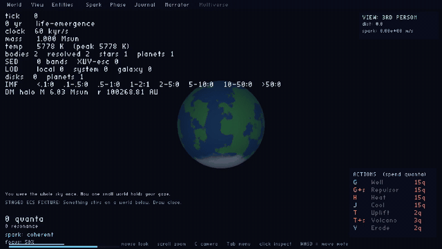

# A native-window tour of Gates of Truth

Truth is a JVM Clojure simulation with one ECS world and one OpenGL renderer.
This tour captures that application directly: screenshots are X11 window
pixels, and videos are continuous recordings of the same native window.


The blue/green globe is a **staged ECS fixture** with a terrestrial planet and
prokaryotic toy ecology. It demonstrates the current surface renderer, rather
than proving that a planet and life emerged during the recording. The camera
is a true-scale macro view: `demo/closeup!` places the observer at the fixture
body and uses the normal manual camera. No body radius is enlarged.

## Show a friend

Start in the Truth repository:

```bash
clojure -M:demo serve
```

1. Watch the purple nebula. It runs `domain.arc/tick-genesis`, including the
   actual ECS physics pipeline. The cloud can naturally progress to later arcs.
2. Press **Tab** to free/lock the cursor. Open **View** to adjust the camera,
   **Spark** for observer controls, and **Phase** or **Journal** for the story.
3. From another terminal, jump to a clearly staged later arc:

   ```bash
   clojure -M:demo-client '(demo/select! :life)'
   ```

4. The selected body's inspector shows mass, radius, temperature, composition,
   and ecology. Open **Entities** to select a body through the list. The camera
   follows the selection. For the gallery macro view:

   ```bash
   clojure -M:demo-client '(demo/closeup!)'
   clojure -M:demo-client '(demo/orbit!)'
   ```

5. Open **Narrator** and **Multiverse** to see the currently available panels.
   Multiverse is visibly locked; its ghost-node text is a placeholder surface.

**Controls:** mouse/drag looks around; scroll zooms; **C** cycles camera modes;
**WASD** flies the observer; arrows move focus in manual mode; **, / .** changes
focus width; **G**, **Shift-G**, **H**, **J** are the gravity/heat palette;
**L** jumps toward life. Palette availability and currency requirements remain
visible. **Escape closes the window** in this revision. Stop the terminal
process with Ctrl-C when finished. This demo uses loopback nREPL port **7890**;
the ordinary `:dev` service uses **7888**.

## Short recordings

| Asset | Duration | What it demonstrates |
| --- | ---: | --- |
| [Live formation](2026-10-06/live-formation.mp4) | 12 s | Actual nebula evolution; physics and simulation clock advance. |
| [Living-world orbit](2026-10-06/living-world-orbit.mp4) | 10 s | Real camera orbit around the staged living globe; physics is frozen. |
| [Protostar orbit](2026-10-06/protostar-orbit.mp4) | 10 s | Real camera orbit around the staged molten protostar; physics is frozen. |

The MP4s use H.264, 1280×720, 24 fps, and browser-compatible YUV420p. They are
silent. GitHub renders the PNG gallery inline; open/download the video links to
play the clips.

The inline GIF below is an eight-second, 640×360 derivative of the actual
living-world recording, prepared for GitHub previews:



## Story coverage

There is no Storybook catalog in this checkout. “Stories” here means the seven
arcs implemented by `domain.arc/detect-arc`. The demo does not create another
simulation model: every scenario is an ordinary ECS world consumed by the
existing renderer, using `domain.stellar.seeder` and the existing arc detector.
Fixture inputs pass the current seed contracts; toy ecology passes its schema.

| Scenario | Narrative arc | Evidence and interpretation |
| --- | --- | --- |
| `nebula` | `:arc/genesis-nebula-collapse` | [Live starting cloud](2026-10-06/01-live-nebula.png); the normal seeded physics world. |
| live progression | Whatever physics reaches during capture | [After the live clip](2026-10-06/02-live-formation.png); no arc is forced. |
| `protostar` | `:arc/genesis-protostar` | [Molten core and inspector](2026-10-06/story-protostar.png); fixture. |
| `ignition` | `:arc/genesis-ignition` | [Stellar surface](2026-10-06/story-ignition.png); fixture. |
| `accretion` | `:arc/genesis-accretion` | [Star, debris, disk accounting](2026-10-06/story-accretion.png); fixture. |
| `planets` | `:arc/genesis-planets-formed` | [Terrestrial planet](2026-10-06/story-planets.png); fixture. |
| `life` | `:arc/life-emergence` | [Ecology inspector](2026-10-06/story-life.png); fixture. |
| `dispersed` | `:arc/genesis-dispersed` | [Empty cloud ending](2026-10-06/story-dispersed.png); fixture. |


## Navigation coverage

The capture script clicks each tab using its current hit rectangle, checks the
active panel state, and saves a screenshot. All eight captures use the life
fixture so the entity and observer panels have meaningful content.

| Panel | Capture | Current capability |
| --- | --- | --- |
| World | [Screenshot](2026-10-06/panel-world.png) | Phase/identity readout, some placeholder copy. |
| View | [Screenshot](2026-10-06/panel-view.png) | Adjustable camera settings. |
| Entities | [Screenshot](2026-10-06/panel-entities.png) | Resolved-body list and selection/follow behavior. |
| Spark | [Screenshot](2026-10-06/panel-spark.png) | Observer state and parameter controls. |
| Phase | [Screenshot](2026-10-06/panel-phase.png) | Current narrative arc; next-phase copy is partly static. |
| Journal | [Screenshot](2026-10-06/panel-journal.png) | Observation note; astronomy/mythology sections remain placeholders. |
| Narrator | [Screenshot](2026-10-06/panel-narrator.png) | Ambient/read-only presence. Addressable narrator is unavailable. |
| Multiverse | [Screenshot](2026-10-06/panel-multiverse.png) | Locked placeholder panel; gate travel is not demonstrated. |

## Reproduce the assets

On Linux, install a JDK and Clojure CLI, **Xvfb**, **FFmpeg/ffprobe**,
**xdotool**, **ripgrep**, `ss` (iproute2), and Mesa or another OpenGL 3.3
implementation. Maven dependencies resolve through `deps.edn` on first use.
No browser, model service, notebook server, or generated imagery is required.

```bash
clojure -M:demo list
clojure -M:demo check
bin/demo-capture docs/demo/my-new-capture
```

The destination must not exist. The script allocates a private Xvfb display,
starts only its own demo process, waits for readiness, captures the tour, checks
panel state and runtime errors, probes video dimensions/duration, and stops the
processes it started. It refuses to compete with an existing server on port
7890. Diagnostic output is under `.ημ/diagnostics/demo-<UTC timestamp>/`.

The RNG seed and fixture inputs are stable. Live screenshots and video timing
depend on machine speed; OpenGL pixels can differ between drivers. This is a
reproducible tour, not a byte-identical video or proof of long-term planetary
formation. The fixture worlds are frozen by an identity tick function; orbit
clips animate the camera and renderer only. Fixture frames display **STAGED ECS
FIXTURE** in the quest line.

## Verification and scope

Captured October 6, 2026, from base revision
`8ade66a3553bdd89696aebf4fc4628a6fe66e5ae` plus the demo/launch/HUD changes in
this working tree. The previous README's `clojure -M:run` route targeted the
absent `infra.main`; it remains unsupported and is no longer advertised. PM2
now resolves its checkout relative to `dev/ecosystem.config.js` and inherits the
requested display.

The existing full suite passes: **879 tests / 15,486 assertions**, zero
failures/errors. Architecture guards and the render group pass; the six-tool
`bin/analyze --strict` gate passes. The new demo clients are separately linted,
all seven scenarios are constructed/validated, and the actual capture pass
checks native UI state. Gallery images and representative video frames are
reviewed visually before handoff.

This tour does not establish natural life emergence, complete geology or
civilization, interactive mythology, gate traversal, research-actor health, or
any particular count of generated papers. The repository contains a larger
research index; those systems require separate verification.

Software/process documentation is GPL-3.0-or-later. Creative screenshot/video
assets are CC-BY-SA-4.0 where applicable, following the project license policy.
