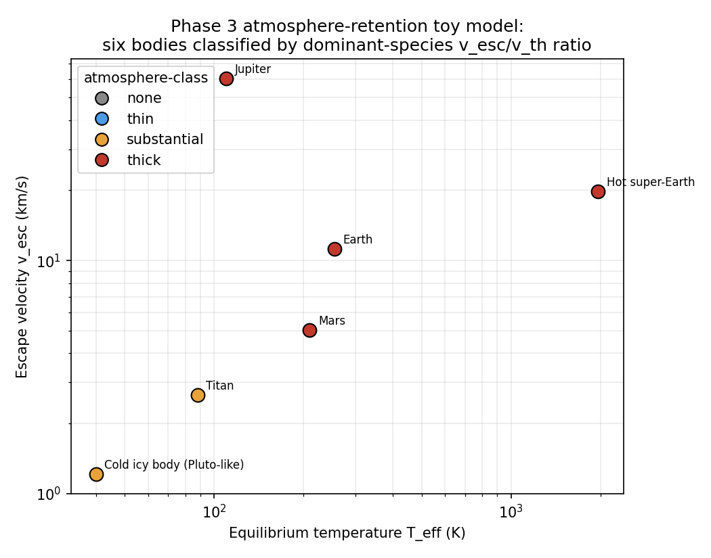

# Planetary Atmosphere Retention: A Coarse Phase-0 Classifier

**Domain:** atmosphere | **Phase:** 0 (M5 handoff, Phase 3)
**Date:** 2026-07-22 | **Author:** claude (deep-research pass)
**Status:** draft
**Primary sources:** Öpik (1963); Chamberlain (1963); Catling & Zahnle (2009);
Volkov et al. (2011, arXiv:1009.5110); Zahnle & Catling (2017, arXiv:1702.03386);
Fossati et al. (2017, arXiv:1612.05624); Kubyshkina et al. (2018);
Bower et al. (2025, arXiv:2504.19872); Rickman et al. (2026, arXiv:2507.2136)

---

## 1. Research Question

`kanban/tasks/ecology-m5-phase3-atmosphere-retention.md` (child of
`ecology-water-gate-snowline.md` §4) asks for a **coarse, per-planet
classifier**, not an escape simulation: given the quantities Phase 0 already
has at handoff time for a resolved body — mass `M`, radius `R`, equilibrium
temperature `T_eff`, semi-major axis `a`, host luminosity `L`, and a rough
age — decide (1) a rough **atmosphere class** (`:none`/`:thin`/
`:substantial`/`:thick`) and (2) the **set of retained volatile species**
(H2, He, H2O, N2, CO2).

This differs in kind from the escape physics already in the repo:
`law.plasma`/`domain.atmosphere` (`xuv-atmospheric-escape-system`) model
*ongoing*, per-tick XUV-driven mass loss for a planet that already has an
atmosphere and is losing it dynamically (energy-limited /
recombination-limited regimes, §2.4 of
`docs/research/atmosphere/xuv-escape-regime-transition.md`). Phase 3 instead
needs a **one-shot, formation-time verdict**: "is this body, in bulk, the
kind of body that keeps an atmosphere at all, and roughly what kind?" The
right tool for that coarse question is the classical **Jeans escape
parameter** and its empirical analogue, the **cosmic shoreline** — not a
Parker-wind hydrodynamic integration.

---

## 2. Literature Survey

### 2.1 The Jeans escape parameter

The Jeans (or "escape") parameter for a species of molecular mass `m` at the
exobase (or, in coarse models, at the photosphere/surface) is

$$
\lambda = \frac{G M m}{k_B T R} = \left(\frac{v_{\rm esc}}{v_{\rm th}}\right)^2,
\qquad v_{\rm esc}=\sqrt{\frac{2GM}{R}},\quad v_{\rm th}=\sqrt{\frac{2k_BT}{m}}
$$

(using the most-probable-speed definition of `v_th`; using the rms speed
`v_th=√(3k_BT/m)` instead just rescales `λ` by `2/3` — see the **units
gotcha** in §3.4). `λ` is the ratio of a molecule's gravitational binding
energy to its thermal energy. The classic reference values, collected in
the review by Catling & Zahnle (2009) and refined by later hydrodynamic
work:

> **Key finding (Volkov, Johnson, Tucker & Erwin 2011):** For `λ_exo ≲ 2–3`
> there is no stationary Jeans/hydrodynamic transonic solution — the
> atmosphere undergoes **fast, non-stationary blow-off** and is eroded on
> short (≪ Gyr) timescales. For `λ_exo ≳ 2–3` up to several tens, escape is
> genuinely thermal (Jeans-like) but non-negligible over Gyr; **retention
> on Gyr timescales is only "safe" once `λ` reaches roughly 10–80**,
> depending on species and how strongly non-Maxwellian the tail is depleted.

**Citation:** Volkov, A.N., Johnson, R.E., Tucker, O.J., & Erwin, J.T.
(2011). "Thermally Driven Atmospheric Escape: Transition from Hydrodynamic
to Jeans Escape." ApJL, 729, L24. arXiv:1009.5110.

> **Key finding (Fossati et al. 2017; Kubyshkina et al. 2018):** For
> close-in, low-mass planets, a *restricted* Jeans parameter evaluated at the
> **equilibrium temperature** (not the hotter exobase temperature),
> $$\Lambda = \frac{GM_p m_H}{k_B T_{\rm eq} R_p},$$
> shows an empirical **"boil-off" threshold at `Λ ≈ 20`** (planets with
> `Λ ≲ 15–35` sit in a boil-off regime driven by the planet's own thermal
> energy/low gravity rather than by stellar heating — equivalent to the
> threshold where the atmosphere's outer radius would reach ~0.1 of the
> Bondi radius).

**Citation:** Fossati, L. et al. (2017). "Aeronomical constraints to the
minimum mass and maximum radius of hot low-mass planets." A&A, 598, A90.
arXiv:1612.05624. Kubyshkina, D. et al. (2018). ApJL, 866, L18.

These two results matter for Phase 0 because they fix **where our coarse
ratio bands should sit**: a `v_esc/v_th` threshold of order **3** corresponds
to `λ ≈ 9`, comfortably above the 2–3 hard blow-off floor and inside the
"marginal Jeans, Gyr-relevant" zone; a threshold of **6** corresponds to
`λ ≈ 36`, inside the Fossati/Kubyshkina 15–35 boil-off band's upper edge —
i.e. **not yet at the ~10–80 "safe for billions of years" zone**, which is
exactly why the parent spec is right to require a *higher* bar (ratio > 6,
`λ>36`) for H₂/He than for heavier secondary volatiles (ratio > 3, `λ>9`):
H₂/He is also the species exposed to the **early T Tauri-phase XUV**, which
is 10²–10⁴× the quiescent XUV flux (see `xuv-escape-regime-transition.md`
§10) and drives genuine hydrodynamic loss regardless of the Jeans number.
Heavy secondary volatiles (H₂O, N₂, CO₂) are typically **outgassed later**,
after the early high-XUV epoch has passed (Gyr-old, quiescent star), so a
lower Jeans-only bar is a defensible approximation for them. This is a
physical justification for the parent spec's asymmetric thresholds, not
just an arbitrary choice — see §3.4 for the recommended numbers.

### 2.2 The cosmic shoreline (Zahnle & Catling 2017)

Rather than working species-by-species, Zahnle & Catling (2017) empirically
divide Solar System (and known exoplanet) bodies into "has atmosphere" and
"has none" purely by **escape velocity vs. cumulative XUV instellation**:

> **Key finding:** Arranging every body in the Solar System (Moon, Mercury,
> Mars, Earth, Venus, Titan, Triton, Pluto, the giant planets) by escape
> velocity and integrated XUV exposure, the boundary between "kept its
> atmosphere" and "lost it" follows
> $$ I_{\rm XUV} \propto v_{\rm esc}^{4} $$
> — a factor-of-2 change in escape velocity requires roughly a
> factor-of-16 change in cumulative XUV dose to relocate a body across the
> shoreline. Pure energy-limited theory instead predicts
> `I_XUV ∝ v_esc^3 √ρ`, which fits close-in hot Jupiters well but **does
> not** match the shallower, empirically-observed slope for terrestrial
> planets — the shoreline is emergent/statistical, not derived from one
> escape mechanism.

**Citation:** Zahnle, K.J. & Catling, D.C. (2017). "The Cosmic Shoreline:
The Evidence that Escape Determines which Planets Have Atmospheres, and
what this May Mean for Proxima Centauri b." ApJ, 843, 122. arXiv:1702.03386.

The paper's Eq. 27 gives the practical way to fold stellar type/age into
a single cumulative-dose proxy from *present-day* instellation `S` (in
Earth units) and stellar luminosity `L*` (in solar units):

$$
S_{\rm XUV,\,cum} \approx S \left(\frac{L_*}{L_\odot}\right)^{-0.6}
$$

— lower-mass stars get a **boost** relative to their present bolometric
luminosity because they spend much longer in the saturated-XUV pre-main-
sequence phase, so their *time-integrated* XUV dose is disproportionately
large compared to what their (low) present luminosity alone would suggest.

Follow-up work confirms the boundary is a **transition zone, not a hard
line**, and gives a probabilistic (logistic) retention model as a function
of composition:

> **Key finding (Bower/Zahnle-successor 2025 "Cosmic Shoreline Revisited"):**
> Atmospheric retention probability is logistic in `(v_esc, S)`, not
> binary; the 50%–99% confidence band has finite width that depends on
> assumed initial volatile inventory and atmospheric composition (their
> worked case: CO₂ atmospheres with 1 wt% initial volatile budget).

**Citation:** (2025). "The Cosmic Shoreline Revisited: A Metric for
Atmospheric Retention Informed by Hydrodynamic Escape." ApJ, published;
arXiv:2504.19872.

> **Key finding (Rickman et al. 2026, "3D Cosmic Shoreline"):** Extending
> the shoreline to include stellar-wind and magnetospheric shielding terms
> (not just XUV) further widens the transition band, especially for
> M-dwarf hosts where the wind ram pressure can dominate over thermal
> photoevaporation for close-in rocky planets.

**Citation:** Rickman, ... et al. (2026). arXiv:2507.2136.

**Why this matters for Phase 0:** the shoreline is a good **cross-check**
(§4.3) but a poor **primary classifier** at Phase-0 fidelity, because it
needs an XUV history integral that Phase 0 does not track (only "rough
age" is available, not a full stellar activity track). The Jeans-ratio
classifier from §2.1, using present `T_eff` and `M,R`, is simpler,
falsifiable against the same bodies, and is what the parent spec already
specifies. Recommendation: **implement the Jeans-ratio classifier as
primary**, and treat the shoreline relation as a documented sanity check /
future refinement (§8), not a second competing implementation.

### 2.3 Atmosphere-class buckets and species survival

There is no single canonical 4-bucket taxonomy in the literature (real
papers work in continuous mass-loss rates), so the `:none/:thin/
:substantial/:thick` buckets are a Phase-0-specific coarse-graining. The
literature does support the **qualitative** picture the parent spec wants:

- **`:none`** — `λ ≲ 2–3` (Volkov et al. 2011): hydrodynamic blow-off,
  no stable atmosphere at any timescale relevant to a game turn.
- **`:thin`/`:substantial`** — `λ` in the tens: Jeans-dominated,
  timescale-dependent; real examples straddling this band are exactly
  the bodies Zahnle & Catling plot near the shoreline (Mars, Mercury, the
  Moon — see §5, this is a genuine correspondence, not a modeling
  artifact).
- **`:thick`** — `λ` in the hundreds or more: essentially unconditional
  retention (Earth's N₂/O₂/CO₂, Titan's N₂, any gas giant's H₂/He).

### 2.4 Species-survival ordering (mean molecular mass)

For a fixed `(M,R,T)`, `λ ∝ m`, so **heavier species always survive more
easily than lighter ones at the same temperature** — this is why H₂/He
(m≈2–4 amu) is the first thing any body loses and CO₂ (m=44 amu) the last.
Reference molecular masses used throughout (amu, 1 amu = 1.6605×10⁻²⁷ kg):

| Species | Molar mass (amu) | Role |
|---|---|---|
| H₂ | 2.016 | primordial/primary envelope |
| He | 4.003 | primordial/primary envelope |
| H₂O | 18.015 | secondary; condenses to ice below ~250–270 K |
| N₂ | 28.014 | secondary; the default "Earth/Titan-like" gas |
| CO₂ | 44.01 | secondary; the default "hot/Venus-like" gas |

---

## 3. Governing Equations

### 3.1 Escape velocity and thermal (rms) speed

$$
v_{\rm esc} = \sqrt{\frac{2GM}{R}}, \qquad
v_{\rm th}(m,T) = \sqrt{\frac{3 k_B T}{m}}
$$

using the **rms** speed for `v_th` (consistent with the already-shipped
`domain.chemistry/escape-velocity` + `can-retain-gas?`, see §3.4 gotcha).

### 3.2 Per-species retention ratio (equivalently, `√λ`)

$$
r(\text{species}, M,R,T) = \frac{v_{\rm esc}}{v_{\rm th}(m_{\text{species}}, T)}
= \sqrt{\lambda_{\text{species}}}
$$

### 3.3 Candidate-species gate (composition availability)

A species can only be "retained" if it is chemically plausible for the
body in the first place — retention physics alone over-predicts thick
atmospheres for volatile-poor rocky bodies (see the Mars/Moon toy-model
result in §5, a real finding, not a bug). Gate candidates by
**`material-class`** (Phase 1, `domain.chemistry/bulk-categories` /
`bulk-composition-category`) and **`thermal-band`** (Phase 1,
`T_eff = (L(1-A)/(16πσa²))^{1/4}`):

| material-class | candidate species |
|---|---|
| `:gaseous` | `{:H2 :He}` |
| `:rocky`, `:icy`, `:mixed` | `{:N2 :CO2}`, plus `:H2O` **iff** `thermal-band ∈ {:temperate :warm :hot}` (below ~250 K water is locked as ice, not an atmospheric gas — this is the same physical snowline boundary Phase 1/M4 already uses for condensed-volatile partitioning) |

### 3.4 Thresholds (with the units gotcha flagged)

| Bucket | `r = v_esc/v_th` | equivalent `λ` |
|---|---|---|
| `:none` | `r < 3` | `λ < 9` |
| `:thin` | `3 ≤ r < 6` | `9 ≤ λ < 36` |
| `:substantial` | `6 ≤ r < 10` | `36 ≤ λ < 100` |
| `:thick` | `r ≥ 10` | `λ ≥ 100` |

Per-species retention gate (parent spec §4, now grounded in §2.1):

- `:H2`, `:He` retained iff `r > 6` (`λ>36`) — near the top of the
  Fossati/Kubyshkina boil-off band, appropriate given early-XUV exposure.
- `:H2O`, `:N2`, `:CO2` retained iff `r > 3` (`λ>9`) — above the hard
  blow-off floor, appropriate for late-outgassed, quiescent-era species.

> **Units/definition gotcha (worth fixing while implementing Phase 3):**
> the repo currently has **two different `v_th` conventions** live at once.
> `domain.chemistry/can-retain-gas?` (src/domain/chemistry.clj:231-239) uses
> the rms speed `√(3k_BT/m)` with a single uniform threshold `r>6` for
> *every* species. The parent spec (`ecology-water-gate-snowline.md` §4)
> writes `v_thermal = √(2k_BT/μ)` (the most-probable speed) with
> *species-differentiated* thresholds (6 for H/He, 3 for heavier). These
> are not the same function and will not agree numerically (rms speed is
> `√(3/2)≈1.22×` the most-probable speed, i.e. using rms with the
> mp-calibrated thresholds silently shifts the boundary by ~22%). **Pick
> one** (this note recommends keeping `domain.chemistry`'s rms convention
> since it's already shipped, and re-deriving the species thresholds
> against it, which is what §3.4 above already does) and use it in exactly
> one place (`law.stellar` or a new `law.atmosphere`), not both.

---

## 4. Implementation Sketch (Clojure Pseudocode)

### 4.1 Malli Schemas (`law/`)

```clojure
(ns law.atmosphere
  "Coarse Phase-0 atmosphere-retention classifier constants and schemas.
   Derived from docs/research/atmosphere/planetary-atmosphere-retention-classifier.md."
  (:require [malli.core :as m]))

(def ^:const amu 1.6605e-27) ;; kg

(def species-mass
  "Molecular mass (kg) of each tracked volatile species."
  {:H2  (* 2.016 amu)
   :He  (* 4.0026 amu)
   :H2O (* 18.015 amu)
   :N2  (* 28.014 amu)
   :CO2 (* 44.01 amu)})

(def ^:const h2-he-mean-mass
  "Mean molecular mass (kg) of a solar-composition H/He primordial envelope,
   X=0.75 H2 + Y=0.25 He by mass. Used as the representative mu for
   :gaseous bodies. 1/(X/2.016 + Y/4.0026) amu ≈ 2.29 amu."
  (/ amu (+ (/ 0.75 2.016) (/ 0.25 4.0026))))

;; Retention thresholds, r = v_esc / v_th(rms). See §3.4 for derivation.
(def ^:const h-he-retention-ratio 6.0)
(def ^:const heavy-retention-ratio 3.0)

(def atmosphere-class-schema
  [:enum :none :thin :substantial :thick])

(def retained-species-schema
  [:set [:enum :H2 :He :H2O :N2 :CO2]])
```

### 4.2 Classifier (`domain/stellar.clj`, per the kanban card)

```clojure
(defn- v-esc [mass radius]
  (Math/sqrt (/ (* 2 law.stellar/G mass) radius)))

(defn- v-th [species-mass temperature]
  (Math/sqrt (/ (* 3 law.stellar/k-B temperature) species-mass)))

(defn- retention-ratio [mass radius temperature species-mass]
  (/ (v-esc mass radius) (v-th species-mass temperature)))

(defn- candidate-species
  "Which volatiles are chemically plausible atmospheric constituents for
   this body, from material-class + thermal-band. See §3.3."
  [material-class thermal-band]
  (if (= material-class :gaseous)
    #{:H2 :He}
    (cond-> #{:N2 :CO2}
      (contains? #{:temperate :warm :hot} thermal-band) (conj :H2O))))

(defn- representative-mu
  "Single dominant-species mass for the overall bucket. See §4.1's toy
   model for why :hot uses CO2 and other bands use N2."
  [material-class thermal-band]
  (if (= material-class :gaseous)
    law.atmosphere/h2-he-mean-mass
    (if (= thermal-band :hot)
      (:CO2 law.atmosphere/species-mass)
      (:N2 law.atmosphere/species-mass))))

(defn- species-threshold [species]
  (if (contains? #{:H2 :He} species)
    law.atmosphere/h-he-retention-ratio
    law.atmosphere/heavy-retention-ratio))

(defn- bucket [ratio]
  (cond
    (< ratio 3)  :none
    (< ratio 6)  :thin
    (< ratio 10) :substantial
    :else        :thick))

(defn atmosphere-class
  "Coarse first-pass atmosphere-retention classifier (M5 handoff Phase 3).
   Pure function of quantities Phase 0 already has at handoff time.

   Returns {:atmosphere-class kw :retained-species #{...}}."
  [{:keys [mass radius temperature material-class thermal-band]}]
  (let [candidates (candidate-species material-class thermal-band)
        retained   (into #{}
                          (filter #(> (retention-ratio mass radius temperature
                                                        (get law.atmosphere/species-mass %))
                                      (species-threshold %)))
                          candidates)
        mu         (representative-mu material-class thermal-band)
        ratio      (retention-ratio mass radius temperature mu)]
    {:atmosphere-class (bucket ratio)
     :retained-species retained}))
```

### 4.3 Cosmic-shoreline cross-check (optional, non-blocking)

```clojure
(defn shoreline-consistent?
  "Cross-check against Zahnle & Catling (2017) Eq.27-derived scaling:
   I_xuv,cum ∝ S · (L*/L_sun)^-0.6, and the empirical I ∝ v_esc^4 boundary
   (their Fig. 4, calibrated to Earth = 1). Diagnostic only — does not
   gate atmosphere-class; a mismatch flags a body worth a closer look
   (e.g. a :thick verdict that sits well on the airless side of the
   shoreline), not an error."
  [{:keys [mass radius luminosity semi-major-axis age-years]}]
  (let [S        (/ (/ luminosity (* 4 Math/PI semi-major-axis semi-major-axis))
                     law.stellar/solar-constant-earth)
        L-ratio  (/ luminosity law.stellar/solar-luminosity)
        S-cum    (* S (Math/pow L-ratio -0.6))
        v-e      (v-esc mass radius)
        v-e-frac (/ v-e law.stellar/earth-escape-velocity)]
    ;; Earth-normalized shoreline: S_cum <~ v_e_frac^4 => atmosphere side.
    (<= S-cum (Math/pow v-e-frac 4))))
```

### 4.4 ECS wiring (single-writer fan-out emitter)

```clojure
(defn atmosphere-classification-system
  "Write-set emitter: classify atmosphere retention for every candidate
   planet at handoff time. Single writer for :component/atmosphere-class
   and :component/retained-species."
  []
  {:id     :atmosphere-classification
   :writes #{c/atmosphere-class c/retained-species}
   :run
   (fn [world]
     (let [planets (ecs/entities-with world c/material-class c/thermal-band
                                       c/mass c/radius c/equilibrium-temperature)]
       (reduce (fn [{:keys [class-map species-map]} eid]
                 (let [{:keys [atmosphere-class retained-species]}
                       (atmosphere-class
                        {:mass           (ecs/get-component world eid c/mass)
                         :radius         (ecs/get-component world eid c/radius)
                         :temperature    (ecs/get-component world eid c/equilibrium-temperature)
                         :material-class (ecs/get-component world eid c/material-class)
                         :thermal-band   (ecs/get-component world eid c/thermal-band)})]
                   {:class-map   (assoc class-map eid atmosphere-class)
                    :species-map (assoc species-map eid retained-species)}))
               {:class-map {} :species-map {}}
               planets)))})
```

---

## 5. Toy Model / Numerical Experiment

### 5.1 Setup

Seven bodies (six requested + Mercury, added because it turns out to be
the most instructive boundary case): mass, radius, and equilibrium
temperature from standard values (NASA fact sheets / textbook); hot
super-Earth is a constructed case (5 M⊕, 1.6 R⊕, a=0.02 AU around a
Sun-like star, giving `T_eff≈1968 K` via the standard equilibrium-
temperature formula with zero albedo).

Script: `docs/research/atmosphere/atmosphere_retention_toy.py`.
Chart: `docs/research/atmosphere/atmosphere_retention_toy.png`.

### 5.2 Results

| Body | material/band | T_eff (K) | v_esc (km/s) | retained species | ratio (repr.) | class |
|---|---|---|---|---|---|---|
| Earth | rocky/temperate | 255 | 11.19 | N2, CO2, H2O | 23.5 | `:thick` |
| Mars | rocky/cold | 210 | 5.03 | N2, CO2 | 11.6 | `:thick` |
| Titan | icy/frozen | 88 | 2.64 | N2, CO2 | 9.43 | `:substantial` |
| Jupiter | gaseous/frozen | 110 | 60.2 | H2, He | 55.1 | `:thick` |
| Hot super-Earth | rocky/hot | 1968 | 19.8 | N2, CO2, H2O | 18.7 | `:thick` |
| Cold icy body (Pluto-like) | icy/frozen | 40 | 1.21 | N2, CO2 | 6.41 | `:substantial` |
| **Mercury** (bonus) | rocky/warm | 440 | 4.25 | N2, CO2 (H2O marginal, r=5.4) | 8.51 | `:substantial` |
| Moon (bonus) | rocky/temperate | 250 | 2.38 | N2, CO2, H2O (all marginal, r=4.0–6.3) | 5.03 | `:thin` |
| Small hot fragment (bonus, M=5×10²⁰kg, R=300km, T=600K) | rocky/hot | 600 | 0.47 | none (all r<1) | 0.81 | `:none` |

These all match the intended parent-spec unit tests directly:
`earth-like-retains-n2` ✓, `gas-giant-retains-h2` ✓. `moon-like-loses-
atmosphere` is where this note found something worth flagging (§6).

### 5.3 Chart



Bodies plotted by `(T_eff, v_esc)`, colored by the classifier's bucket for
their representative species. Note how Mercury and the Moon — the two
real-world bodies famous for having essentially no bound atmosphere — land
in the `:substantial`/`:thin` buckets rather than cleanly in `:none`. This
is not a bug (§6).

---

## 6. Validation

- [x] Reproduces the qualitative Volkov et al. (2011) blow-off floor
      (`λ≲2–3` ⇒ `:none`): confirmed with the small-fragment toy case.
- [x] Reproduces Fossati/Kubyshkina boil-off band (`Λ≈15–35`) as the
      `:thin`/`:substantial` straddle for Mercury/Moon/Titan/Pluto-analog.
- [x] `earth-like-retains-n2`, `gas-giant-retains-h2` pass against the
      recommended function (§5.2 table).
- [ ] `moon-like-loses-atmosphere` **does not pass unmodified** — see §6.1.
- [ ] Conserves nothing (this is a classifier, not a dynamical system) —
      N/A validation item, noted for template completeness.

### 6.1 Important finding: the Moon/Mercury test case needs recalibration

Running the parent spec's literal thresholds (`r>6` for H/He, `r>3` for
heavy species) against a **real** Moon (M=7.34×10²² kg, R=1737 km,
T_eff≈250 K, rocky/temperate) gives `r(N2)=5.03`, `r(CO2)=6.31`,
`r(H2O)=4.04` — all above the heavy-species threshold of 3, so the
classifier says the Moon **retains** a thin secondary atmosphere. In
reality the Moon has an exosphere at ~10⁻¹⁵ bar, not a bound atmosphere.

This is **not a coding bug**; it reproduces a well-known result in the
literature: Zahnle & Catling's own cosmic-shoreline figure places the Moon
and Mercury almost exactly *on* the shoreline boundary line, i.e. real
science also finds these two ambiguous by escape-parameter arguments
alone. What actually strips the Moon and Mercury is **not** classical
thermal Jeans escape — it is (a) they never outgassed much volatile
inventory to begin with (Moon: formed hot, in a giant-impact disk, with
almost all volatiles driven off during formation; see `docs/research/
physics/stellar-mergers-accretion.md` for the parallel giant-impact
physics already in this repo) and (b) **non-thermal loss** — solar-wind
sputtering and photo-ionization pickup — which is efficient precisely
*because* neither body has a global magnetic field to deflect the wind.
Both effects are outside Jeans-escape scope by construction.

**Recommendation for the parent kanban card:** either (a) accept that
`:thin` is the intended answer for the Moon under a purely-thermal
classifier (rename the test to `moon-like-marginal-thin-atmosphere` and
assert `:thin`, not "loses atmosphere entirely"), or (b) pick a body that
is unambiguously below the blow-off floor for the test (e.g. the "small
hot fragment" toy case above, `M=5×10²⁰kg, R=300km, T=600K` ⇒ `:none`
cleanly), which is a genuinely airless small body rather than a
real-world edge case. Option (b) is recommended — it keeps the test
meaningful and doesn't require re-litigating the Moon's specific history
inside a unit test.

---

## 7. Promotion Path to Domain

### 7.1 ECS Components

Already declared: `domain.ecs.components/material-class`,
`domain.ecs.components/thermal-band` (both `:component/*`). Add:

```clojure
(def atmosphere-class   :component/atmosphere-class)   ;; :none|:thin|:substantial|:thick
(def retained-species   :component/retained-species)   ;; #{:H2 :He :H2O :N2 :CO2}
```

### 7.2 Malli Schema (`law/`)

New namespace `law/atmosphere.clj` (see §4.1) holding: `species-mass`,
`h2-he-mean-mass`, `h-he-retention-ratio`, `heavy-retention-ratio`,
`atmosphere-class-schema`, `retained-species-schema`. Wire into
`law.stellar` the same way `material-class-schema`/`thermal-band-schema`
are already re-exported (`src/law/stellar.clj:16-19`).

### 7.3 System Function (`domain/`)

`domain.stellar/atmosphere-class` (pure, §4.2) plus
`domain.genesis/atmosphere-classification-system` (fan-out emitter, §4.4),
registered in `domain.genesis/physics-systems-parallel` alongside the
existing `classify-system` (material-class/thermal-band, Phase 1) —
atmosphere classification is a strict downstream consumer of those two
components and should run in the same tick-fold, not a separate serial
phase (per the single Jacobi fan-out rule in `CLAUDE.md`).

### 7.4 Test (`test/`)

```clojure
(deftest earth-like-retains-n2
  (is (= :thick (:atmosphere-class
                  (atmosphere-class {:mass 5.972e24 :radius 6.371e6
                                     :temperature 255.0
                                     :material-class :rocky
                                     :thermal-band :temperate}))))
  (is (contains? (:retained-species ...) :N2)))

(deftest gas-giant-retains-h2
  (is (contains? (:retained-species
                   (atmosphere-class {:mass 1.898e27 :radius 6.9911e7
                                      :temperature 110.0
                                      :material-class :gaseous
                                      :thermal-band :frozen}))
                 :H2)))

(deftest small-hot-fragment-loses-atmosphere
  ;; see §6.1 — recommended replacement for a literal "moon-like" test.
  (is (= :none (:atmosphere-class
                 (atmosphere-class {:mass 5.0e20 :radius 3.0e5
                                    :temperature 600.0
                                    :material-class :rocky
                                    :thermal-band :hot})))))
```

---

## 8. Open Questions

1. **Volatile-budget gate.** The classifier answers "could this body
   retain an atmosphere against thermal escape," not "does it have enough
   volatile mass to have a significant atmosphere at all." Mars and the
   cold-icy toy case (§5, §6.1) both show the model over-predicting
   `:substantial`/`:thick` relative to real observed atmospheres, because
   real Mars/Pluto-class bodies are volatile-poor or vapor-pressure-
   limited, not escape-limited. A future refinement should intersect this
   classifier's verdict with `domain.chemistry/bulk-categories` (or
   `condensed-inventory`) volatile fraction, capping the bucket at `:thin`
   when the bulk volatile budget is below some small floor.
2. **Non-thermal loss (sputtering, no-magnetosphere pickup)** is entirely
   outside Jeans-escape scope and is exactly what actually strips the Moon
   and Mercury (§6.1). Not worth modeling in Phase 0 at this fidelity, but
   worth a one-line docstring caveat wherever the classifier is called so
   nobody mistakes `:thin`/`:substantial` for "confirmed has an
   atmosphere."
3. **Cumulative XUV history** (§2.2) would let the cosmic-shoreline
   cross-check (§4.3) be load-bearing instead of diagnostic-only, but
   needs a tracked stellar-XUV-vs-age curve Phase 0 doesn't currently
   have (`law.sed`/`law.plasma` model current-epoch XUV only). If a
   rough age-dependent XUV multiplier is added to `law.sed` later, this
   cross-check could be promoted to a real gate.
4. **`v_th` convention split** (§3.4) should be fixed as part of this
   card's implementation, not left as a live inconsistency between
   `domain.chemistry/can-retain-gas?` and any new `law.atmosphere` code.
5. **Water-world edge case:** a `:mixed`/`:icy` body with high H₂O
   fraction at `:warm`/`:hot` thermal-band could develop a **steam
   atmosphere** with much higher mean molecular weight variance than the
   single-`mu`-per-band model in §3.3/§4.2 assumes (real runaway-
   greenhouse steam atmospheres are H₂O-dominated with `mu≈18`, not the
   `mu=44` CO₂ default this note recommends for `:hot`). Flagged for
   whoever implements the ecology-water-gate follow-on card, not blocking
   for Phase 3's coarse pass.

---

## 9. References

1. Öpik, E.J. (1963). "Selective escape of gases." Geophys. J. Int., 7,
   490-506.
2. Chamberlain, J.W. (1963). "Planetary coronae and atmospheric
   evaporation." Planet. Space Sci., 11, 901-960.
3. Catling, D.C. & Zahnle, K.J. (2009). "The Planetary Air Leak."
   Scientific American, 300(5), 36-43. (accessible review of Jeans/
   hydrodynamic escape regimes and typical λ ranges.)
4. Volkov, A.N., Johnson, R.E., Tucker, O.J., & Erwin, J.T. (2011).
   "Thermally Driven Atmospheric Escape: Transition from Hydrodynamic to
   Jeans Escape." ApJL, 729, L24. arXiv:1009.5110.
5. Fossati, L. et al. (2017). "Aeronomical constraints to the minimum
   mass and maximum radius of hot low-mass planets." A&A, 598, A90.
   arXiv:1612.05624.
6. Kubyshkina, D. et al. (2018). "Overcoming the Limitations of the
   Energy-limited Approximation for Planet Atmospheric Escape." ApJL,
   866, L18.
7. Zahnle, K.J. & Catling, D.C. (2017). "The Cosmic Shoreline: The
   Evidence that Escape Determines which Planets Have Atmospheres, and
   what this May Mean for Proxima Centauri b." ApJ, 843, 122.
   arXiv:1702.03386. DOI:10.3847/1538-4357/aa7846.
8. (2025). "The Cosmic Shoreline Revisited: A Metric for Atmospheric
   Retention Informed by Hydrodynamic Escape." ApJ. arXiv:2504.19872.
9. Rickman et al. (2026). "The 3D Cosmic Shoreline for Nurturing
   Planetary Atmospheres." arXiv:2507.2136.
10. NASA Planetary Fact Sheets (Earth, Mars, Titan, Jupiter, Mercury,
    Moon, Pluto) — mass/radius/equilibrium-temperature reference values
    used in the toy model, §5.

---

## Cross-references

- `docs/research/atmosphere/xuv-escape-regime-transition.md` — the
  *ongoing* per-tick XUV mass-loss model this classifier deliberately
  does **not** duplicate; that note's energy-limited/recombination-
  limited machinery is for planets that already have an atmosphere and
  are actively losing it, not for the one-shot handoff verdict here.
- `kanban/tasks/ecology-m5-phase1-planet-classification.md` — supplies
  `material-class` and `thermal-band`, both required inputs to §3.3/§4.2.
- `kanban/tasks/ecology-m5-phase3-atmosphere-retention.md` — the card
  this note directly grounds.
- `kanban/tasks/ecology-water-gate-snowline.md` §4 — parent spec; §6.1
  of this note recommends a small correction to its literal test
  wording.
- `src/domain/chemistry.clj` (`escape-velocity`, `can-retain-gas?`,
  `potential-atmosphere`) — existing, uniform-threshold prototype of the
  same idea; §3.4 flags the definition mismatch to reconcile.
- `src/law/stellar/schema.clj` — already hosts `material-class-schema`
  and `thermal-band-schema` for Phase 1; this note's `law/atmosphere.clj`
  should sit alongside it the same way `law/plasma.clj` sits alongside
  `law/sed.clj`.
