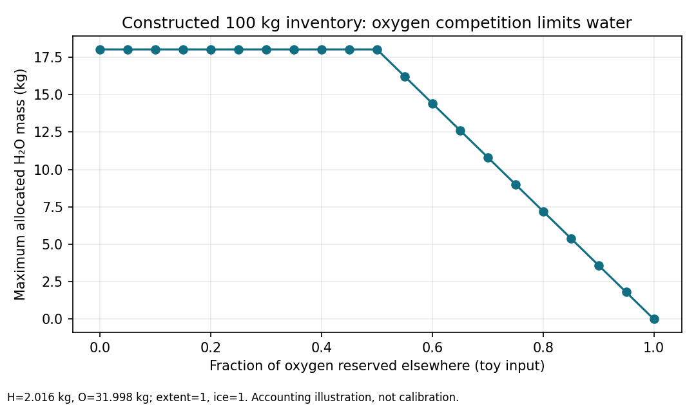

# Condensed water: an elemental budget before a life substrate

**Domain:** physics / chemistry | **Phase:** 0 → represented-life prerequisites

**Date:** 2026-10-07 | **Author:** interactive Codex intent-research scout

**Status:** draft; arithmetic checked, engineering options unaccepted

**Owner:** `a4744132-2328-4cb2-a550-e1328d346673` (Incoming, 3 points)

**Primary sources:** [Lodders 2003](https://doi.org/10.1086/375492),
[Bitsch & Battistini 2020](https://doi.org/10.1051/0004-6361/201936463),
[D’Angelo et al. 2018](https://doi.org/10.1051/0004-6361/201833715)

**Source pin:** `b395c4049718f7ce015ddf25fc0a192d97821373`; no production changes.

## 1. Research Question

How can a small, conserved material model carry hydrogen **bound in water-bearing
solids**, while continuing to exclude free nebular hydrogen from a refractory
core? What can that inventory tell the atmosphere projection or a later life
account, and what must remain unknown?

The existing [nebular research](nebular-chemistry-metal-enrichment.md), completed
[composition owner](../../../kanban/tasks/nebular-chemistry-and-composition-spec.md)
and [retention research](../atmosphere/planetary-atmosphere-retention-classifier.md)
are the starting point. Their evidence is not overwritten. In current
[planet-composition](../../../src/domain/planet_formation/composition.clj), lines
20–49, filtering `:H` from normalized grains deliberately prevents the broad
condensation sigmoid from leaking free gas into every core. It also removes the
hydrogen that a water-bearing solid would contain. Restoring that leakage is not
a material model.

The [pinned prerequisite audit](https://github.com/octave-commons/Truth/blob/349142e01f4010aeb0cd033ee98a33bce16771af/.%CE%B7%CE%BC/diagnostics/life-actor-planning/chemistry-prerequisite-audit.json)
separates source facts from saved observations. Gas-free seeds have `H=0`;
ordinary positive-luminosity envelope-bearing seeds start outside the snowline
and below 190.4975 K under the existing birth-temperature law. Neither statement
rules out later transport, heating or mergers. Saved scalar-life milestones do
not establish current material eligibility. PR38’s proposed positive H/O/C/N
and final-parent guards remain unchanged by this research.

**Bounded recommendation for later design:** first define an element-conserving
water allocation with explicit oxygen reservations and phase inputs. Keep
hydration kinetics, actual atmospheric supply and biological accessibility
separate. This notebook does not select a full equilibrium network, create
organisms, make a planet eligible, or admit implementation.

## 2. Literature Survey

### 2.1 Condensed water is not condensed elemental hydrogen

Lodders’ solar-composition calculation accounts for oxygen consumed by rock before
water condensation. At total pressure `10^-4 bar`, §3.4.1 and Table 10 give 182 K
for water ice in the equilibrium case; alternative kinetic chemistry changes the
low-temperature inventory. About 23% of oxygen is associated with rocky elements
before ice, rising to about 26% with magnetite in that calculation. These are
model-specific results, not fixed fractions to apply to every parcel. Water
contains hydrogen even though the abundant free hydrogen reservoir remains gas.
[Author full text, printed p. 1244](https://solarsystem.wustl.edu/wp-content/uploads/reprints/2003/Lodders%202003%20ApJ%20Elemental%20abundances.pdf).

**Corpus correction:** the older notebook’s approximate 150 K water entry must
not be presented as reproduction of this paper’s specified-pressure 182 K result.
Truth’s 170 K snowline is yet another existing model choice. This research does
not silently change any of them.

### 2.2 Oxygen has competing owners before water is assigned

Bitsch & Battistini’s deliberately compact model reserves oxygen for silicates,
carbon oxides and iron oxides, then assigns the remainder to water. Their Table 1
uses **number abundances**, not mass fractions; it adopts a 150 K water cutoff.
The paper studies solids around the water line above 70 K, where its carbon
oxides remain gaseous but still consume oxygen. Its two-silicate formula must
not be applied outside its nonnegative Mg/Si domain. This supports explicit
oxygen competition without requiring Truth to adopt the paper’s carbon split,
iron oxidation or fixed temperatures. [Methods §2.2 and Table 1](https://arxiv.org/html/1911.09725v1).

For example, in the two-silicate submodel,
`n(Mg2SiO4)=n(Mg)-n(Si)` and
`n(MgSiO3)=2n(Si)-n(Mg)` require `1 ≤ Mg/Si ≤ 2`.
This algebra is an applicability check; clamping negative mineral amounts would
hide an unsupported composition.

### 2.3 Hydrated minerals require a different state and history

D’Angelo et al. model adsorption, surface diffusion and desorption of water on
forsterite using temperature, water-vapor density and grain binding sites. Their
§3 methods concern formation of an initial surface layer; that is not a direct
conversion of all available water into bulk hydrated rock. Their model makes
warm surface-bound water a legitimate possibility, while demonstrating why a
single ice-temperature switch cannot represent its production or release.
[Full text, §§3.1–3.3](https://arxiv.org/pdf/1808.06183).

**Engineering limit:** the first water-ice accounting slice should label
hydrated/adsorbed stock **unmodeled**, not absent in nature. A later hydration
producer needs a grain capacity, reactant budget, clock, reversible transfer and
provenance. No hydration rate or warm-water bonus is selected here.

### 2.4 Reading record and evidence tiers

The candidate bibliography was recovered from the existing corpus before the
full-text methods pass. The three sources above supply the retained claims.
The Lodders author PDF and arXiv full texts were opened; the A&A publisher
endpoint returned 403, so the author manuscript supplies the methods. The
Bitsch arXiv PDF has a later typesetting date but identifies `1911.09725v1`;
the cited journal article is the 2020 publication. Murphy & Koop’s vapor-pressure
paper was considered, but its publisher endpoint exposed an abstract rather
than the requested PDF. No vapor-pressure fit from it is implemented here.

| Tier | What this notebook establishes |
| --- | --- |
| Literature | Bound H, competing oxygen sinks, and phase/kinetic applicability matter |
| Current code | Elemental fractions, filtered grain core, heuristic retained species |
| Derived mathematics | A stoichiometric allocation can conserve each element exactly |
| Proposed engineering | Named reservations and explicit conversion/phase fractions |
| Not established | Actual equilibrium yields, native planet distribution, accessible water or life |

## 3. Governing Equations

### 3.1 One elemental budget and explicit reservations

Use a finite accounting basis of mass `M` kg, with elemental masses
`b_e = M x_e`, where `x_e` are bulk mass fractions. Input validation must reject
negative/nonfinite values, unsupported keys and an invalid total; the later law
must choose a numeric representation and tolerance explicitly. Do not
renormalize an invalid input to make it pass.

Let `r^s_e` and `r^g_e` be already allocated **elemental masses** in other solid
and gas compounds. Require, for every element,

\[
0\le r^s_e+r^g_e\le b_e,\qquad a_e=b_e-r^s_e-r^g_e\ge0.
\]

These reservations are not extra matter. Their upstream model must identify
which compounds consume them and enforce their own stoichiometry. Oxygen in CO,
CO2, silicates or oxides is unavailable for simultaneous water allocation.
Hydrogen used by methane, ammonia or a previous hydrate reservation must also
be excluded. An aggregate reservation is sufficient for this kernel but is not
by itself proof of chemical plausibility.

With molar masses `A_H=1.008` and `A_O=15.999` kg/kmol (rounded element weights),
the residual capacity in kmol of water is

\[
q_{max}=\min\left(\frac{a_H}{2A_H},\frac{a_O}{A_O}\right).
\]

This is a stoichiometric **upper bound**, not a claim that every residual atom
reacts. Introduce an explicit model-selected extent `0 ≤ η ≤ 1`, and an ice
partition `0 ≤ f ≤ 1`:

\[
q=\eta q_{max},\quad q_i=fq,\quad q_v=(1-f)q.
\]

The toy sets `η=1` to expose the capacity bound. No biological, kinetic or
thermodynamic calibration justifies adopting that value in production.
Each water compartment owns `2A_H q_*` kg H and `A_O q_*` kg O. The remainder
`u_e=a_e-w^i_e-w^v_e` stays explicitly **unassigned**. Therefore

\[
b_e=r^s_e+r^g_e+w^i_e+w^v_e+u_e
\]

for every element, including elements untouched by water. Summing this identity
conserves total mass. A molecular `H2O-kg` label is a projection of its H+O
allocation; it must never be added to the same elemental masses a second time.

### 3.2 Oxygen competition: compare, do not silently replace

Current [chemistry](../../../src/domain/chemistry.clj), lines 330–379, reserves
oxygen first for a CO proxy, then a SiO2 proxy. Its groups are disjoint, but the
proxy does not establish Mg/Fe oxidation or a molecular equilibrium. The current
`molecular-composition` diagnostic at lines 238–261 is also not a conserved
compound allocator. Neither function should be promoted unchanged into a
spendable water stock merely because it returns a molecule-like key.

Two bounded options for the next design are:

| Option | Benefit | Required limitation |
| --- | --- | --- |
| Preserve the current CO/SiO2 reservation as a named toy closure | Small compatibility change; no hidden new oxygen owner | Explicitly limited oxide chemistry; quantify sensitivity and leave other claims unassigned |
| Adopt a reviewed small mineral/carbon allocation table | More explicit oxygen competition | Validate composition domain, oxidation and carbon species; reject unsupported cases rather than clamp |

The conservation kernel works with either. Choice of reservation chemistry is
still unaccepted; importing a table for all 17 Truth elements would exceed this
research slice.

### 3.3 Phase selection and normalization

Current `partition-solids` in [chemistry](../../../src/domain/chemistry.clj),
lines 136–159, independently normalizes the two returned phase maps;
`bulk-categories` at lines 161–170 explicitly warns that those maps cannot report
the solid/gas split. A replacement allocation must retain common-basis amounts,
reservations and phase weights before normalization. The current return shape
alone cannot prove the conserved water identity below.

`f` must refer to **local material conditions**, with its model/version recorded.
A fixed temperature cutoff can be an explicit coarse prescription; it is not a
universal water phase boundary. An equilibrium version needs local pressure or
water partial pressure and vapor capacity; a kinetic version additionally needs
time and exchange rates. Current whole-body `c/pressure` is not automatically
nebular annulus pressure or surface water partial pressure. This notebook chooses
none of those missing quantities. `f=0, 1/2, 1` below are sensitivity inputs.

After every residual element has a justified phase assignment, define the
unnormalized elemental solid and gas budgets `s_e,g_e`. Only then calculate

\[
S=\sum_e s_e,\ G=\sum_e g_e,\quad x^s_e=s_e/S,\ x^g_e=g_e/G.
\]

Zero phase mass has no normalized composition and cannot supply positive sampled
mass. Unassigned matter must remain visible; it is not silently classified as gas.
Normalization produces a **composition**, never additional available inventory.
For core mass `m_c` and envelope mass `m_g`, proposed extracted elemental mass is
`d_e=m_c x^s_e+m_g x^g_e`. Require `0 ≤ m_c ≤ S` and `0 ≤ m_g ≤ G` before
extraction, with nonnegative phase leftovers `s_e-m_c x^s_e` and
`g_e-m_g x^g_e`. Other outstanding demands must already be reserved consistently
from these available phase budgets. Every `d_e` must also fit the donor’s
available element budget; leftover donor material is `b_e-d_e`, including any
unassigned compartment. An element-total bound alone could let a core silently
borrow gas when the phases have identical compositions. Merely normalizing two
phase maps and debiting total disk mass proves neither the phase nor element
conditions.

This is a real integration boundary: the current disk seed pathway draws from a
bulk-composition proxy and debits disk mass. A future implementation must name
how that parent-local elemental inventory is represented and depleted through
the existing single-writer lifecycle. No second physical mass is introduced.

### 3.4 Inventory, escape capability and accessibility

Keep three outputs separate:

1. **Material allocation:** bounded H/O assigned to water, with phase and model
   provenance; unknown allocation remains unknown.
2. **Escape capability:** the existing thermal escape ratio says whether a
   supplied species could be retained. It is neither an amount nor a delivery
   mechanism. [Retention research §8.1](../atmosphere/planetary-atmosphere-retention-classifier.md#8-open-questions)
   explicitly records this limitation.
3. **Atmospheric/biological supply:** outgassing, sublimation, transport, pressure,
   accessible habitat and reaction rates determine what is available locally.
   None follows from positive bulk H/O alone.

A conservative future projection may report `could-retain?` alongside
`material-supported?` and an inventory amount or `:unknown`; a derived supported
set is an intersection only when the inventory projection is known. A positive
water stock in ice/hydrates does not prove a current atmosphere. Unknown cannot
be relabeled zero or true. Do not infer thick/thin atmospheric amounts or a life
unlock from this Boolean intersection.

## 4. Implementation Sketch (Clojure Pseudocode)

The following is **proposed pure pseudocode**, not a new API or accepted schema.
Maps carry elemental kg on one basis. The named validator and `sub-elements` /
`scale-elements` are proposed operations with their ordinary pointwise meanings;
no such production namespace is claimed to exist.

```clojure
(defn water-partition
  "Allocate bounded water from a validated residual element budget.

  Returns disjoint elemental compartments; performs no ECS write or debit."
  [{:keys [stock reserved-solid reserved-gas eta ice-fraction model]
    :as input}]
  (when-not (law.condensed-water/input? input)
    (throw (ex-info "Invalid material allocation" {:model model})))
  (let [available (sub-elements stock reserved-solid reserved-gas)
        q (* eta (min (/ (:H available 0) (* 2 atomic-H))
                      (/ (:O available 0) atomic-O)))
        water {:H (* 2 atomic-H q) :O (* atomic-O q)}
        ice (scale-elements water ice-fraction)
        vapor (scale-elements water (- 1 ice-fraction))]
    {:model model
     :reserved-solid reserved-solid
     :reserved-gas reserved-gas
     :water-ice ice
     :water-vapor vapor
     :unassigned (sub-elements available water)}))
```

Validation includes finite nonnegative stocks/reservations, common basis/units,
per-element reservation bounds, named model, and both fractions in `[0,1]`.
The output must independently satisfy the elemental identity. No silent clip,
implicit chemical conversion or fallback to the old grain filter follows failure.
The implementation’s floating-point/decimal/rational policy remains a review
choice; exact rational toy arithmetic below does not settle JVM hot-path cost.

## 5. Toy Model / Numerical Experiment

### 5.1 Setup

[Python source](2026-10-07-condensed-water-material-budget.py),
[raw inputs and exact rational outputs](2026-10-07-condensed-water-material-budget.json).
Run command: `python3 docs/research/physics/2026-10-07-condensed-water-material-budget.py`.
The script creates new adjacent outputs and refuses to overwrite the JSON.
The zero-H variant removes hydrogen from the basis (97.984 kg remains); it is
not silently renormalized back to 100 kg.

Constructed 100 kg inventory: H 2.016, O 31.998, C 12.011, Si 28.085,
He 25.89 kg. It is **not solar composition or an observed planet**. A comparison
reserves one kmol CO (12.011 kg C + 15.999 kg O) and 8 kg O with the corresponding
SiO2 silicon. Fractions and reservations are explicit inputs, not inferred from
a temperature or empirical fit. Unused elements remain unassigned.

### 5.2 Results

| Constructed case | Total water kg | Ice kg | Result |
| --- | ---: | ---: | --- |
| No reservations, η=1, f=1 | 18.015000 | 18.015000 | H-limited capacity |
| CO and silica reserve oxygen, η=1, f=1 | 9.006937 | 9.006937 | Oxygen competition reduces capacity |
| Same budget, f=1/2 | 9.006937 | 4.503468 | Other half is allocated vapor |
| Same budget, f=0 | 9.006937 | 0 | Material exists without ice |
| H absent | 0 | 0 | No water regardless of escape capability |
| All O reserved | 0 | 0 | No water despite positive total O |
| η=0 | 0 | 0 | Capacity does not imply reaction |
| O reservation exceeds stock | — | — | Rejected before allocation |

All seven admitted cases have exactly zero elemental balance residual under
Python rational arithmetic and nonnegative compartments. The eighth rejects.
These are analytic conservation checks; **no published planet fraction or
condensation benchmark was reproduced**. Displayed decimals are rounded; JSON
retains exact fractions. The 21-point oxygen-reservation sweep is a bounded
sensitivity calculation, not a calibrated chemistry experiment.

### 5.3 Chart



The flat segment is hydrogen limitation; the declining segment is oxygen
limitation. The curve shows a resource bound, not a temperature transition or a
predicted population of planets.

## 6. Validation

- [x] Seven admitted constructed cases satisfy exact element and total-mass
  identities; over-reservation rejects.
- [x] Zero H, zero residual O, η=0, and phase fractions `0`, `1/2`, and `1` are explicit.
- [x] Raw inputs, exact outputs, script hash and Python version retained.
- [x] Literature applicability is distinguished from source behavior and proposals.
- [ ] Reproduce a specified-pressure equilibrium condensation benchmark.
- [ ] Validate a hydration/phase-rate law; none is selected or implemented.
- [ ] Demonstrate conserved donor depletion through actual disk seeding.
- [ ] Demonstrate current native material eligibility or a life-account lifetime.
- [ ] Measure production performance; no JVM or native work occurred.

Complexity of the proposed kernel is linear in the small element set, with no
spatial queries. That algorithmic observation is not a measured timing claim.
The existing global board/source gate and future before/after benchmark remain
mandatory for any promoted hot-path change.

## 7. Promotion Path to Domain

### 7.1 ECS components and ownership

Keep `c/composition` as the elemental source of truth. A derived material view
may remain a pure value/record, for example proposed
`MaterialAllocation [basis-kg model elemental-compartments]`; molecular totals
and phase fractions are projections, not additive physical components.
A persistent donor reservoir, if needed, requires separately reviewed ownership,
parent lifecycle/depletion and replay semantics. This notebook creates none.

### 7.2 Malli law

A proposed `law.condensed-water/input?` should validate stock/reservation maps,
model identity, basis kg, finite nonnegative quantities and bounded fractions.
A proposed result predicate must independently recombine compartments and compare
element totals under the chosen numerical law. Validate both sides of this
replaceable boundary, rather than treating normalization as validation.

### 7.3 Bounded future system slices

These are proposed decomposition boundaries, **not new cards or admissions**:

| Later slice | Maximum intended size | Required prior decision |
| --- | ---: | --- |
| Pure water-allocation law and derived view | 3 | Reservation closure, units/numeric policy, supported composition domain |
| Seeding consumes conserved solid/gas budgets | 5 | Explicit donor elemental supply/debit and phase rule; preserve uniform lifecycle |
| Inventory-aware retention projection | 3 | Species inventory semantics, unknown handling and existing capability compatibility |

No new per-entity writer is justified solely to cache this inexpensive projection.
Any persisted reservoir belongs on the same ECS with declared component reads
and one writer; it cannot be a second world or a rich hidden transfer route.

### 7.4 Later test boundary

```clojure
(deftest allocation-conserves-elements
  ;; Proposed test: independent recombination, not an expected copy of the solver.
  (doseq [admitted-input supported-boundary-cases]
    (let [result (water-partition admitted-input)]
      (is (same-element-budget? (:stock admitted-input)
                                (sum-compartments result))))))
```

Add unsupported/overspent rejection, fixed-reservation ordering, zero-phase
normalization, independent core/solid and envelope/gas draw bounds (including
identical phase compositions), and unchanged unrelated elements.
A later production pipeline test must verify donor and child **together**, not
only the normalized child composition. Native proof must use ordinary formation,
actual current bulk fields and retained causal events; fixtures prove laws only.

## 8. Open Questions

1. Which oxygen/carbon/metal closure is admitted, and over what composition and
   temperature range? The current CO/SiO2 proxy and a mineral table are distinct
   choices. Neither is silently selected by this notebook.
2. Is `η=1` admitted as a named capacity closure, or is reaction extent supplied
   by a modeled chemical history? Do not label capacity actual inventory without
   choosing this contract.
3. What local pressure/temperature or explicit coarse law supplies `f`? The
   existing 170 K snowline, the paper’s 150 K prescription and the specified
   182 K equilibrium result cannot all be the same benchmark.
4. What finite parent-local disk inventory supports elemental extraction without
   double counting star mass or using normalized fractions as unlimited stock?
5. How is material presence exposed alongside retention capability, preserving
   unknown and avoiding a false atmospheric-pressure or biological-access claim?
6. Hydration/adsorption requires a later capacity, kinetic clock and transfer law.
   It is a possible warm-solid pathway, not a shortcut added to cold ice here.

**Next research-to-design action:** review and choose one bounded reservation
and phase prescription with an explicit donor budget. The chemistry roadmap and
existing retention owner retain their authority; this Incoming research card
admits no production change and does not weaken PR38’s guard.

## 9. References

1. Lodders, K. (2003). *Solar System Abundances and Condensation Temperatures of
   the Elements*. ApJ 591, 1220–1247.
   [DOI](https://doi.org/10.1086/375492);
   [author PDF](https://solarsystem.wustl.edu/wp-content/uploads/reprints/2003/Lodders%202003%20ApJ%20Elemental%20abundances.pdf).
   Read for oxygen competition and §3.4.1/Table 10 pressure-specific ice result.
2. Bitsch, B. & Battistini, C. (2020). *Influence of sub- and super-solar
   metallicities on the compositions of solid planetary building blocks*.
   A&A 633, A10. [DOI](https://doi.org/10.1051/0004-6361/201936463);
   [author manuscript](https://arxiv.org/html/1911.09725v1).
   Read §2.2/Table 1; not a calibration for arbitrary Truth compositions.
3. D’Angelo, M., Cazaux, S., Kamp, I., Thi, W.-F. & Woitke, P. (2018).
   *On water delivery in the inner solar nebula: Monte Carlo simulations of
   forsterite hydration*. A&A (2018).
   [DOI](https://doi.org/10.1051/0004-6361/201833715);
   [author manuscript](https://arxiv.org/abs/1808.06183).
   Read surface methods and scope; no bulk-hydration rate imported.

Local cross-links: [existing nebular notebook](nebular-chemistry-metal-enrichment.md),
[retention limitation](../atmosphere/planetary-atmosphere-retention-classifier.md#8-open-questions),
[Phase-0 design](../../designs/truth-phase-0-stellar-nebula-design.md),
[nested-budget design](../../designs/resolution-regimes-and-scale-coupling.md),
[chemistry roadmap](../../../kanban/tasks/roadmap-phase-0-physics-honesty-chemistry-disks-plasma-inspection.md),
[research owner](../../../kanban/tasks/ground-condensed-water-material-and-inventory-aware-retention-8d346673.md).
