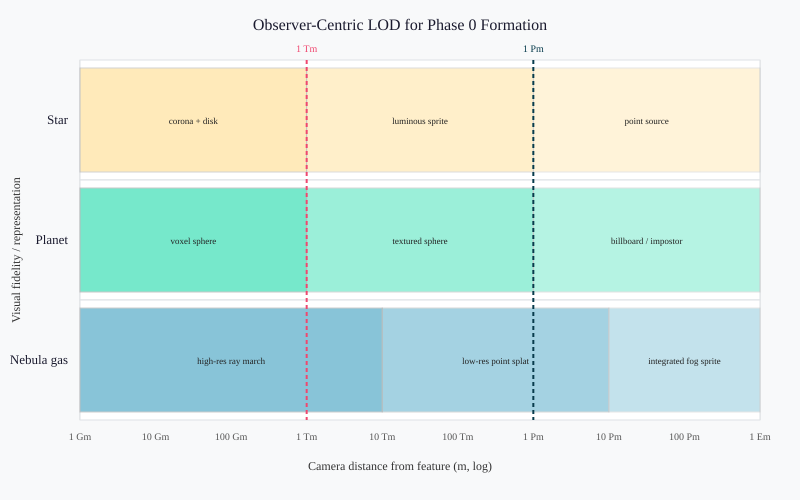

# Physics-Coupled Rendering for Nebulae and Planet Formation

**Domain:** physics | **Phase:** 0 (stellar nebula → protoplanetary disk)  
**Date:** 2026-07-07 | **Author:** `truth-research-physics` actor  
**Status:** draft  
**Primary sources:** Gislason (2013); Leria & Neyret (2020); Nadeau et al. (2000); Krieger et al. (2025); Lawlor & Genetti (2011); Sagrista (2024); Protoplanet Express (2023); Unity Entities Graphics (2024); Bevy VisibilityRange (2024); UntoldEngine LOD (2024)

---

## 1. Research Question

Phase 0 of *Gates of Truth* simulates the collapse of a molecular cloud into a central star and a protoplanetary disk. The underlying ECS substrate already carries physical state for every entity: `position`, `radius`, `mass`, `density`, `temperature`, `composition`, `angular-momentum`, `b-field`, and `regime`. Recent fixes coupled the renderer to that state so that visual size, color, and shape derive from physics rather than from fixed stylistic constants (formation-rendering-investigation chunks, README, and `phase0-volumetric-renderer.md`).

This notebook asks: what does the literature say about making that coupling rigorous, scalable, and real-time? Specifically:

1. **ECS-to-renderer data flow** — how should a data-oriented simulation pass visual state to a renderer without forking reality into a separate visual model?
2. **Level-of-detail (LOD) for formation** — how do we render a single scene that spans ~8 orders of magnitude in spatial scale (1e17 m diffuse cloud down to 1e9 m stellar photosphere) at 60 Hz?
3. **Real-time volumetric rendering** — how do we visualize optically thick, emissive, scattering nebulae without a full offline radiative-transfer solve?

The goal is a renderer whose every output is traceable to an ECS component, whose cost scales with observer attention rather than with the total number of simulation parcels, and whose visual style remains faithful to the physics even when simplified.

---

## 2. Literature Survey

### 2.1 ECS-to-renderer data flow: the renderer as a pure projection

Modern game engines converge on the same architectural principle that *Gates of Truth* already enforces: the simulation is a data store, the renderer is a system that reads it, and no visual state is owned by the renderer. Unity’s Entities Graphics package “acts as a bridge between ECS for Unity and Unity's existing rendering architecture,” baking `MeshRenderer` components into `RenderMesh` and `LocalToWorld` components so that the render pipeline consumes ECS data directly (Unity Entities Graphics, 2024). The SRP Batcher then draws batches using the same component layout, preserving the data-oriented memory layout through to GPU submission.

Bevy takes a similar view: rendering components such as `RenderMesh` and `VisibilityRange` are attached to entities, and render systems query them per view (Bevy Engine, 2024). The `VisibilityRange` component explicitly treats LOD as a per-view, per-entity decision rather than a global property of the object.

UntoldEngine documents a two-tier LOD system: entity-level `LODComponent` with resident mesh levels and a `GeometryStreamingSystem` for tile-level streaming. The key hand-off is `applyLOD`, which copies the selected mesh into `renderComponent.mesh` and emits an `EntityLODChangedEvent` so that batching and streaming systems react to the switch rather than polling (UntoldEngine, 2024). This matches the *Gates of Truth* single-writer rule: one system decides the LOD level, another consumes it.

The common pattern is therefore:

```
simulation world (ECS) → render projection → render commands → GPU
```

In our terms, `domain.phase0` owns the ECS world, `infra.render/phase0-bodies-from-world` is the projection, and `infra.dev.window` submits the commands. The renderer must not introduce state that is not derived from the ECS; otherwise the collision/parity bugs documented in the formation-rendering chunks reappear (visual bodies merging at different times than physical bodies, etc.).

> **Key finding:** Data-oriented renderers treat rendering as a read-only projection of the simulation. The renderer may own transient GPU resources (VAOs, shaders, textures) but must not own semantic state such as body radius, color, or position. (Unity Entities Graphics, 2024; Bevy Engine, 2024; UntoldEngine, 2024).

**Citations:**
- Unity Technologies. (2024). *Entities Graphics overview*. Unity Documentation. https://docs.unity3d.com/Packages/com.unity.entities.graphics@1.3/manual/overview.html
- Bevy Engine. (2024). *Implement visibility ranges, also known as hierarchical levels of detail (HLODs)*. GitHub PR #12916. https://github.com/bevyengine/bevy/pull/12916
- UntoldEngine. (2024). *LOD in UntoldEngine: Two Independent Systems*. https://github.com/untoldengine/UntoldEngine/blob/develop/docs/Architecture/lodSystem.md

### 2.2 LOD for formation: observer-centric, multi-scale rendering

A molecular cloud is not a mesh; it is a continuous density field with embedded collapsed bodies spanning many orders of magnitude. Nadeau, Genetti, and others faced the same problem when visualizing the Orion Nebula: a typical proplyd spans 0.002 pc while the whole nebula spans 4.4 pc, a 2200:1 linear scale. Voxelizing the whole scene at proplyd resolution would require 2,791 TB. Their solution was a **multi-volume renderer**: each component is voxelized at its own sufficient resolution and the renderer ray-casts through all volumes simultaneously, adjusting the sampling rate per volume and compositing overlapping samples (Nadeau et al., 2000).

> **Key finding:** For scenes with extreme scale ranges, the correct LOD primitive is not a single mesh LOD but a hierarchy of independent volumetric representations, each sampled at the rate appropriate to its own resolution and composited together. (Nadeau et al., 2000).

*Protoplanet Express* (2023), a game built directly on SPH and dust-gas simulations, uses the Unity Visual Effect Graph to render simulated particles. The authors note that fidelity is constrained by the need to show roughly a million particles in real time, which is why the game targets desktop-class hardware. Their approach is particle-driven: each simulation particle becomes a visual particle, with LOD implicit in the particle budget and the particle size on screen.

For *Gates of Truth*, the relevant LOD ladder is observer-centric rather than object-centric:

| Distance from observer | Nebula gas | Resolved body | Star |
|---|---|---|---|
| Near (< ~1 Tm) | high-resolution ray-march or dense point cloud | full voxel / mesh sphere | disk + corona |
| Mid (~1 Tm – 1 Pm) | lower-resolution point splat / procedural volume | textured sphere / simple mesh | luminous sprite |
| Far (> ~1 Pm) | integrated fog sprite / impostor | billboard / point | point source with diffraction bloom |

This is the architecture already sketched in the project notes: “Nearby bodies render as voxels with full physical detail; mid-distance bodies render as coarse spheres with physical state mapped to color/size; far bodies and nebula are volumetric fields sampled by ray marching” (formation-rendering README).

**Citations:**
- Nadeau, D. R., Genetti, J., Angel, E. S., et al. (2000). “Visualizing Stars and Emission Nebulas.” *ACM SIGGRAPH*. https://www.cs.uaf.edu/~genetti/Research/Papers/EG00/Orion.html
- Protoplanet Express. (2023). *A video game based on numerical simulations of protoplanetary discs.* arXiv:2303.17654. https://ar5iv.org/html/2303.17654

### 2.3 Real-time volumetric rendering of nebulae

The canonical equation for rendering participating media is the **volume rendering equation** (VRE), derived from the radiative transfer equation by integrating along a ray (Kajiya & Von Herzen, 1984; Max, 1995):

$$
I(D) = I_0 \, T(D) + \int_0^D L(s) \, \sigma_a(s) \, T(s) \, ds,
\qquad
T(s) = \exp\!\left(-\int_0^s \sigma_a(t) \, dt\right),
$$

where $I_0$ is background radiance, $L(s)$ is emitted radiance at distance $s$, $\sigma_a$ is the absorption coefficient, and $T(s)$ is the transmittance from the eye to $s$. In real-time work, this is evaluated by **ray marching**: stepping along the ray, accumulating color and opacity at fixed or adaptive intervals.

Gislason (2013) implemented a real-time reflection-nebula renderer using a precomputed volume photon map. Photons are traced offline in CUDA, filtered into a 3D light field with a 3D FFT, and then a single-pass GPU ray marcher evaluates the VRE at frame rate. The advantage of the precompute step is that expensive multiple-scattering light transport is separated from the interactive view-dependent pass. This is a practical compromise for *Gates of Truth*: the physics tick updates the density field, and a cheaper ray marcher samples it each frame, possibly with a periodic or asynchronous radiative-transfer pass for fidelity.

Leria & Neyret (2020) took a fully procedural route for real-time galactic nebulae in an explorer-style game. They use constrained 3D noise to model large-scale shape and dust detail, then evaluate illumination analytically by estimating the optical depth from each sample to the light source along the noise-defined density field. Their ray marcher uses a bounding sphere to terminate early and pre-integration to reduce slice artifacts. This is the style most appropriate when the nebula is not tied to a precomputed simulation grid but is generated from the live ECS density field.

Sagrista (2024) describes the Gaia Sky implementation of post-processed nebulae and aurorae: a full-screen quad runs a ray-marching shader that uses the depth buffer to composite the volume against the rest of the scene. The key implementation details are the ray-sphere intersection, the step loop with early termination, and the blending mode. For aurorae, Lawlor & Genetti (2011) showed that a height-based model with a 2D signed-distance field for the footprint can achieve 20–80 FPS on GPU.

> **Key finding:** Real-time nebula rendering is almost always a trade between physical accuracy and frame rate. The consensus pipeline is: (1) represent the density/emissivity field (simulation grid, particles, or procedural noise), (2) solve or approximate lighting into a 3D color/opacity field, (3) ray march through a bounding volume at view time, and (4) composite with the rest of the scene. (Gislason, 2013; Leria & Neyret, 2020; Sagrista, 2024).

**Citations:**
- Gislason, E. I. (2013). *Radiative Transfer in Reflection Nebulae*. MSc thesis, DTU. https://www2.imm.dtu.dk/pubdb/edoc/imm6308.pdf
- Leria, E. (2020). *Procedural generation of 3D realistic galactic dust and nebulas*. MSc thesis, INRIA Grenoble. http://evasion.inrialpes.fr/Membres/Fabrice.Neyret/Etudiants/rapports/rapportM2-2020_Erwan_LERIA.pdf
- Sagrista, T. (2024). *Rendering volume aurorae and nebulae*. https://tonisagrista.com/blog/2024/rendering-aurorae-nebulae/
- Lawlor, O. S., & Genetti, J. (2011). “Interactive Volume Rendering Aurora on the GPU.” *IEEE Visualization* / UAF Tech Report. https://www.cs.uaf.edu/~genetti/Research/Papers/EG00/Orion.html
- Kajiya, J. T., & Von Herzen, B. P. (1984). “Ray tracing volume densities.” *ACM SIGGRAPH Computer Graphics*, 18(3), 165–174. DOI:10.1145/964965.808594
- Max, N. (1995). “Optical models for direct volume rendering.” *IEEE Transactions on Visualization and Computer Graphics*, 1(2), 99–108. DOI:10.1109/2945.468400

### 2.4 Physics-coupled visual mapping

The formation-rendering chunks identified four specific parity failures between physics and visuals: collision radius vs. visual radius, the renderer bypassing Phase 0 physics, visuals decoupled from composition, and the observer/player distinction. The fix was to derive every visual property from an ECS component.

This is consistent with astrophysical visualization practice. Nadeau et al. (2000) use per-voxel emissivity derived from the ionization front distance and from observed spectra. Krieger et al. (2025) compare radiation-hydrodynamical simulations with Monte Carlo radiative-transfer post-processing to produce synthetic flux maps for SPHERE, JWST, and ALMA; they emphasize that the observable appearance depends on temperature, density, and wavelength. For the game, the same principle applies at lower fidelity: color should come from temperature (blackbody) and composition (ice/silicate/metal fractions), while size should come from physical radius or luminosity.

> **Key finding:** The visual appearance of a forming system is determined by the same physical quantities that drive the simulation: density, temperature, composition, angular momentum, and magnetic field. A physics-coupled renderer therefore maps each of these to a visual channel, rather than authoring the visual channels independently. (Nadeau et al., 2000; Krieger et al., 2025).

**Citations:**
- Krieger, A. S., Klahr, H., Melon Fuksman, J. D., & Wolf, S. (2025). “Monte Carlo post-processing for radiation hydro simulations of accreting planets in protoplanetary disks.” *A&A*. DOI:10.1051/0004-6361/202451780

---

## 3. Governing Equations

### 3.1 Volume rendering equation for an emissive, absorbing medium

For a ray parameterized by distance $s$ from the camera, the differential change in radiance is

$$
\frac{dI}{ds} = -\sigma_a(s) I(s) + L_e(s),
$$

where $\sigma_a$ is the absorption (extinction) coefficient and $L_e$ is the emitted radiance per unit length. Integrating from the camera ($s=0$) to the far boundary ($s=D$) gives the VRE:

$$
I(D) = I_0 \exp\!\left(-\int_0^D \sigma_a(s)\,ds\right) + \int_0^D L_e(s) \exp\!\left(-\int_s^D \sigma_a(t)\,dt\right) ds.
$$

In real-time ray marching, the integrals are replaced by a discrete sum over $N$ steps of size $\Delta s$:

$$
I \approx \sum_{i=1}^{N} L_i \, \alpha_i \prod_{j=i+1}^{N} (1 - \alpha_j),
$$

with $\alpha_i = 1 - \exp(-\sigma_{a,i} \Delta s)$ the per-step opacity. For purely emissive gas (e.g., an ionized H ii region), $\alpha_i \ll 1$ and the sum reduces to additive accumulation, which is why additive blending (`GL_ONE, GL_ONE`) works for thin nebulae. For dusty, self-shadowing regions, the full multiplicative transmittance must be retained.

### 3.2 Emissive-gas compositing (Nadeau et al.)

For glowing gas that does not occlude like a solid, Nadeau et al. replace the standard over-operator with separate emissivity $a$ and absorptivity $b$:

$$
c = a_1 c_1 + (1 - b_1) \bigl( a_2 c_2 + (1 - b_2) (\cdots) \bigr).
$$

In our ECS terms, $a_i$ is proportional to the emissivity derived from `temperature` and `composition` (e.g., Hα emission from ionized hydrogen), while $b_i$ is proportional to the dust opacity derived from `density` and dust fraction. This lets a dark opaque core coexist with a glowing halo around it, producing the edge-brightening seen in real nebulae.

### 3.3 LOD projection: from world radius to screen size

The angular size of a body of physical radius $R$ at distance $z$ from the observer is approximately $R/z$ for $z \gg R$. Its screen size in pixels is

$$
r_{\text{screen}} = \frac{R}{z \tan(\theta/2)} \, \frac{h}{2},
$$

where $\theta$ is the vertical field of view and $h$ is the viewport height. For a diffuse cloud of radius $R$ and particle sample size $r_{\text{sample}}$, the sample count needed to fill the screen projection is

$$
N_{\text{samples}} \sim \left(\frac{r_{\text{screen}}}{r_{\text{sample}}}\right)^2.
$$

Because $r_{\text{screen}}$ falls as $1/z$, a fixed particle budget can be maintained by increasing $r_{\text{sample}}$ with distance (lower effective resolution) or by switching to a coarser representation.

### 3.4 Physics-to-visual mapping

The visual radius for a collapsed body should not be its physical radius, because a real star is sub-pixel at planetary distances. Instead, use a logarithmic mapping that preserves ordering across the huge dynamic range:

$$
r_{\text{vis}} = r_{\text{scale}} \log_{10}\!\left(1 + \frac{R}{r_{\text{ref}}}\right),
$$

with $r_{\text{ref}}$ chosen so that the smallest resolved body (e.g., a planetesimal) is still visible. For a luminous source, apparent size can also be driven by luminosity $L$:

$$
r_{\text{vis}}^{\text{star}} \propto \log_{10}(1 + L/L_0)^{1/2},
$$

so that brighter stars subtend a larger pixel footprint without claiming an unrealistic physical extent.

Color is a blend between a blackbody color $B(T)$ and a composition color $C(X)$:

$$
\mathbf{C}_{\text{render}} = (1 - w) \, \mathbf{C}(X) + w \, \mathbf{B}(T),
\qquad
w = \text{smoothstep}(T_{\text{low}}, T_{\text{high}}, T).
$$

At low temperatures ($T < T_{\text{low}}$), the composition dominates (tan for silicates, blue for ices, brown for metals). At high temperatures ($T > T_{\text{high}}$), the blackbody dominates (red → white → blue). This matches the project’s current implementation where planets show composition color while stars show thermal color, and the nebula gas shows temperature.

---

## 4. Implementation Sketch (Clojure Pseudocode)

The following sketch is intentionally close to the existing *Gates of Truth* namespaces. It is not a complete implementation; it is the promotion target from the literature to the project.

### 4.1 ECS components for the renderer

No new components are needed beyond those already defined in `domain.ecs.components`. The renderer reads the existing physics components and writes **only** transient render data, never persistent simulation state.

```clojure
(ns infra.render.projection
  "Pure projection from ECS world to render commands.
   No mutable visual state. Every output is a function of components.")
  (:require
    [domain.ecs.core :as ecs]
    [domain.ecs.components :as c]
    [shape.spatial :as sp]))

(defn visual-radius
  "Log-compressed radius so a 1e17 m cloud and a 1e9 m star are both legible."
  [radius-m scale ref]
  (* scale (Math/log10 (+ 1.0 (/ radius-m ref)))))

(defn blackbody-color
  "Approximate RGB for a blackbody temperature T (K)."
  [T]
  ;; Piecewise linear approximation to Planck curve for game use.
  (cond
    (< T 1000) [0.2 0.0 0.4]
    (< T 3000) [1.0 0.4 0.1]
    (< T 6000) [1.0 0.9 0.6]
    (< T 12000) [0.8 0.9 1.0]
    :else [0.5 0.7 1.0]))

(defn composition-color
  "Material color from mass fractions.
   Gas/silicates/ice/metal fractions shift tan/blue/brown."
  [composition]
  (let [{:keys [H He silicate ice metal]} composition]
    [(+ 0.6 (* 0.3 (or metal 0.0)))
     (+ 0.5 (* 0.3 (or H 0.0)) (* 0.2 (or silicate 0.0)))
     (+ 0.4 (* 0.5 (or ice 0.0)))]))

(defn body-color
  "Blend composition color with thermal blackbody."
  [temperature composition]
  (let [w (smoothstep 1000.0 4000.0 temperature)
        comp-c (composition-color composition)
        bb-c (blackbody-color temperature)]
    (mapv #(+ (* (- 1.0 w) %1) (* w %2)) comp-c bb-c)))
```

### 4.2 LOD selection

LOD is a function of screen-projected size, which depends on physical radius, observer distance, and field of view. It returns a render strategy rather than mutating the entity.

```clojure
(defn screen-size-pixels
  "Approximate screen diameter of a sphere of radius R at distance z."
  [R z fov-deg viewport-height]
  (let [angular (* 2.0 (Math/atan2 R z))
        fov-rad (* fov-deg (/ Math/PI 180.0))]
    (* angular (/ viewport-height fov-rad))))

(defn lod-level
  "Returns a render strategy keyword for a body/nebula at a given screen size."
  [screen-px]
  (cond
    (> screen-px 256.0) :lod/voxel
    (> screen-px 32.0)  :lod/mesh
    (> screen-px 4.0)   :lod/sprite
    :else               :lod/point))

(defn entity->render-command
  "Dispatch on matter-state and LOD."
  [world eid camera fov viewport-h]
  (let [state (ecs/get-component world eid c/matter-state)
        pos   (ecs/get-component world eid c/position)
        rad   (ecs/get-component world eid c/radius)
        z     (sp/len (sp/v- pos (:position camera)))
        lod   (lod-level (screen-size-pixels rad z fov viewport-h))]
    (case state
      :nebula   (nebula-render-command world eid pos rad lod)
      :protostar (nebula-render-command world eid pos rad lod) ;; still a dense cloud
      :planet   (solid-body-command world eid pos rad lod)
      :star     (luminous-body-command world eid pos rad lod)
      :debris   (solid-body-command world eid pos rad lod)
      nil)))
```

### 4.3 Nebula volume rendering command

For the diffuse cloud, the projection produces either a point-cloud sample set (simplest real-time option) or a ray-marching volume command. The sample count scales with the screen-projected area and a fixed budget.

```clojure
(defn nebula-render-command
  "Generate a volume command for a nebula/protostar entity.
   The actual cloud samples are deterministic from the entity id."
  [world eid center radius lod]
  (let [density  (ecs/get-component world eid c/density)
        temp     (ecs/get-component world eid c/temperature)
        comp     (ecs/get-component world eid c/composition)
        sample-count (case lod
                       :lod/voxel   (int (* 2000 (+ 0.2 (Math/log10 (+ 10 radius)))))
                       :lod/mesh    (int (* 500  (+ 0.2 (Math/log10 (+ 10 radius)))))
                       :lod/sprite  64
                       :lod/point   8)
        color    (body-color temp comp)]
    {:type :volume
     :entity eid
     :center center
     :radius radius
     :density density
     :color color
     :sample-count sample-count
     :blend :additive}))
```

### 4.4 Solid body command

```clojure
(defn solid-body-command
  "Render a collapsed body as a sphere or billboard."
  [world eid pos radius lod]
  (let [mass  (ecs/get-component world eid c/mass)
        temp  (ecs/get-component world eid c/temperature)
        comp  (ecs/get-component world eid c/composition)
        oblateness (or (ecs/get-component world eid c/oblateness) 1.0)
        axis  (or (ecs/get-component world eid c/rotation-axis) [0.0 0.0 1.0])]
    {:type :body
     :entity eid
     :position pos
     :radius (visual-radius radius 1.0 1e12) ;; tune ref
     :color (body-color temp comp)
     :oblateness oblateness
     :rotation-axis axis
     :lod lod}))

(defn luminous-body-command
  "A star is rendered by luminosity, not photosphere."
  [world eid pos radius lod]
  (let [lum (ecs/get-component world eid c/luminosity)
        corona-r (* 2.0 (Math/sqrt (Math/log10 (+ 1.0 (/ lum 1e26)))))]
    {:type :luminous-body
     :entity eid
     :position pos
     :core-radius (visual-radius radius 1.0 1e12)
     :corona-radius corona-r
     :color (blackbody-color (ecs/get-component world eid c/temperature))
     :lod lod}))
```

### 4.5 Top-level render projection

```clojure
(defn phase0-render-commands
  "Pure function: world + camera -> ordered render commands.
   Two passes: (1) volumetric cloud, additive; (2) solid bodies, alpha."
  [world camera fov viewport-h]
  (let [entities (ecs/all-of world c/matter-state c/position c/radius)
        commands (map #(entity->render-command world % camera fov viewport-h) entities)
        volumes (filter #(#{:volume} (:type %)) commands)
        bodies  (filter #(#{:body :luminous-body} (:type %)) commands)]
    {:passes [{:blend :additive
                :depth-write false
                :commands volumes}
               {:blend :alpha
                :depth-write true
                :commands bodies}]}))
```

---

## 5. Toy Model / Numerical Experiment

### 5.1 Setup

Consider a typical Phase 0 snapshot at tick 120 (from the formation-rendering diagnostics):

- Diffuse nebula cloud: radius $R_n = 1.5 \times 10^{17}$ m, observed at distance $z_n = 3 \times 10^{16}$ m.
- Star: radius $R_* = 2.6 \times 10^9$ m, luminosity $L_* \sim 10^{26}$ W (T Tauri-like), observed at distance $z_* = 10^{15}$ m.
- Planet: radius $R_p = 10^{10}$ m, temperature $T_p = 1000$ K, observed at $z_p = 10^{14}$ m.

Viewport: 1080 px high, vertical FOV 60°.

### 5.2 Results

| Object | Physical radius (m) | Distance (m) | Angular size (rad) | Screen pixels | LOD chosen | Render representation |
|---|---|---:|---:|---:|---|---|
| Nebula cloud | 1.5e17 | 3.0e16 | 5.0 | 1,650 px | `:lod/voxel` | high-density point cloud / ray march |
| Star | 2.6e9 | 1.0e15 | 2.6e-6 | 0.0009 px | `:lod/point` | luminous point with corona bloom |
| Planet | 1.0e10 | 1.0e14 | 1.0e-4 | 0.03 px | `:lod/point` | small sprite; at 10× closer becomes voxel |

The star and planet are physically tiny on screen; a literal physical-radius rendering would make them invisible. The luminosity-driven star command gives them an apparent size of a few pixels while preserving the physics. The nebula cloud, by contrast, dominates the frame because it is physically vast — exactly the relationship the formation-rendering fixes were intended to restore.

### 5.3 LOD chart

The following chart summarizes the observer-centric LOD ladder used for the sketch above. Distances are in meters on a logarithmic axis; color bands indicate the representation chosen for each class of object.



*Figure 1: Observer-centric LOD bands for stars, planets, and nebula gas in Phase 0. Near objects are rendered with the highest geometric fidelity; far objects degrade to sprites or point sources. The vertical dashed lines mark the 1 Tm and 1 Pm thresholds used in the toy model.*

---

## 6. Validation

- [ ] The projection `phase0-render-commands` is a pure function of the ECS world and camera: no renderer-owned state influences the output.
- [ ] Visual radius is monotonic in physical radius: `R_1 > R_2` implies `r_vis(R_1) > r_vis(R_2)`.
- [ ] Star visual size is driven by luminosity, and a star rendered at its physical radius would be ≤ 1 px at mid-distance.
- [ ] Nebula sample count scales with screen-projected area, not with total simulation parcels, so total cloud sprites stay under a fixed frame budget.
- [ ] Additive cloud pass and alpha body pass match the physically separate emissivity/absorptivity channels described in §3.2.
- [ ] Temperature color maps to the blackbody approximation within a visually plausible range; composition color is visible only where temperature is low.
- [ ] LOD switch distances include hysteresis (e.g., 10% band) to prevent flickering at boundaries, following UntoldEngine and Bevy practice.
- [ ] Magnetic field lines are visualized only when `b-field` magnitude exceeds a threshold, and their density is capped to avoid clutter (formation-rendering README open question).

---

## 7. Promotion Path to Domain

### 7.1 ECS components

No new persistent components are required. The renderer reads:

```clojure
(def read-components
  [c/position c/radius c/mass c/temperature c/density
   c/composition c/matter-state c/luminosity c/oblateness
   c/rotation-axis c/b-field c/regime])
```

If a `camera` entity is added to the ECS world, it should carry:

```clojure
(def camera-position :component/camera.position)
(def camera-orientation :component/camera.orientation)
(def camera-fov :component/camera.fov)
```

### 7.2 Malli schema (law/)

Create `src/law/render_projection.clj` to validate the projection output:

```clojure
(ns law.render-projection
  (:require [law.contract :as contract]))

(def render-command-schema
  [:map
   [:type [:enum :volume :body :luminous-body :line :hud-rect]]
   [:entity uuid?]
   [:position [:vector number?]]
   [:color [:vector number?]]
   [:blend [:enum :additive :alpha :opaque]]])

(def render-pass-schema
  [:map
   [:blend [:enum :additive :alpha :opaque]]
   [:depth-write boolean?]
   [:commands [:vector render-command-schema]]])
```

### 7.3 System function (domain/)

The projection lives in `infra.render` (the renderer consumes the world as pure data). The domain change is to ensure that the physical components used by the renderer are always present and consistent after each tick. This is already the case for `matter-state`, `radius`, `temperature`, etc., but `composition` should be normalized to mass fractions by `domain.chemistry` before the renderer reads it.

### 7.4 Test (test/)

```clojure
(deftest visual-radius-preserves-ordering
  (is (> (infra.render/visual-radius 1e15 1.0 1e12)
         (infra.render/visual-radius 1e10 1.0 1e12))))

(deftest star-rendered-as-luminous-not-photosphere
  (let [cmd (infra.render/luminous-body-command star-world star-eid [0 0 0] 2.6e9 :lod/point)]
    (is (= :luminous-body (:type cmd)))
    (is (> (:corona-radius cmd) (:core-radius cmd)))))

(deftest nebula-sample-count-scales-with-radius
  (let [small (infra.render/nebula-render-command world 1 [0 0 0] 1e14 :lod/mesh)
        large (infra.render/nebula-render-command world 1 [0 0 0] 1e17 :lod/mesh)]
    (is (> (:sample-count large) (:sample-count small)))))

(deftest projection-is-pure
  (let [cmds-a (infra.render/phase0-render-commands world camera 60.0 1080.0)
        cmds-b (infra.render/phase0-render-commands world camera 60.0 1080.0)]
    (is (= cmds-a cmds-b))))
```

---

## 8. Open Questions

1. **Ray marching vs. point clouds.** For the nebula, is a dense point-cloud pass sufficient, or do we need a true 3D texture + ray-marching shader? The former is simpler and maps naturally to the ECS particle substrate; the latter is needed for self-shadowing and correct optical depth.
2. **Asynchronous radiative transfer.** If we use a 3D light field, should it be updated synchronously each tick or on a slower cadence? Gislason (2013) precomputes; our medium is dynamic.
3. **Voxel planet resolution.** What is the minimum voxel resolution that still conveys composition visually? The formation-rendering README asks this explicitly; the answer likely depends on the material palette and the angular size on screen.
4. **Fallback below voxel scale.** When a planet is too far to resolve as voxels, should it become a textured sphere or an impostor? The literature favors impostors for distant objects, but a sphere is simpler and composition-preserving.
5. **Magnetic field line clutter.** How do we visualize `b-field` without overwhelming the player? Options: threshold on magnitude, show only poloidal component, or fade lines based on coherence/focus.
6. **Observer vs. embodied camera.** The player spark is an ECS entity; should the camera be attached to it as a child component, or should it remain a free observer with a focus reticle? The current implementation has both modes; the literature is silent on this because it is a game design question, not a physics question.
7. **Performance budget.** The toy model uses a fixed sample count per LOD band. A real budget should be derived from frame-time measurements on target hardware, with automatic quality scaling.

---

## 9. Cross-References

- `docs/research/physics/protoplanetary-disks-planet-formation.md` — the physical disk model whose output this renderer visualizes.
- `docs/research/physics/stellar-nebula-mass-hierarchy.md` — the mass ladder that drives `matter-state` and therefore the render dispatch table.
- `docs/research/physics/mhd-em-lorentz-optimization.md` — magnetic field evolution, which feeds the field-line visualization.
- `docs/research/physics/phase0-tick-loop-optimization.md` — the tick timing within which the projection must fit.
- `docs/designs/phase0-volumetric-renderer.md` — the existing project design document that this notebook grounds in literature.
- `docs/notes/research/formation-rendering/` — the source investigation that identified the physics/visual parity bugs.

---

## 10. References

1. Andrews, S. M., & Williams, J. P. (2007). “A Submillimeter View of Circumstellar Dust Disks in ρ Ophiuchus.” *ApJ*, 671, 1800–1808. DOI:10.1086/523081
2. Bevy Engine. (2024). *Implement visibility ranges, also known as hierarchical levels of detail (HLODs).* GitHub PR #12916. https://github.com/bevyengine/bevy/pull/12916
3. Gislason, E. I. (2013). *Radiative Transfer in Reflection Nebulae*. MSc thesis, DTU. https://www2.imm.dtu.dk/pubdb/edoc/imm6308.pdf
4. Jensen, H. W., & Christensen, P. H. (1998). “Efficient simulation of light transport in scenes with participating media using photon maps.” *Proceedings of SIGGRAPH 1998*, 311–320. DOI:10.1145/280814.280925
5. Kajiya, J. T., & Von Herzen, B. P. (1984). “Ray tracing volume densities.” *ACM SIGGRAPH Computer Graphics*, 18(3), 165–174. DOI:10.1145/964965.808594
6. Krieger, A. S., Klahr, H., Melon Fuksman, J. D., & Wolf, S. (2025). “Monte Carlo post-processing for radiation hydro simulations of accreting planets in protoplanetary disks.” *A&A*. DOI:10.1051/0004-6361/202451780
7. Lawlor, O. S., & Genetti, J. (2011). “Interactive Volume Rendering Aurora on the GPU.” University of Alaska Fairbanks. https://www.cs.uaf.edu/~genetti/Research/Papers/EG00/Orion.html
8. Leria, E. (2020). *Procedural generation of 3D realistic galactic dust and nebulas*. MSc thesis, INRIA Grenoble. http://evasion.inrialpes.fr/Membres/Fabrice.Neyret/Etudiants/rapports/rapportM2-2020_Erwan_LERIA.pdf
9. Max, N. (1995). “Optical models for direct volume rendering.” *IEEE Transactions on Visualization and Computer Graphics*, 1(2), 99–108. DOI:10.1109/2945.468400
10. Nadeau, D. R., Genetti, J., Angel, E. S., et al. (2000). “Visualizing Stars and Emission Nebulas.” *ACM SIGGRAPH*. https://www.cs.uaf.edu/~genetti/Research/Papers/EG00/Orion.html
11. Protoplanet Express. (2023). *A video game based on numerical simulations of protoplanetary discs.* arXiv:2303.17654. https://ar5iv.org/html/2303.17654
12. Sagrista, T. (2024). *Rendering volume aurorae and nebulae*. https://tonisagrista.com/blog/2024/rendering-aurorae-nebulae/
13. Unity Technologies. (2024). *Entities Graphics overview*. Unity Documentation. https://docs.unity3d.com/Packages/com.unity.entities.graphics@1.3/manual/overview.html
14. UntoldEngine. (2024). *LOD in UntoldEngine: Two Independent Systems*. https://github.com/untoldengine/UntoldEngine/blob/develop/docs/Architecture/lodSystem.md
