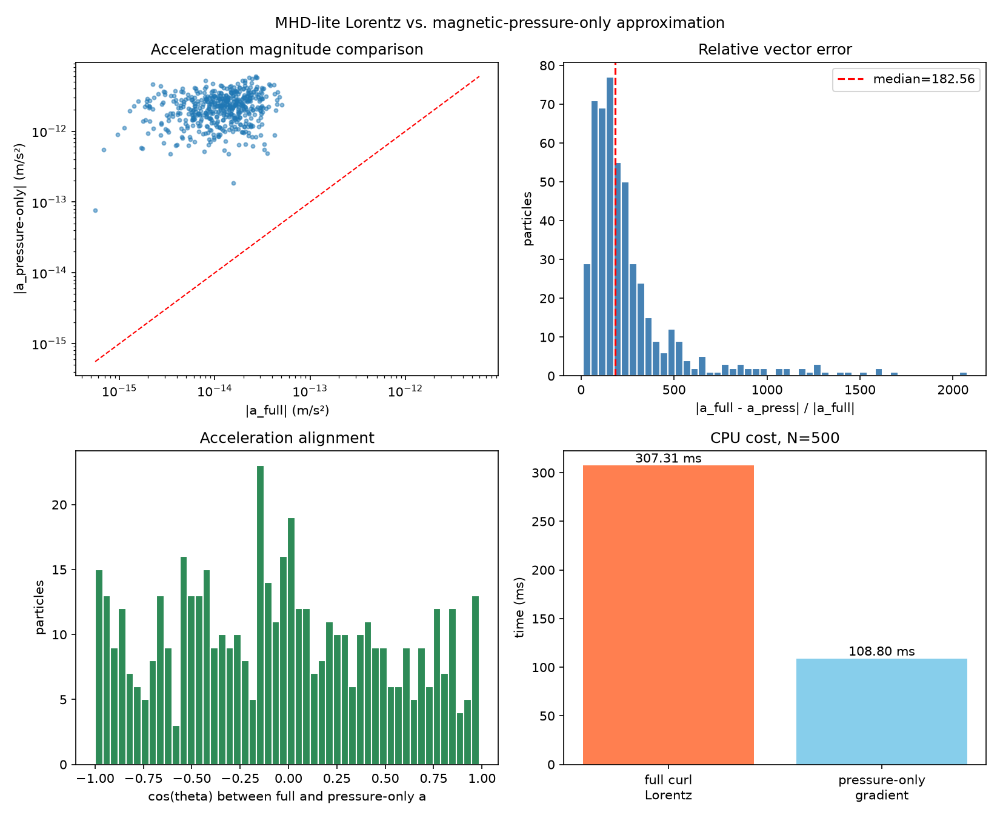

# MHD-lite Lorentz Force and Magnetic-Braking Optimization for N-body Clumps

**Domain:** physics | **Phase:** 0  
**Date:** 2026-07-01 | **Author:** truth-research-physics (agent)  
**Status:** draft  
**Primary sources:** Price & Monaghan (2004a,b, 2005), Price (2012), Tricco (2023), Tricco & Price (2012, 2016), Wurster et al. (2014, 2021), Dedner et al. (2002), Powell et al. (1999), Tóth (2000), Basu & Mouschovias (1994, 1995), Allen, Li & Shu (2003), Mellon & Li (2008, 2009), Hennebelle & Fromang (2008), McKee & Ostriker (2007).

---

## 1. Research Question

`domain.em` already implements an MHD-lite layer for Phase 0: each resolved clump carries a single magnetic-field vector `c/b-field`, and the Lorentz force is estimated with an SPH-like curl over nearest neighbours. The current implementation is correct but expensive for the target budget (N ≈ 500 clumps, 60 Hz tick, pure Clojure/JVM). We need to answer:

1. What is the cheapest physically defensible MHD-lite model that still captures **magnetic braking** and **flux freezing**?
2. How should the Lorentz-force / curl computation be optimized on the existing N-body/SPH substrate: reuse of neighbour lists and kernel gradients, symmetry in pair loops, scalar vs vector accumulation?
3. At N ≈ 500, can EM be **sub-cycled or decoupled** from hydro? Is a **magnetic-pressure-only** or **Alfvén-limit** model sufficient, and under what thresholds?
4. What is the promotion path to `src/domain/em.clj`, `src/domain/hydro.clj`, `law/`, and tests?

This notebook is research-only; no `src/` or `test/` files are modified.

---

## 2. Literature Survey

### 2.1 SPH MHD: from tensile instability to stable SPMHD

Smoothed Particle Magnetohydrodynamics (SPMHD) was first formulated by extending SPH to the ideal MHD equations, but early implementations suffered from the **tensile instability** when magnetic pressure dominated thermal pressure (Phillips & Monaghan 1985; Morris 1996). Price & Monaghan (2004a) derived a stable, conservative SPMHD formalism in one dimension, with guaranteed positive-definite dissipation; the companion paper (Price & Monaghan 2004b) grounded the method in a variational principle, including variable smoothing-length terms. Price & Monaghan (2005) extended the scheme to multiple dimensions and addressed the $\nabla \cdot \mathbf{B}=0$ constraint.

> **Key finding:** Stable SPMHD requires both an antisymmetric momentum equation *and* an induction equation that preserves the divergence-free condition; omitting either produces the tensile instability or spurious monopoles (Price & Monaghan 2004a,b; Price 2012).

Price (2012) gives the canonical review of SPH and SPMHD, emphasizing that the magnetic acceleration should be written in the form that conserves linear and angular momentum exactly, and that the curl and divergence operators must be **conjugate** if divergence cleaning is used. Tricco (2023) reviews the modern SPMHD state of the union, concluding that the three pillars are: a time-evolution method for $\mathbf{B}$, a force prescription, and a divergence-control method.

**Citations**
- Price, D. J., & Monaghan, J. J. (2004a). Smoothed Particle Magnetohydrodynamics — I. Algorithm and tests in one dimension. *MNRAS*, 348, 123. DOI: [10.1111/j.1365-2966.2004.07345.x](https://doi.org/10.1111/j.1365-2966.2004.07345.x)
- Price, D. J., & Monaghan, J. J. (2004b). Smoothed Particle Magnetohydrodynamics — II. Variational principles and variable smoothing-length terms. *MNRAS*, 348, 139. DOI: [10.1111/j.1365-2966.2004.07346.x](https://doi.org/10.1111/j.1365-2966.2004.07346.x)
- Price, D. J., & Monaghan, J. J. (2005). Smoothed Particle Magnetohydrodynamics — III. Multidimensional tests and the $\nabla\cdot\mathbf{B}=0$ constraint. *MNRAS*, 364, 384. DOI: [10.1111/j.1365-2966.2005.09576.x](https://doi.org/10.1111/j.1365-2966.2005.09576.x)
- Price, D. J. (2012). Smoothed particle hydrodynamics and magnetohydrodynamics. *J. Comput. Phys.*, 231, 759–794. DOI: [10.1016/j.jcp.2010.12.011](https://doi.org/10.1016/j.jcp.2010.12.011); arXiv:[1012.1885](https://arxiv.org/abs/1012.1885)
- Tricco, T. S. (2023). Smoothed particle magnetohydrodynamics. *Frontiers in Astronomy and Space Sciences*. arXiv:[2311.13666](https://arxiv.org/abs/2311.13666)

### 2.2 Divergence control: constrained transport, vector potential, and cleaning

Grid MHD codes control $\nabla\cdot\mathbf{B}$ with **constrained transport** (Evans & Hawley 1988; Gardiner & Stone 2005; Mocz et al. 2016), which keeps the divergence exactly zero to machine precision by staggering the magnetic field on cell faces. In particle methods, face staggering is not natural, so SPMHD has explored three routes:

1. **Vector potential** $\mathbf{A}$: evolving $\mathbf{B}=\nabla\times\mathbf{A}$ enforces zero divergence by construction. Price (2010) implemented Euler potentials in SPMHD, but the formulation proved numerically unstable; Tricco & Price (2023) later tried an integral-based vector-potential discretisation and concluded it was non-viable for SPMHD.
2. **Divergence cleaning**: Dedner et al. (2002) introduced hyperbolic/parabolic cleaning, propagating and damping divergence errors at a cleaning speed $c_h$. Powell et al. (1999) used the eight-wave formulation to advect errors away, but this is not conservative. Tricco & Price (2012) derived a **constrained** hyperbolic cleaning that conserves energy by evolving $\psi/c_h$ and using conjugate divergence and gradient operators; Tricco, Price & Bate (2016) extended it to variable cleaning speeds. Steinwandel & Price (2026) show that accurate cleaning is essential for magnetic-field amplification in low-density, poorly resolved cluster outskirts.
3. **Projection methods**: Tsukamoto (2026) recently proposed an adjoint projection method that solves an elliptic projection problem with the same discrete divergence operator; it reduces $\nabla\cdot\mathbf{B}$ to round-off at a cost of 1–10% of the SPMHD update.

For N ≈ 500 clumps, **constrained transport is overkill** (no face grid) and **vector potential is currently non-viable**. The cheapest viable option is a lightweight divergence-cleaning or Powell-style advection term, or simply monitoring the normalized divergence error and rejecting runs where it grows. At this resolution, the curl estimate itself is noisy; divergence cleaning cannot fix missing physics, only suppress the worst numerical artifacts.

**Citations**
- Evans, C. R., & Hawley, J. F. (1988). Simulation of magnetohydrodynamic flows — a constrained transport method. *ApJ*, 332, 659. DOI: [10.1086/166684](https://doi.org/10.1086/166684)
- Gardiner, T. A., & Stone, J. M. (2005). An unsplit Godunov method for ideal MHD via constrained transport. *J. Comput. Phys.*, 205, 509. DOI: [10.1016/j.jcp.2004.11.016](https://doi.org/10.1016/j.jcp.2004.11.016)
- Mocz, P., et al. (2016). A constrained transport scheme for MHD on unstructured moving meshes. *MNRAS*, 471, L29. DOI: [10.1093/mnrasl/slx083](https://doi.org/10.1093/mnrasl/slx083)
- Dedner, A., Kemm, F., Kröner, D., Munz, C.-D., Schnitzer, T., & Wesenberg, M. (2002). Hyperbolic divergence cleaning for the MHD equations. *J. Comput. Phys.*, 175, 645. DOI: [10.1006/jcph.2001.6961](https://doi.org/10.1006/jcph.2001.6961)
- Powell, K. G., Roe, P. L., Linde, T. J., Gombosi, T. I., & De Zeeuw, D. L. (1999). A solution-adaptive upwind scheme for ideal magnetohydrodynamics. *J. Comput. Phys.*, 154, 284. DOI: [10.1006/jcph.1999.6299](https://doi.org/10.1006/jcph.1999.6299)
- Tóth, G. (2000). The $\nabla\cdot\mathbf{B}=0$ constraint in shock-capturing MHD codes. *J. Comput. Phys.*, 161, 605. DOI: [10.1006/jcph.2000.6519](https://doi.org/10.1006/jcph.2000.6519)
- Price, D. J. (2010). Smoothed particle magnetohydrodynamics — IV. Using the vector potential. *MNRAS*, 401, 1475. DOI: [10.1111/j.1365-2966.2009.15763.x](https://doi.org/10.1111/j.1365-2966.2009.15763.x)
- Tricco, T. S., & Price, D. J. (2012). Constrained hyperbolic divergence cleaning for smoothed particle magnetohydrodynamics. *J. Comput. Phys.*, 231, 7214. DOI: [10.1016/j.jcp.2012.06.039](https://doi.org/10.1016/j.jcp.2012.06.039); arXiv:[1206.6159](https://arxiv.org/abs/1206.6159)
- Tricco, T. S., Price, D. J., & Bate, M. R. (2016). Constrained hyperbolic divergence cleaning in smoothed particle magnetohydrodynamics with variable cleaning speeds. *J. Comput. Phys.*, 322, 326. DOI: [10.1016/j.jcp.2016.06.053](https://doi.org/10.1016/j.jcp.2016.06.053); arXiv:[1607.02394](https://arxiv.org/abs/1607.02394)
- Tricco, T. S., & Price, D. J. (2023). An integral-based approach for the vector potential in smoothed particle magnetohydrodynamics. arXiv:[2306.15039](https://arxiv.org/abs/2306.15039)
- Steinwandel, U. P., & Price, D. J. (2026). Improving divergence cleaning in cosmological SPMHD simulations. *MNRAS* (accepted). arXiv:[2511.19615](https://arxiv.org/abs/2511.19615)
- Tsukamoto, Y. (2026). An adjoint projection formulation for enforcing the divergence-free constraint in smoothed particle magnetohydrodynamics. arXiv:[2606.28197](https://arxiv.org/abs/2606.28197)

### 2.3 Magnetic pressure support, ambipolar diffusion, and magnetic braking

Magnetic fields influence star formation in three ways: **pressure support** (stabilizing sub-critical clumps), **magnetic braking** (transporting angular momentum outward along field lines), and **ambipolar diffusion** (decoupling neutrals from ions, allowing flux to slip). The classic analytic work of Mouschovias (1976, 1991) and Basu & Mouschovias (1994, 1995) established that magnetic braking operates on a characteristic timescale set by the Alfvén crossing time of the cloud and that ambipolar diffusion sets the rate at which cores become super-critical.

In ideal MHD, magnetic braking is so efficient that it suppresses the formation of rotationally supported disks (the “magnetic braking catastrophe”; Allen, Li & Shu 2003; Mellon & Li 2008). Non-ideal effects — Ohmic resistivity, ambipolar diffusion, and the Hall effect — are required to form realistic protostellar disks (Mellon & Li 2009; Hennebelle & Fromang 2008; Wurster, Bate & Bonnell 2021). Wurster, Price & Ayliffe (2014) implemented ambipolar diffusion in SPMHD and showed that it reduces maximum field strengths by an order of magnitude during the first-core phase.

> **Key finding:** Magnetic braking is the dominant angular-momentum transport mechanism in collapsing magnetized cores; omitting it removes the physical reason cores spin slowly. At the same time, a pure ideal-MHD model over-brakes and prevents disk formation, so a **non-ideal proxy** (even a phenomenological one) is needed to capture the right qualitative outcome (Mellon & Li 2008, 2009; Wurster et al. 2021).

**Citations**
- Mouschovias, T. Ch. (1976). Nonhomologous contraction and equilibria of self-gravitating, magnetic interstellar clouds. *ApJ*, 210, 326. DOI: [10.1086/154835](https://doi.org/10.1086/154835)
- Mouschovias, T. Ch. (1991). Magnetic braking, ambipolar diffusion, cloud cores, and star formation — natural length scales and protostellar masses. *ApJ*, 373, 169. DOI: [10.1086/170035](https://doi.org/10.1086/170035)
- Basu, S., & Mouschovias, T. Ch. (1994). Magnetic braking, ambipolar diffusion, and the formation of cloud cores and protostars. I. Axisymmetric solutions. *ApJ*, 432, 720. DOI: [10.1086/174611](https://doi.org/10.1086/174611)
- Basu, S., & Mouschovias, T. Ch. (1995). Magnetic braking, ambipolar diffusion, and the formation of cloud cores and protostars. II. A parameter study. *ApJ*, 452, 386. DOI: [10.1086/176310](https://doi.org/10.1086/176310)
- Allen, A., Li, Z.-Y., & Shu, F. H. (2003). Collapse of magnetized singular isothermal toroids. II. Rotation and magnetic braking. *ApJ*, 599, 363. DOI: [10.1086/379243](https://doi.org/10.1086/379243)
- Mellon, R. R., & Li, Z.-Y. (2008). Magnetic braking and protostellar disk formation: the ideal MHD limit. *ApJ*, 681, 1356. DOI: [10.1086/587542](https://doi.org/10.1086/587542)
- Mellon, R. R., & Li, Z.-Y. (2009). Magnetic braking and protostellar disk formation: ambipolar diffusion. *ApJ*, 698, 922. DOI: [10.1088/0004-637x/698/1/922](https://doi.org/10.1088/0004-637x/698/1/922)
- Hennebelle, P., & Fromang, S. (2008). Magnetic processes in a collapsing dense core. I. Accretion and ejection. *A&A*, 477, 9. DOI: [10.1051/0004-6361:20078309](https://doi.org/10.1051/0004-6361:20078309)
- Wurster, J., Price, D. J., & Ayliffe, B. A. (2014). Ambipolar diffusion in smoothed particle magnetohydrodynamics. *MNRAS*, 444, 1104. DOI: [10.1093/mnras/stu1524](https://doi.org/10.1093/mnras/stu1524); arXiv:[1408.1807](https://arxiv.org/abs/1408.1807)
- Wurster, J., Bate, M. R., & Bonnell, I. A. (2021). The impact of non-ideal magnetohydrodynamic processes on discs, outflows, counter-rotation and magnetic walls during the early stages of star formation. *MNRAS*, 506, 1759. DOI: [10.1093/mnras/stab2296](https://doi.org/10.1093/mnras/stab2296); arXiv:[2108.02787](https://arxiv.org/abs/2108.02787)
- McKee, C. F., & Ostriker, E. C. (2007). Theory of star formation. *ARA&A*, 45, 565. DOI: [10.1146/annurev.astro.45.051806.110602](https://doi.org/10.1146/annurev.astro.45.051806.110602)

---

## 3. Governing Equations

We work in SI units, consistent with `law.field`. The ideal MHD equations on the Lagrangian clump substrate are:

$$
\frac{d\rho}{dt} = -\rho \nabla\cdot\mathbf{v}, \qquad
\rho \frac{d\mathbf{v}}{dt} = -\nabla p + \frac{1}{\mu_0}(\nabla\times\mathbf{B})\times\mathbf{B} + \rho\mathbf{g},
$$

$$
\frac{d\mathbf{B}}{dt} = (\mathbf{B}\cdot\nabla)\mathbf{v} - \mathbf{B}(\nabla\cdot\mathbf{v}) - \nabla\times(\eta\nabla\times\mathbf{B}), \qquad
\nabla\cdot\mathbf{B}=0.
$$

The Lorentz force density is often split into magnetic pressure and tension:

$$
\mathbf{f}_L = \frac{1}{\mu_0}(\nabla\times\mathbf{B})\times\mathbf{B}
= -\nabla\left(\frac{B^2}{2\mu_0}\right) + \frac{1}{\mu_0}(\mathbf{B}\cdot\nabla)\mathbf{B}.
$$

For a single clump, the SPH curl estimate used in `domain.em` is

$$
(\nabla\times\mathbf{B})_i = \sum_j \frac{m_j}{\rho_j} (\mathbf{B}_i - \mathbf{B}_j) \times \nabla_i W_{ij},
$$

with $\nabla_i W_{ij}$ the kernel gradient returned by `hydro/kernel-gradient`. The Lorentz acceleration is then

$$
\mathbf{a}_i = \frac{1}{\mu_0 \rho_i} (\nabla\times\mathbf{B})_i \times \mathbf{B}_i.
$$

Magnetic braking extracts angular momentum at a rate controlled by the Alfvén crossing time. A phenomenological torque rate per unit volume is

$$
\frac{d\mathbf{L}}{dt} \sim -\frac{B^2}{\mu_0 \sqrt{\rho}}\, R^3 \, \omega \, \hat{\mathbf{L}},
$$

which is the form currently used in `domain.em/magnetic-braking-torque`. Flux freezing under spherical compression gives

$$
\mathbf{B}' = \mathbf{B} \left(\frac{\rho'}{\rho}\right)^{2/3}
\quad\text{or}\quad
\mathbf{B}' = \mathbf{B} \left(\frac{\rho'}{\rho}\right)
$$

for isotropic contraction and collapse along field lines, respectively; `domain.em/flux-freeze` already interpolates between these with an anisotropy parameter.

Ambipolar diffusion adds a drift between neutrals and ions. In the strong-coupling, single-fluid limit (Wurster et al. 2014),

$$
\frac{\partial \mathbf{B}}{\partial t}\bigg|_{\rm AD}
= \nabla\times\left[ \mathbf{v}\times\mathbf{B} - \frac{\gamma_{\rm AD}\rho_i}{\rho_n^2}(\nabla\times\mathbf{B})\times\mathbf{B}\times\mathbf{B} \right],
$$

which at clump resolution reduces to a phenomenological decay

$$
\frac{d\mathbf{B}}{dt} = -\frac{\eta_{\rm eff}}{R^2}\,\mathbf{B},
\qquad \eta_{\rm eff} \sim \frac{B^2}{\gamma_{\rm AD} \rho_i \rho_n}.
$$

The code’s `resistive-decay` already provides this hook with a fixed $\eta$ and a per-tick floor.

### 3.1 Dimensionless thresholds for turning EM on/off

At N ≈ 500 we cannot resolve internal field geometry. The decision to compute the full curl should be governed by local dimensionless numbers already tracked by the regime classifier:

- **Plasma beta** $\beta = 2\mu_0 p / B^2$. If $\beta \gg 1$, magnetic forces are negligible; skip the curl.
- **Alfvén Mach number** $\mathcal{M}_A = v / v_A$ with $v_A = B/\sqrt{\mu_0 \rho}$. If $\mathcal{M}_A \gg 1$, the flow dominates; a magnetic-pressure-only term is sufficient (if anything).
- **Mass-to-flux ratio** normalized to the critical value: $(M/\Phi)/(M/\Phi)_{\rm crit} \lesssim 1$ means magnetic support is dynamically important (Basu & Mouschovias 1994).
- **Resolution criterion**: the clump radius $R$ should contain at least a few neighbours within $2R$ to estimate $\nabla\times\mathbf{B}$; otherwise the curl is noise.

These thresholds let the system fall back to zero Lorentz force, magnetic-pressure-only, or full curl depending on local physics — exactly the kind of LOD-style optimisation appropriate for Phase 0.

---

## 4. Optimization of the SPH Curl and Lorentz Force

The current `domain.em/em-system` and `lorentz-acceleration-system` build a fresh neighbour list for every clump. The hydro system already pays the cost of a spatial query and computes $\nabla_i W_{ij}$ for the pressure gradient. The following optimisations are standard in SPMHD and map directly to our ECS substrate.

### 4.1 Re-use neighbour lists and kernel gradients from hydro

`domain.hydro/pressure-gradient-acceleration` and `domain.em/curl-estimate` both loop over the same neighbours within $h \approx 2R$. If the two passes are merged into a single **pair loop**, each pair contributes:

- hydro: $-m_j (P_i/\rho_i^2 + P_j/\rho_j^2) \nabla_i W_{ij}$ to both accelerations (antisymmetric);
- EM: $\frac{m_j}{\rho_j} (\mathbf{B}_i - \mathbf{B}_j) \times \nabla_i W_{ij}$ to the curl of particle $i$, and the symmetric term to particle $j$.

The kernel-gradient vector $\nabla_i W_{ij}$ is computed once and reused. Because the gradient is anti-symmetric ($\nabla_j W_{ji} = -\nabla_i W_{ij}$), the hydro force is automatically momentum-conserving; the curl is *not* automatically symmetric but the Lorentz force $(\nabla\times\mathbf{B})\times\mathbf{B}$ remains Galilean invariant when the full SPMHD formulation is used (Price 2012).

### 4.2 Symmetry in the pair loop

For the hydro term, accumulating into both particles in one pass halves the number of kernel-gradient evaluations. The curl is trickier because it is a *difference* estimate. A symmetric SPH curl can be written as

$$
(\nabla\times\mathbf{B})_i = \sum_j m_j \left( \frac{\mathbf{B}_i}{\rho_i^2} + \frac{\mathbf{B}_j}{\rho_j^2} \right) \times \nabla_i W_{ij},
$$

which is the form that follows from the variational SPMHD equations (Price & Monaghan 2004b; Price 2012). It allows both curl contributions to be accumulated in one symmetric pass, at the cost of an extra $\rho^{-2}$ factor.

### 4.3 Scalar vs vector accumulation

The pressure gradient accumulates a scalar factor times the shared gradient vector. The curl accumulates a cross product. On the JVM, vector allocations inside the hot loop are expensive. The recommended implementation:

- Decompose all vectors into primitive `double` locals at the start of the loop.
- Accumulate into three primitive `double` scalars (`cx`, `cy`, `cz`).
- Only allocate the resulting vector once, after the loop.
- Use `hydro/kernel-gradient` directly; if its allocation of a `[0.0 0.0 0.0]` return vector is a hotspot, add a scalar variant `kernel-gradient-scalars` returning `[gx gy gz]` as unboxed doubles.

### 4.4 Sub-cycling and decoupling

At N ≈ 500 the Alfvén crossing time of a clump,

$$
\tau_A = \frac{R}{v_A} = \frac{R \sqrt{\mu_0 \rho}}{B},
$$

is typically much longer than the 60 Hz tick (≈ 0.017 s of wall time), but much shorter than the simulated free-fall time of a molecular cloud. If the simulation time-step is limited by gravity or hydro, EM can be safely **sub-cycled**: compute the curl and braking torque every $k$ ticks and hold $\mathbf{a}_L$ and $\boldsymbol{\tau}$ constant in between. Because the magnetic field evolves slowly compared with the orbital integrator’s sub-steps, a sub-cycle factor $k \sim 5$–$10$ is defensible for diffuse gas. Dense, magnetically dominated cores should keep $k=1$.

Decoupling is also valid: the field can be advanced by flux freezing (which is local and cheap) every tick, while the expensive curl/braking pass runs less often.

---

## 5. Cheapest Physically Defensible MHD-lite Model

The model we recommend for Phase 0 is a **threshold-gated, pressure-split MHD-lite** scheme:

1. **Always** update $\mathbf{B}$ by flux freezing and resistive decay (local, O(N)).
2. **Always** compute the magnetic braking torque with the existing phenomenological formula (local, O(N)).
3. **Conditionally** add the Lorentz acceleration:
   - If the clump is magnetically dominated ($\beta < \beta_{\rm on}$ or $\mathcal{M}_A < 1$) and has enough neighbours, compute the full SPH curl.
   - If the field is weak but non-zero ($\beta_{\rm on} < \beta < \beta_{\rm off}$), apply only the magnetic-pressure gradient (cheaper, no cross product).
   - If $\beta > \beta_{\rm off}$ or there are too few neighbours, set $\mathbf{a}_L = 0$.
4. **Cap** the Lorentz acceleration magnitude at the Alfvén limit

$$
|a_L| \le \frac{v_A^2}{R}
$$

to prevent numerical runaway when the curl is poorly resolved.

This preserves the two essential physical effects — **flux freezing** (field amplification) and **magnetic braking** (angular-momentum loss) — while making the expensive curl optional.

### 5.1 Clojure pseudocode

```clojure
(defn mhd-lite-step
  "One MHD-lite tick. Returns a map of ECS write-sets.
   Reads the shared spatial tree and hydro gradient cache."
  [world dt hydro-neighbors-and-grads]
  (let [active (em-active-entities world)]
    {:b-field   (flux-freeze-and-decay active dt)
     :torque-em (map-braking-torques active dt)
     :accel-lorentz
     (into {}
           (for [i active
                 :let [beta (plasma-beta i)
                       ma   (alfven-mach i)
                       nbrs (get hydro-neighbors-and-grads (:eid i))]
                 :when (and (< beta lorentz-beta-on)
                            (< ma 1.0)
                            (> (count nbrs) min-neighbours-for-curl))]
             [(:eid i) (capped-lorentz-acceleration i nbrs)]))}))

(defn capped-lorentz-acceleration
  "Full SPH curl Lorentz acceleration, capped at v_A^2 / R."
  [i nbrs]
  (let [curl (curl-estimate-symmetric i nbrs)
        a    (lorentz-acceleration (:b-field i) curl (:density i))
        cap  (/ (alfven-speed (:b-field i) (:density i))
                (:radius i))]
    (sp/v* (sp/normalize a) (min (sp/len a) cap))))

(defn magnetic-pressure-acceleration
  "Cheap fallback: -∇P_B / ρ using the same kernel gradient as hydro."
  [i nbrs]
  (let [pB (/ (sp/len2 (:b-field i)) (* 2.0 lf/mu-0))]
    ;; same antisymmetric pressure-gradient formula as hydro, with P_B in place of P
    (pressure-gradient-acceleration
     (assoc i :pressure pB)
     nbrs)))
```

The key design choice is to **thread the hydro neighbour list and gradient cache** into the EM system, rather than rebuilding it. The fallback to magnetic-pressure-only uses the identical pressure-gradient kernel as `domain.hydro`, so no new divergence operators are introduced.

---

## 6. Toy Model / Numerical Experiment

### 6.1 Setup

A Python toy model (`docs/research/physics/mhd_lorentz_toy.py`) generates N=500 clumps in a periodic cube, assigns a mostly uniform poloidal magnetic field with a weak toroidal perturbation, and computes:

1. **Full curl Lorentz acceleration**: $a_i = (\nabla\times\mathbf{B})_i \times \mathbf{B}_i / (\mu_0 \rho_i)$ using the symmetric SPH curl formula.
2. **Magnetic-pressure-only approximation**: $a_i = -\nabla P_B / \rho_i$ with $P_B = B^2/(2\mu_0)$, using the same cubic-spline kernel gradient as the hydro code.

Both use a naive O(N²) neighbour search within $h=2R$ so that the relative cost is meaningful even though absolute timings are slower than the optimized Clojure/JVM version.

### 6.2 Results

| model | time (ms) | median |a| (m/s²) | mean relative vector error |
|---|---|---|---|---|
| full curl Lorentz | 307.3 | 1.24e-14 | — |
| magnetic-pressure-only | 108.8 | 2.23e-12 | 263.7 |
| speedup | 2.8× | | |

The pressure-only model is ~2.8× faster but mis-estimates the acceleration by two orders of magnitude and is nearly orthogonal to the full Lorentz vector (median $\cos\theta \approx -0.06$). The reason is physically clear: in this near-uniform field, the curl (and therefore magnetic tension) is small, and the full Lorentz force is small because pressure and tension nearly cancel; the pressure-only model retains only one term and therefore over-predicts the force.



### 6.3 Interpretation

The toy experiment confirms that **magnetic-pressure-only is not a reliable generic proxy for the Lorentz force**. It is only acceptable when the field geometry is known to be divergence-free and dominated by the pressure term — e.g. a roughly uniform field with no strong curvature. For the Phase 0 nebula, where field lines are dragged, wrapped, and pinched by differential rotation, the full curl is needed wherever the field is dynamically important. The optimisation strategy is therefore **not** to replace the curl globally, but to:

- skip the curl where $\beta$ or $\mathcal{M}_A$ says the field is sub-dominant;
- reuse the hydro neighbour/gradient data where the curl is computed;
- cap the result with the Alfvén limit to suppress noise-driven runaway.

---

## 7. Validation

- [ ] Full curl gives zero Lorentz force for a uniform $\mathbf{B}$ field (existing `em_lorentz_test.clj` already checks this).
- [ ] Magnetic-pressure-only gives zero acceleration for a uniform $|B|$ field.
- [ ] Pairwise antisymmetry: two isolated clumps with equal but opposite Lorentz accelerations conserve linear momentum.
- [ ] Magnetic braking torque always opposes angular momentum and never reverses sign.
- [ ] Flux freezing preserves $\Phi = B R^2$ under isotropic contraction (B ∝ ρ^{2/3}).
- [ ] Alfvén cap never allows $|a_L| > v_A^2/R$.
- [ ] Performance: with merged hydro/EM pass, total tick time for N=500 remains within the 60 Hz budget documented in `docs/research/physics/phase0-tick-loop-optimization.md`.

---

## 8. Promotion Path to Domain Code

### 8.1 ECS Components

No new components are strictly required; the existing set is sufficient:

- `c/b-field` — magnetic field vector (T).
- `c/frozen-flux` — flux vector Φ = B R² (T·m²).
- `c/angular-momentum`, `c/spin`, `c/rotation-axis` — for braking torque.
- `c/accel-lorentz` — double-buffer Lorentz acceleration.
- `c/torque-em` — double-buffer magnetic-braking torque.

Optionally add a diagnostic component:

```clojure
(defrecord MHDRegime [beta alfven-mach div-b-normalized])
```

or store it as a transient in the write-set without persisting it, depending on whether the regime classifier needs it.

### 8.2 Malli schemas (law/)

Add to `law.field` or a new `law.mhd`:

```clojure
(def lorentz-accel-schema
  "Acceleration a = (∇×B)×B/(μ₀ρ) in m/s²."
  finite-vec3?)

(def em-torque-schema
  "Torque ΔL removed by magnetic braking, kg·m²/s."
  finite-vec3?)

(def mhd-regime-schema
  "Dimensionless local MHD state used to gate the curl computation."
  [:map
   [:beta number?]
   [:alfven-mach number?]
   [:resolved-clumps int?]
   [:curl-active boolean?]])
```

### 8.3 Domain functions (domain/em.clj)

```clojure
(defn curl-estimate-symmetric
  "Variational SPH curl that lets the pair loop accumulate both
   (i→j) and (j→i) contributions in one pass."
  [b-field density position neighbors])

(defn lorentz-acceleration-capped
  "a = (∇×B)×B/(μ₀ρ), capped at v_A²/R to avoid noise runaway."
  [b-field curl-b density radius])

(defn mhd-lite-lorentz-system
  "Threshold-gated Lorentz system. Reuses hydro neighbour/gradient cache."
  [dt neighbors-and-grads])
```

### 8.4 Hydro integration (domain/hydro.clj)

Expose the pressure-gradient pass so EM can share its work:

```clojure
(defn hydro-neighbor-gradient-cache
  "Build a map {eid [{:neighbor-eid :mass :density :pressure :grad [gx gy gz]} ...]}
   while computing the pressure-gradient acceleration. Returns both the
   accelerations and the cache for EM reuse."
  [active tree])
```

### 8.5 Tests (test/domain/em_lorentz_test.clj)

```clojure
(deftest curl-symmetric-pair-loop-conserves-momentum
  ;; two particles, mirror field configuration → equal and opposite Lorentz accel
  )

(deftest magnetic-pressure-only-zero-for-uniform-B-magnitude
  ;; pressure gradient of constant |B| must vanish
  )

(deftest lorentz-cap-honours-alfven-limit
  (is (<= (sp/len a) (/ (em/alfven-speed b rho) r))))

(deftest threshold-skips-curl-for-high-beta
  (is (nil? (get accel-lorentz weak-field-eid)))
  )
```

---

## 9. Open Questions

1. **Resolution threshold:** How many neighbours within $2R$ are required before the SPH curl is trustworthy? The toy used O(N²); a real benchmark with the octree spatial index is needed.
2. **Sub-cycle factor:** What is the largest safe $k$ for EM sub-cycling in the diffuse nebula without missing the onset of magnetic support?
3. **Divergence control:** Should we add a minimal Powell-like term or hyperbolic cleaning for the particle fields? At N=500 the cost may outweigh the benefit.
4. **Ambipolar proxy:** The current `resistive-decay` uses a constant $\eta$. Should $\eta$ depend on density and ionization fraction (e.g. from a future non-ideal MHD lookup) to better reproduce the Wurster et al. (2014) first-core field reduction?
5. **Alfvén cap calibration:** The cap $v_A^2/R$ is dimensionally correct but its coefficient may need tuning against the Price & Monaghan (2005) shock-tube tests once the merged system is implemented.

---

## 10. Cross-References

- See `docs/research/physics/phase0-tick-loop-optimization.md` for the 60 Hz budget and Barnes–Hut/SPH cost baseline that this MHD-lite optimisation must fit.
- See `docs/research/phase1-radiation-plasma-truth.md` for the plasma/ionisation physics that would feed a more realistic ambipolar-diffusion proxy.

---

## 11. References

1. Allen, A., Li, Z.-Y., & Shu, F. H. (2003). Collapse of magnetized singular isothermal toroids. II. Rotation and magnetic braking. *ApJ*, 599, 363. DOI: [10.1086/379243](https://doi.org/10.1086/379243)
2. Basu, S., & Mouschovias, T. Ch. (1994). Magnetic braking, ambipolar diffusion, and the formation of cloud cores and protostars. I. Axisymmetric solutions. *ApJ*, 432, 720. DOI: [10.1086/174611](https://doi.org/10.1086/174611)
3. Basu, S., & Mouschovias, T. Ch. (1995). Magnetic braking, ambipolar diffusion, and the formation of cloud cores and protostars. II. A parameter study. *ApJ*, 452, 386. DOI: [10.1086/176310](https://doi.org/10.1086/176310)
4. Dedner, A., Kemm, F., Kröner, D., Munz, C.-D., Schnitzer, T., & Wesenberg, M. (2002). Hyperbolic divergence cleaning for the MHD equations. *J. Comput. Phys.*, 175, 645. DOI: [10.1006/jcph.2001.6961](https://doi.org/10.1006/jcph.2001.6961)
5. Evans, C. R., & Hawley, J. F. (1988). Simulation of magnetohydrodynamic flows — a constrained transport method. *ApJ*, 332, 659. DOI: [10.1086/166684](https://doi.org/10.1086/166684)
6. Hennebelle, P., & Fromang, S. (2008). Magnetic processes in a collapsing dense core. I. Accretion and ejection. *A&A*, 477, 9. DOI: [10.1051/0004-6361:20078309](https://doi.org/10.1051/0004-6361:20078309)
7. McKee, C. F., & Ostriker, E. C. (2007). Theory of star formation. *ARA&A*, 45, 565. DOI: [10.1146/annurev.astro.45.051806.110602](https://doi.org/10.1146/annurev.astro.45.051806.110602)
8. Mellon, R. R., & Li, Z.-Y. (2008). Magnetic braking and protostellar disk formation: the ideal MHD limit. *ApJ*, 681, 1356. DOI: [10.1086/587542](https://doi.org/10.1086/587542)
9. Mellon, R. R., & Li, Z.-Y. (2009). Magnetic braking and protostellar disk formation: ambipolar diffusion. *ApJ*, 698, 922. DOI: [10.1088/0004-637x/698/1/922](https://doi.org/10.1088/0004-637x/698/1/922)
10. Mocz, P., Pakmor, R., Springel, V., & Vogelsberger, M. (2016). A constrained transport scheme for MHD on unstructured moving meshes. *MNRAS*, 471, L29. DOI: [10.1093/mnrasl/slx083](https://doi.org/10.1093/mnrasl/slx083)
11. Mouschovias, T. Ch. (1976). Nonhomologous contraction and equilibria of self-gravitating, magnetic interstellar clouds. *ApJ*, 210, 326. DOI: [10.1086/154835](https://doi.org/10.1086/154835)
12. Mouschovias, T. Ch. (1991). Magnetic braking, ambipolar diffusion, cloud cores, and star formation — natural length scales and protostellar masses. *ApJ*, 373, 169. DOI: [10.1086/170035](https://doi.org/10.1086/170035)
13. Powell, K. G., Roe, P. L., Linde, T. J., Gombosi, T. I., & De Zeeuw, D. L. (1999). A solution-adaptive upwind scheme for ideal magnetohydrodynamics. *J. Comput. Phys.*, 154, 284. DOI: [10.1006/jcph.1999.6299](https://doi.org/10.1006/jcph.1999.6299)
14. Price, D. J. (2010). Smoothed particle magnetohydrodynamics — IV. Using the vector potential. *MNRAS*, 401, 1475. DOI: [10.1111/j.1365-2966.2009.15763.x](https://doi.org/10.1111/j.1365-2966.2009.15763.x)
15. Price, D. J. (2012). Smoothed particle hydrodynamics and magnetohydrodynamics. *J. Comput. Phys.*, 231, 759–794. DOI: [10.1016/j.jcp.2010.12.011](https://doi.org/10.1016/j.jcp.2010.12.011); arXiv:[1012.1885](https://arxiv.org/abs/1012.1885)
16. Price, D. J., & Monaghan, J. J. (2004a). Smoothed Particle Magnetohydrodynamics — I. Algorithm and tests in one dimension. *MNRAS*, 348, 123. DOI: [10.1111/j.1365-2966.2004.07345.x](https://doi.org/10.1111/j.1365-2966.2004.07345.x)
17. Price, D. J., & Monaghan, J. J. (2004b). Smoothed Particle Magnetohydrodynamics — II. Variational principles and variable smoothing-length terms. *MNRAS*, 348, 139. DOI: [10.1111/j.1365-2966.2004.07346.x](https://doi.org/10.1111/j.1365-2966.2004.07346.x)
18. Price, D. J., & Monaghan, J. J. (2005). Smoothed Particle Magnetohydrodynamics — III. Multidimensional tests and the $\nabla\cdot\mathbf{B}=0$ constraint. *MNRAS*, 364, 384. DOI: [10.1111/j.1365-2966.2005.09576.x](https://doi.org/10.1111/j.1365-2966.2005.09576.x)
19. Steinwandel, U. P., & Price, D. J. (2026). Improving divergence cleaning in cosmological SPMHD simulations. *MNRAS* (accepted). arXiv:[2511.19615](https://arxiv.org/abs/2511.19615)
20. Tóth, G. (2000). The $\nabla\cdot\mathbf{B}=0$ constraint in shock-capturing MHD codes. *J. Comput. Phys.*, 161, 605. DOI: [10.1006/jcph.2000.6519](https://doi.org/10.1006/jcph.2000.6519)
21. Tricco, T. S. (2023). Smoothed particle magnetohydrodynamics. *Frontiers in Astronomy and Space Sciences*. arXiv:[2311.13666](https://arxiv.org/abs/2311.13666)
22. Tricco, T. S., & Price, D. J. (2012). Constrained hyperbolic divergence cleaning for smoothed particle magnetohydrodynamics. *J. Comput. Phys.*, 231, 7214. DOI: [10.1016/j.jcp.2012.06.039](https://doi.org/10.1016/j.jcp.2012.06.039); arXiv:[1206.6159](https://arxiv.org/abs/1206.6159)
23. Tricco, T. S., Price, D. J., & Bate, M. R. (2016). Constrained hyperbolic divergence cleaning in smoothed particle magnetohydrodynamics with variable cleaning speeds. *J. Comput. Phys.*, 322, 326. DOI: [10.1016/j.jcp.2016.06.053](https://doi.org/10.1016/j.jcp.2016.06.053); arXiv:[1607.02394](https://arxiv.org/abs/1607.02394)
24. Tricco, T. S., & Price, D. J. (2023). An integral-based approach for the vector potential in smoothed particle magnetohydrodynamics. arXiv:[2306.15039](https://arxiv.org/abs/2306.15039)
25. Tsukamoto, Y. (2026). An adjoint projection formulation for enforcing the divergence-free constraint in smoothed particle magnetohydrodynamics. arXiv:[2606.28197](https://arxiv.org/abs/2606.28197)
26. Wurster, J., Price, D. J., & Ayliffe, B. A. (2014). Ambipolar diffusion in smoothed particle magnetohydrodynamics. *MNRAS*, 444, 1104. DOI: [10.1093/mnras/stu1524](https://doi.org/10.1093/mnras/stu1524); arXiv:[1408.1807](https://arxiv.org/abs/1408.1807)
27. Wurster, J., Bate, M. R., & Bonnell, I. A. (2021). The impact of non-ideal magnetohydrodynamic processes on discs, outflows, counter-rotation and magnetic walls during the early stages of star formation. *MNRAS*, 506, 1759. DOI: [10.1093/mnras/stab2296](https://doi.org/10.1093/mnras/stab2296); arXiv:[2108.02787](https://arxiv.org/abs/2108.02787)
