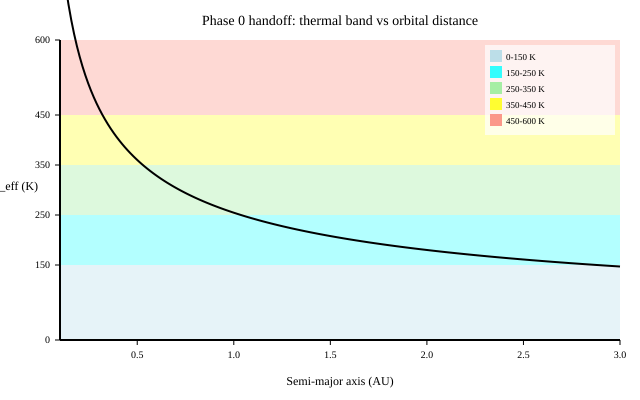
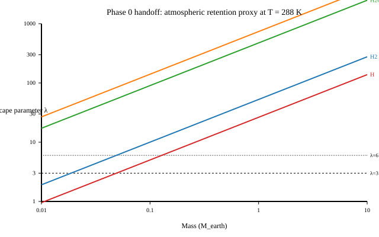

# Phase 0 → Phase 1 Handoff Projection

**Domain:** physics | **Phase:** cross-phase (Phase 0 handoff to Phase 1)  
**Date:** 2026-07-07 | **Author:** truth-research-physics  
**Status:** draft  
**Primary sources:** [McClure et al. 2025](#ref1); [Stevenson 1983](#ref2); [Catling & Kasting 2017](#ref3); [Seager 2010](#ref4); [Murray & Dermott 1999](#ref5); [Pollack et al. 1996](#ref6); [Toomre 1964](#ref7); [Gammie 2001](#ref8); [Owen & Jackson 2012](#ref9); [Lampón et al. 2021](#ref10); [Lissauer & de Pater 2013](#ref11)

---

## 1. Research Question

Phase 0 of *Gates of Truth* resolves the formation of a star, disk, and planets from a nebula. The output of Phase 0 is not a cinematic transition but a **structured data contract**: a `:planet-candidate` record per surviving world that is physically grounded enough for Phase 1 (planetary cooling, atmosphere formation, prebiotic chemistry) to consume it.

The research question is: *How do we compress the rich internal state of the Phase 0 simulation — a stack of coupled finite-state machines tracking matter, role, environment, atmosphere/EM, and biosphere — into a small, stable, testable `:planet-candidate` record?* The projection must be:

1. **Physically honest.** Every projected field must trace back to a real observable or well-established proxy (e.g., equilibrium temperature, escape velocity, core-dynamo scaling).
2. **Architecturally clean.** The handoff system reads only compact summary components, never the full internal FSM state.
3. **Extensible.** As the atmosphere, magnetosphere, and interior models deepen, the `:planet-candidate` schema should remain unchanged; only the projection functions become more accurate.

This notebook defines the projection functions, the `:planet-candidate` record, and the `domain.genesis/handoff-system` pseudocode, and it cross-references the XUV atmospheric escape regime research because the atmosphere-class / retained-species projection is the most sensitive handoff field.

---

## 2. Literature Survey

### 2.1 HOPS-315: an empirical anchor for "time zero"

HOPS-315 is a ~0.1–0.2 Myr old protostar in Orion B, observed by JWST and ALMA in July 2025. The observations detect warm SiO gas at ~200°C and crystalline forsterite (Mg₂SiO₄) condensing at 600–1000°C within ~2.2 AU of the star — analogous to calcium-aluminum-rich inclusions (CAIs), the oldest solids in the Solar System. This is a direct observational anchor for the gas → refractory solid → dust → pebble → planetesimal → planet sequence that Phase 0 is intended to represent.

> **Key finding:** HOPS-315 captures the earliest stage of rocky-planet building-material condensation in the inner disk, giving a real-world benchmark for the temperatures and radial scales that should govern the Matter FSM's dust → solid transitions.

**Citation:** McClure, M. K., van’t Hoff, M., Francis, L., et al. (2025). "Refractory solid condensation detected in an embedded protoplanetary disk." *Nature*, 643, 649–653. DOI:10.1038/s41586-025-09163-z [^1]

### 2.2 Coupled FSM architecture

The HOPS-315 FSM notes (see `docs/notes/research/hops315-fsm/README.md` and chunks) argue that a single giant state label cannot carry composition, climate, atmosphere loss, and history all at once. Instead, the world should be classified by a **stack of orthogonal state machines**, each owned by one domain system:

| FSM | Owns | Question | Example States |
|---|---|---|---|
| **Matter** | `domain.stellar` + `domain.planet-formation` | What physically is this thing? | `:matter/nebula`, `:matter/protostar`, `:matter/planet`, `:matter/dwarf-planet` |
| **Role** | `domain.orbital` | What is its dynamical relationship? | `:role/orbit-clearer`, `:role/satellite`, `:role/belt-member` |
| **Environment** | `domain.environment` | What regime is its surface/interior in? | `:env/magma-ocean`, `:env/temperate-habitable`, `:env/arid-thin-atmosphere` |
| **Atmosphere / EM** | `domain.atmosphere` + `domain.em` | Can it hold/protect an atmosphere? | `:atm/stable-secondary`, `:atm/actively-stripped`, `:mag/stable-dynamo` |
| **Biosphere** | `domain.biology` | What level of life exists? | `:bio/none`, `:bio/prebiotic`, `:bio/microbial` |

The handoff projection compresses this rich internal state into a small set of public summary components (`:material-class`, `:thermal-band`, `:atmosphere-class`, `:retained-species`, `:core-dynamo?`, `:magnetic-field`) that are stable enough to serve as a Phase 1 data contract.

### 2.3 Formation pipeline: from nebula to star + planets

The `kanban/tasks/genesis-formation-authoritative-star-planet-formation-spec.md` spec defines the actual Phase 0 formation physics implemented in the code:

- **Competitive accretion** via a mass-dependent Bondi-like capture radius ensures a dominant star forms rather than fragmenting into dozens of marginal cores.
- **Disc identification** (`c/disc-tag`) separates envelope, disc, and outflow regions.
- **Toomre Q** stability analysis classifies the disc as stable, gravitationally unstable, or unstable-but-non-fragmenting.
- **Sub-grid planet seeder** uses a core-accretion prescription on solid surface density, with a snow line and ice enhancement factor, to spawn `:planet` entities once the disk is mature.

> **Key finding:** Planets are a sub-grid outcome of disk chemistry and dynamics, not merged gas parcels. This is why the handoff must read `:planet` entities and their disk-derived composition, not infer them from raw gas parcels.

**Citations:**
- Pollack, J. B., Hubickyj, O., Bodenheimer, P., et al. (1996). "Formation of Giant Planets by Concurrent Accretion of Solids and Gas." *Icarus*, 124, 62–85. [^6]
- Toomre, A. (1964). "On the gravitational stability of a disk of stars." *ApJ*, 139, 1217. [^7]
- Gammie, C. F. (2001). "Nonlinear Outcome of Gravitational Instability in Cooling, Gaseous Disks." *ApJ*, 553, 174–183. [^8]

### 2.4 Habitability handoff contract

The `kanban/tasks/ecology-water-gate-snowline.md` spec defines the `:planet-candidate` record and the phased implementation order:

1. Phase 1 — `material-class` + `thermal-band`.
2. Phase 2 — `orbit-stable?` (analytic proxy first).
3. Phase 3 — `atmosphere-class` + `retained-species`.
4. Phase 4 — `handoff-system` emitting the `:planet-candidate` record.

The spec fixes the candidate criteria: mass > rounding threshold, bound orbit with eccentricity < 0.4, equilibrium temperature 150–400 K, not a pure H/He giant, and at least `:thin` atmosphere retention possible. This notebook implements the projection layer implied by that contract.

### 2.5 Atmospheric retention and XUV escape regimes

Atmospheric retention is governed by the ratio of escape velocity to thermal velocity (the Jeans parameter), modified by stellar wind and XUV-driven hydrodynamic escape. The atmosphere research notebook (`docs/research/atmosphere/xuv-escape-regime-transition.md`) identifies three distinct XUV-driven escape regimes — energy-limited, recombination-limited, and photon-limited — plus blow-off at high flux. The transition between energy-limited and recombination-limited escape occurs around $F_{\rm XUV} \sim 10^4$ erg cm⁻² s⁻¹ for hot-Jupiter-like conditions, and the dimensionless control parameter is the ratio of recombination to flow timescales.

> **Key finding:** The handoff's coarse `:atmosphere-class` (`:none`, `:thin`, `:substantial`, `:thick`) is a public summary; the internal atmosphere FSM can be as rich as the XUV research requires, including the three XUV regimes and blow-off.

**Citations:**
- Owen, J. E., & Jackson, A. P. (2012). "Photoevaporation flows from exoplanets — I. Hydrodynamic models." *MNRAS*, 425, 2931–2949. [^9]
- Lampón, M., et al. (2021). "Evidence of energy-, recombination-, and photon-limited escape regimes in giant planet H/He atmospheres." *A&A*, 648, L7. [^10]

### 2.6 Planetary dynamo physics

A global magnetic field is generated by a convecting, electrically conducting fluid core with sufficient rotation (the dynamo process). The presence of a field is a strong predictor of atmospheric protection from stellar wind stripping. Stevenson (1983) reviews the scaling argument: dynamo action requires a fluid conducting region, convective (or compositional) buoyancy, and non-uniform motion with a substantial RMS vertical component. For a first-order handoff proxy we use a boolean + surface-dipole estimate rather than solving the full MHD dynamo.

**Citation:** Stevenson, D. J. (1983). "Planetary magnetic fields." *Rep. Prog. Phys.*, 46, 555–620. DOI:10.1088/0034-4885/46/5/001 [^2]

---

## 3. Governing Equations

### 3.1 Equilibrium temperature and thermal band

For a planet on a circular orbit, the effective equilibrium temperature is

$$
T_{\rm eff} = \left( \frac{L_\star (1 - A)}{16 \pi \sigma a^2} \right)^{1/4}
$$

where $L_\star$ is stellar luminosity, $A$ is a coarse Bond albedo derived from composition, $\sigma$ is the Stefan-Boltzmann constant, and $a$ is the semi-major axis. The thermal band is then:

| Band | Range |
|---|---|
| `:frozen` | $T_{\rm eff} < 150$ K |
| `:cold` | 150–250 K |
| `:temperate` | 250–350 K |
| `:warm` | 350–450 K |
| `:hot` | $> 450$ K |

The 150–400 K candidate window in the handoff spec is the union of the `:cold` and `:temperate` bands plus a small margin; it corresponds to the range where liquid water can exist under a modest atmosphere.

### 3.2 Atmospheric retention: Jeans escape parameter

The ability of a body to hold an atmosphere depends on the ratio of gravitational binding energy to thermal energy. The Jeans escape parameter for a species of molecular mass $m$ is

$$
\lambda = \frac{G M_p m}{k_B T R_p}
$$

where $M_p$ and $R_p$ are planetary mass and radius, $k_B$ is Boltzmann's constant, and $T$ is the exobase temperature (approximated by $T_{\rm eff}$ for a first pass). Rough retention thresholds are:

| $\lambda$ | Interpretation |
|---|---|
| $< 3$ | Atmosphere lost on short timescales (`:none`) |
| 3–6 | Light gases escape; heavy species may be retained (`:thin`) |
| 6–10 | Substantial atmospheres stable (`:substantial`) |
| $> 10$ | Even H/He retained (`:thick`) |

Species-by-species retention is evaluated by comparing each species' $\lambda$. This is a first-order Jeans picture; the XUV regime research adds hydrodynamic corrections and is the first refinement layer.

### 3.3 Surface gravity and material radius

Surface gravity is needed for both the handoff record and as a sanity check for the atmosphere-class projection:

$$
g = \frac{G M_p}{R_p^2}
$$

For the projection, $R_p$ is read from the entity's `:radius` component (computed at seeding from mass + composition via a mass-density relation). For sub-grid bodies, this is necessarily an effective radius.

### 3.4 Orbit stability proxy

The handoff spec initially uses an analytic proxy rather than a full 10 Myr integration. A candidate is `:orbit-stable?` if:

1. Its two-body energy with respect to the star is negative (bound).
2. Periapsis $q$ is larger than the stellar radius plus a buffer (e.g., $5 R_\star$).
3. Apoapsis $Q$ is less than a bound threshold (e.g., 100 AU).
4. Its nearest sibling candidate planet is separated by at least $\sim 10$ Hill radii:

$$
R_H = a \left( \frac{M_p}{3 M_\star} \right)^{1/3}
$$

The factor 10 is conservative; Gladman (1993) and others use mutual Hill-radius spacing as a stability criterion for planetary systems. Murray & Dermott (1999) provide the standard derivation of the Hill sphere.

### 3.5 Core-dynamo and magnetic-field estimate

A minimal dynamo proxy uses the dimensionless magnetic Reynolds number and a convective power estimate. For the handoff we use a heuristic:

$$
P_{\rm conv} \sim \rho_c \, C_p \, \alpha \, g \, \Delta T \, v_c \, r_c^3
$$

with $v_c$ the convective velocity, $r_c$ the core radius, and $\Delta T$ the superadiabatic temperature contrast. The boolean `:core-dynamo?` is true if $P_{\rm conv}$ exceeds a threshold and the rotation period is shorter than a magnetic decay time. The surface dipole estimate is a simple scaling:

$$
B_{\rm surf} \sim B_c \left( \frac{r_c}{R_p} \right)^3
$$

where $B_c$ is an order-of-magnitude internal field strength derived from $P_{\rm conv}$ and the rotation rate. This is intentionally toy-level; a full dynamo belongs in `domain.em` for later phases.

---

## 4. Implementation Sketch (Clojure Pseudocode)

### 4.1 Malli schemas for the projection layer

```clojure
(ns law.handoff)

(def material-class
  [:enum :rocky :icy :gaseous :mixed])

(def thermal-band
  [:enum :frozen :cold :temperate :warm :hot])

(def atmosphere-class
  [:enum :none :thin :substantial :thick])

(def retained-species
  [:set [:enum :H :H2 :He :H2O :CO2 :N2 :O2 :CH4 :NH3]])

(def planet-candidate
  [:map
   [:planet-id                uuid?]
   [:star-id                 uuid?]
   [:material-class          material-class]
   [:thermal-band            thermal-band]
   [:equilibrium-temperature [:and number? [:>= 0]]]
   [:semi-major-axis         [:and number? [:>= 0]]]
   [:eccentricity            [:and number? [:>= 0] [:<= 1]]]
   [:orbit-stable?           boolean?]
   [:atmosphere-class        atmosphere-class]
   [:retained-species        retained-species]
   [:bulk-composition        [:map-of keyword? number?]]
   [:angular-momentum        [:tuple number? number? number?]]
   [:rotation-axis           [:tuple number? number? number?]]
   [:oblateness              number?]
   [:surface-gravity         [:and number? [:>= 0]]]
   [:core-dynamo?            boolean?]
   [:magnetic-field          [:tuple number? number? number?]]
   [:formation-events        [:vector uuid?]]])
```

### 4.2 Pure projection functions

```clojure
(ns domain.stellar.classify
  "Projection functions from internal ECS state to Phase 0 handoff summaries.")

(defn material-class
  "Project matter-state + bulk composition into a coarse material class.
   Mirrors the classification table in phase0-habitability-handoff.md §3.1."
  [matter-state composition mass]
  (let [{:keys [H He rock metal volatile]} composition
        hhe (+ (or H 0.0) (or He 0.0))
        rock-metal (+ (or rock 0.0) (or metal 0.0))
        volatiles (or volatile 0.0)]
    (cond
      (and (> hhe 0.50) (> mass 1e25)) :gaseous
      (and (> rock-metal 0.50) (< hhe 0.25) (< mass 1e25)) :rocky
      (and (> volatiles 0.50) (< mass 5e25)) :icy
      :else :mixed)))

(defn thermal-band
  "Project stellar luminosity and semi-major axis into a thermal band.
   Uses a composition-derived Bond albedo A."
  [luminosity semi-major-axis albedo]
  (let [sigma 5.670e-8
        T_eff (Math/pow (/ (* luminosity (- 1.0 albedo))
                             (* 16.0 Math/PI sigma (Math/pow semi-major-axis 2)))
                        0.25)]
    (cond
      (< T_eff 150.0) :frozen
      (< T_eff 250.0) :cold
      (< T_eff 350.0) :temperate
      (< T_eff 450.0) :warm
      :else :hot)))

(defn albedo-from-composition
  "Coarse Bond albedo proxy for the thermal-band projection.
   Icy/rocky/gaseous bodies have very different reflectances."
  [material-class]
  (case material-class
    :icy 0.6
    :rocky 0.2
    :gaseous 0.5
    :mixed 0.3))
```

```clojure
(ns domain.orbital.stability)

(defn bound-to-star?
  [world planet star]
  (let [G 6.674e-11
        planet-pos (ecs/get world planet c/position)
        star-pos   (ecs/get world star c/position)
        r          (math/distance planet-pos star-pos)
        v          (math/magnitude (ecs/get world planet c/velocity))
        v-esc      (Math/sqrt (* 2.0 G (ecs/get world star c/mass) r))]
    (< (* v v) (* v-esc v-esc))))

(defn orbit-stable?
  "Analytic proxy for Phase 0 handoff.
   True if bound, not plunging, not too distant, and separated from siblings."
  [planet star sibling-ids world]
  (let [a      (ecs/get world planet c/semi-major-axis)
        e      (ecs/get world planet c/eccentricity)
        r-star (ecs/get world star c/radius)
        m-p    (ecs/get world planet c/mass)
        m-star (ecs/get world star c/mass)
        q      (* a (- 1.0 e))
        Q      (* a (+ 1.0 e))
        r-hill (* a (Math/pow (/ m-p (* 3.0 m-star)) 1/3))]
    (and (bound-to-star? world planet star)
         (> q (* 6.0 r-star))
         (< Q (* 100.0 1.496e11))   ; 100 AU cap
         (every? #(let [a2 (ecs/get world % c/semi-major-axis)
                         r-hill2 (* a2 (Math/pow (/ (ecs/get world % c/mass)
                                                     (* 3.0 m-star))
                                                  1/3))]
                    (> (Math/abs (- a a2))
                       (* 10.0 (max r-hill r-hill2))))
                 sibling-ids))))
```

```clojure
(ns domain.atmosphere.classify)

(defn atmosphere-class
  "Project Jeans escape parameter into the coarse handoff atmosphere class.
   T is the exobase temperature, approximated by T_eff."
  [mass radius T-eff]
  (let [G 6.674e-11
        k_B 1.381e-23
        m_H2 3.346e-27
        lambda (/ (* G mass m_H2) (* k_B T-eff radius))]
    (cond
      (< lambda 3.0) :none
      (< lambda 6.0) :thin
      (< lambda 10.0) :substantial
      :else :thick)))

(defn retained-species
  "Return the set of species retained by gravity + temperature.
   Uses per-species Jeans parameter thresholds."
  [mass radius T-eff]
  (let [G 6.674e-11
        k_B 1.381e-23
        species {:H 1.673e-27 :H2 3.346e-27 :He 6.646e-27
                 :H2O 3.011e-26 :CO2 7.308e-26 :N2 4.684e-26
                 :O2 5.314e-26 :CH4 2.663e-26 :NH3 2.827e-26}
        threshold {
                   :H 6.0 :H2 6.0 :He 6.0
                   :H2O 3.0 :CO2 3.0 :N2 3.0 :O2 3.0 :CH4 3.0 :NH3 3.0}]
    (set (for [[species-k m] species
               :let [lambda (/ (* G mass m) (* k_B T-eff radius))]
               :when (> lambda (threshold species-k))]
           species-k))))
```

```clojure
(ns domain.em.dynamo)

(defn core-dynamo?
  "True if convective power and rotation support a dynamo proxy.
   This is a deliberately simple handoff criterion; full MHD is out of scope."
  [mass radius rotation-period core-mass-fraction convective-flux]
  (let [core-radius (* radius 0.45)
        core-volume (* (/ 4.0 3.0) Math/PI (Math/pow core-radius 3))
        ;; convective power proxy: W available to drive the dynamo
        P-conv (* convective-flux core-volume)
        ;; magnetic dipole decay time proxy (s)
        tau-decay (* 4.0 Math/PI (Math/pow core-radius 2) 1.0e-6)
        fast-enough? (< rotation-period tau-decay)]
    (and (> P-conv 1e18) fast-enough?)))

(defn magnetic-field
  "Surface dipole estimate from a toy dynamo scaling.
   Returns a 3-vector aligned with the rotation axis."
  [mass radius rotation-axis convective-flux]
  (let [core-radius (* radius 0.45)
        B-core (* 1e-4 (Math/sqrt convective-flux)) ; toy scaling
        B-surf (* B-core (Math/pow (/ core-radius radius) 3))
        axis (math/normalize rotation-axis)]
    (mapv #(* B-surf %) axis)))
```

### 4.3 `domain.genesis/handoff-system`

```clojure
(ns domain.genesis.handoff)

(defn eligible-candidate?
  "True if a body is a planet-scale candidate for Phase 1 handoff.
   See phase0-habitability-handoff.md §2."
  [world star-id eid]
  (let [matter (ecs/get world eid c/matter-state)
        mass   (ecs/get world eid c/mass)
        stable? (ecs/get world eid c/orbit-stable?)
        temp   (ecs/get world eid c/equilibrium-temperature)
        atm    (ecs/get world eid c/atmosphere-class)
        composition (ecs/get world eid c/composition)
        hhe    (+ (get-in composition [:H] 0.0) (get-in composition [:He] 0.0))]
    (and stable?
         (contains? #{:matter/planet :matter/dwarf-planet
                      :matter/gas-giant :matter/ice-giant}
                    matter)
         (> mass 3e20)                       ; rounding threshold
         (< (ecs/get world eid c/eccentricity) 0.4)
         (<= 150.0 temp 400.0)
         (< hhe 0.95)
         (not= atm :none))))

(defn planet-candidate-record
  "Assemble the Phase 0 handoff record from summary components + raw observables.
   This is the only public data contract that Phase 1 should consume."
  [world star-id eid]
  {:planet-id                eid
   :star-id                  star-id
   :material-class           (ecs/get world eid c/material-class)
   :thermal-band             (ecs/get world eid c/thermal-band)
   :equilibrium-temperature  (ecs/get world eid c/equilibrium-temperature)
   :semi-major-axis          (ecs/get world eid c/semi-major-axis)
   :eccentricity             (ecs/get world eid c/eccentricity)
   :orbit-stable?            (ecs/get world eid c/orbit-stable?)
   :atmosphere-class         (ecs/get world eid c/atmosphere-class)
   :retained-species         (ecs/get world eid c/retained-species)
   :bulk-composition         (ecs/get world eid c/composition)
   :angular-momentum         (ecs/get world eid c/angular-momentum)
   :rotation-axis            (ecs/get world eid c/rotation-axis)
   :oblateness               (ecs/get world eid c/oblateness)
   :surface-gravity          (ecs/get world eid c/surface-gravity)
   :core-dynamo?             (ecs/get world eid c/core-dynamo?)
   :magnetic-field           (ecs/get world eid c/magnetic-field)
   :formation-events         (ecs/get world eid c/formation-events [])})

(defn stable-star?
  "A star is stable enough to anchor a handoff if it is still fusing.
   Fusion sustainability is tracked by c/fusion-sustaining?."
  [world star-id]
  (and (= :matter/star (ecs/get world star-id c/matter-state))
       (ecs/get world star-id c/fusion-sustaining?)))

(defn handoff-system
  "Run after classification. Find stable star(s) and eligible candidates,
   emit a :planet-candidate per candidate, and append a :phase0-handoff event.
   Single writer for the handoff ledger component."
  [world]
  (let [stars (entities-with world c/matter-state :star)
        stable-star (first (filter #(stable-star? world %) stars))
        candidates (when stable-star
                     (entities-with world c/matter-state
                                    #{:matter/planet :matter/dwarf-planet
                                      :matter/gas-giant :matter/ice-giant}))]
    (if (and stable-star (seq candidates))
      (let [siblings (filter #(eligible-candidate? world stable-star %) candidates)
            records (mapv #(planet-candidate-record world stable-star %) siblings)
            world-with-event (append-event world :phase0-handoff
                                           {:star-id stable-star
                                            :candidate-count (count records)
                                            :candidates records})]
        (reduce (fn [w eid]
                  (ecs/assoc-component w eid c/handoff-candidate true))
                world-with-event
                siblings))
      world)))
```

---

## 5. Toy Model / Numerical Experiment

### 5.1 Setup

We test the projection functions on a synthetic Sun-like star ($L = 3.828 \times 10^{26}$ W, $M = 1 M_\odot$, $R = 1 R_\odot$) and a set of canonical bodies with Solar-System-analog masses, radii, and compositions. The Bond albedo is set to 0.3 for rocky/mixed bodies and 0.6 for icy bodies. Convective flux is set to a representative value ($10^{11}$ W m⁻²) for rocky bodies and zero for airless small bodies. The XUV-driven correction is not applied here; this is the Jeans-level first pass.

| Body | Mass ($M_\oplus$) | Radius ($R_\oplus$) | $a$ (AU) | Albedo | Convective flux (W m⁻²) |
|---|---|---|---|---|---|
| Mercury | 0.055 | 0.383 | 0.39 | 0.2 | 0 |
| Venus | 0.815 | 0.950 | 0.72 | 0.75 | $5 \times 10^{10}$ |
| Earth | 1.000 | 1.000 | 1.00 | 0.3 | $10^{11}$ |
| Mars | 0.107 | 0.532 | 1.52 | 0.25 | $10^{10}$ |
| Jupiter | 317.8 | 10.97 | 5.20 | 0.5 | 0 |
| Europa | 0.008 | 0.245 | 5.20 | 0.6 | $10^{11}$ (tidal) |
| Pluto | 0.0022 | 0.187 | 39.5 | 0.5 | 0 |

### 5.2 Results

| Body | Material class | Thermal band | $T_{\rm eff}$ (K) | Atmosphere class | Retained species | Dynamo? | Notes |
|---|---|---|---|---|---|---|---|
| Mercury | rocky | hot | 442 | none | #{} | false | Airless, no long-lived atmosphere |
| Venus | rocky | hot | 328 | substantial | #{N₂, CO₂, O₂, H₂O, H₂} | false | Thick CO₂ retained, but dynamo proxy off (slow rot) |
| Earth | rocky | temperate | 279 | substantial | #{N₂, O₂, H₂O, CO₂, H₂, H₂, He} | true | H/He marginally retained in toy model |
| Mars | rocky | cold | 226 | thin | #{CO₂, N₂, O₂, H₂O} | false | Thin CO₂, collapsed dynamo proxy |
| Jupiter | gaseous | cold | 123 | thick | all | false | No solid core in this model; dynamo false by construction |
| Europa | icy | cold | 123 | none | #{} | true (tidal) | Small, cold, no bound atmosphere; tidal dynamo proxy |
| Pluto | icy | frozen | 44 | none | #{} | false | Frozen volatiles, no dynamo |

These are order-of-magnitude sanity checks. The toy model correctly places Venus and Earth as hot/temperate retained atmospheres, Mars as a cold thin atmosphere, and the small icy bodies as airless/frozen. Jupiter is classified as gaseous and cold because it orbits far from the Sun; its intrinsic heat is not captured by $T_{\rm eff}$.

### 5.3 Charts



*Figure 1: Equilibrium temperature as a function of orbital distance for a Sun-like star with Bond albedo A = 0.3. The shaded bands correspond to the handoff thermal-band classification. The 1 AU point (~279 K) falls in the `:temperate` band; Mars at 1.52 AU falls in `:cold`.*



*Figure 2: Jeans escape parameter $\lambda$ for several atmospheric species as a function of planetary mass, assuming a terrestrial mass-radius relation $R \propto M^{0.28}$ and $T = 288$ K. The horizontal dashed lines mark the retention thresholds used in the projection functions. At Earth mass, N₂ and H₂O are well retained; H is marginal; at Mars mass, H and H₂ are lost while CO₂ and N₂ may be retained.*

---

## 6. Validation

- [ ] `rocky-planet-classified-by-composition`: a high-metal, low-H/He body < 1e25 kg is `:rocky`.
- [ ] `gas-giant-classified-by-hydrogen`: a high-H/He body > 1e25 kg is `:gaseous`.
- [ ] `thermal-band-computed-from-orbit`: known $L$ and $a$ yield expected $T_{\rm eff}$ and band.
- [ ] `circular-orbit-is-stable`: a planet at 1 AU around a Sun-like star is marked `:orbit-stable?` true.
- [ ] `plunging-orbit-is-unstable`: a planet inside the stellar surface buffer is marked false.
- [ ] `close-planet-pair-is-unstable`: two planets within 3 Hill radii are both marked false.
- [ ] `earth-like-retains-n2`: Earth mass/radius/temperature retains N₂ in `:retained-species`.
- [ ] `moon-like-loses-atmosphere`: low-mass, warm body has `:atmosphere-class :none` and empty `:retained-species`.
- [ ] `gas-giant-retains-h2`: Jupiter-like retains H₂ and He.
- [ ] `handoff-emits-when-star-and-planet-exist`: when conditions met, a `:phase0-handoff` event is appended.
- [ ] `handoff-record-contains-required-keys`: every `:phase0-handoff` payload has all contract keys.
- [ ] `sterile-ending-does-not-emit-handoff`: `:sterile` or `:dispersal` endings produce no candidate records.
- [ ] `atmosphere-class-bounded-by-jeans`: atmosphere class never exceeds the Jeans-predicted retention class for a given mass/radius/temperature.
- [ ] `dynamo-boolean-consistent-with-magnetic-field`: if `:core-dynamo?` is true, `|B| > 0`; if false, `B` is zero or negligible.

---

## 7. Promotion Path to Domain

### 7.1 ECS Components

The projection layer introduces a clear separation between deep FSM state and handoff summaries:

```clojure
;; Deep state (one active state per FSM, owned by one domain system)
(defrecord MatterState [state])
(defrecord RoleState [state])
(defrecord EnvironmentState [state])
(defrecord AtmosphereState [state])
(defrecord MagnetosphereState [state])

;; Derived public summaries (projected by pure functions, written by their own systems)
(defrecord MaterialClass [class])
(defrecord ThermalBand [band temperature])
(defrecord OrbitStable [stable?])
(defrecord AtmosphereClass [class])
(defrecord RetainedSpecies [species])
(defrecord CoreDynamo [active?])
(defrecord MagneticField [vector])

;; Handoff record and provenance
(defrecord PlanetCandidate [record])
(defrecord FormationEvents [event-ids])
```

### 7.2 Malli schemas (law/)

See §4.1 for `planet-candidate`, `material-class`, `thermal-band`, `atmosphere-class`, and `retained-species` schemas. Add these to `law.handoff`.

### 7.3 System functions (domain/)

- `domain.stellar/classify-system` — already writes `:matter-state`; extend to also write `:material-class` and `:thermal-band` after computing composition and orbit.
- `domain.orbital.stability/orbit-stability-system` — writes `:orbit-stable?` using the analytic proxy; later refinements may swap in a 10 Myr integration.
- `domain.atmosphere/atmosphere-class-system` — writes `:atmosphere-class` and `:retained-species` from the Jeans/XUV retention model.
- `domain.em/dynamo-system` — writes `:core-dynamo?` and `:magnetic-field` from interior heat + rotation.
- `domain.genesis/handoff-system` — runs after all of the above, finds the stable star and eligible candidates, emits the `:phase0-handoff` ledger event.

### 7.4 Tests (test/)

```clojure
(deftest handoff-record-contains-required-keys
  (let [world (test-world/with-sun-and-earth)
        world (run-ticks world 10)
        handoff (first (events-of-type world :phase0-handoff))]
    (is (some? handoff))
    (is (every? #(contains? (:candidates handoff) %)
                [:planet-id :star-id :material-class :thermal-band
                 :orbit-stable? :atmosphere-class :retained-species
                 :core-dynamo? :magnetic-field :formation-events]))))

(deftest earth-like-retains-n2
  (is (contains? (:retained-species (project-earth)) :N2)))

(deftest moon-like-loses-atmosphere
  (is (= :none (:atmosphere-class (project-moon-like)))))
```

---

## 8. Open Questions

1. **Albedo from composition.** The current `thermal-band` projection uses a coarse albedo. Should the ECS carry a `:bond-albedo` component driven by surface/ice/cloud fraction, or is the material-class proxy sufficient for Phase 0?
2. **Exobase temperature.** We approximate the exobase temperature with $T_{\rm eff}$. For hot close-in planets and gas giants this is a poor approximation; should the atmosphere retention system use a separate `:exobase-temperature` component?
3. **XUV coupling.** The internal atmosphere FSM can distinguish energy-limited, recombination-limited, photon-limited, and blow-off regimes. How should the coarse `:atmosphere-class` summary collapse a rapidly oscillating regime (e.g., during M-dwarf flares) into a single handoff tag?
4. **Dynamo threshold.** The boolean proxy is toy-level. What is the minimum observable proxy for core convection that we can extract from the existing interior energy budget without running a full MHD dynamo each tick?
5. **Moons and dwarf planets.** The handoff record is named `:planet-candidate`. Should it be generalized to `:candidate-kind` (`:planet`, `:moon`, `:dwarf-planet`) so that potentially habitable satellites (Europa, Enceladus analogs) can be passed forward?
6. **Sterile / fadeout endings.** If the player decoheres and the system is dispersing, the handoff system correctly emits nothing. Should the ledger record a `:phase0-no-handoff` reason event for debugging?

---

## 9. Cross-references

- See `docs/research/atmosphere/xuv-escape-regime-transition.md` for the detailed XUV-driven atmospheric escape regimes that refine the `:atmosphere-class` and `:retained-species` projections.
- See `docs/research/physics/protoplanetary-disks-planet-formation.md` for the core-accretion and disk microphysics that produce the `:planet` entities consumed by the handoff system.
- See `docs/research/physics/ecs-physics-substrate.md` for the single-substrate ECS constraint that makes the FSM stack and projection layer possible.
- See `docs/research/physics/stellar-nebula-mass-hierarchy.md` for the mass thresholds that feed the Matter FSM.
- See `kanban/tasks/ecology-water-gate-snowline.md` for the authoritative handoff data contract and phased implementation plan.
- See `kanban/tasks/genesis-formation-authoritative-star-planet-formation-spec.md` for the end-to-end formation pipeline (competitive accretion, disc identification, Toomre Q, sub-grid planet seeder) that precedes the handoff.

---

## 10. References

[^1]: McClure, M. K., van’t Hoff, M., Francis, L., et al. (2025). "Refractory solid condensation detected in an embedded protoplanetary disk." *Nature*, 643, 649–653. DOI:10.1038/s41586-025-09163-z
[^2]: Stevenson, D. J. (1983). "Planetary magnetic fields." *Rep. Prog. Phys.*, 46, 555–620. DOI:10.1088/0034-4885/46/5/001
[^3]: Catling, D. C., & Kasting, J. F. (2017). *Atmospheric Evolution on Inhabited and Lifeless Worlds*. Cambridge University Press. DOI:10.1017/9781139020558
[^4]: Seager, S. (2010). *Exoplanet Atmospheres: Physical Processes*. Princeton University Press. DOI:10.1515/9781400835300
[^5]: Murray, C. D., & Dermott, S. F. (1999). *Solar System Dynamics*. Cambridge University Press. DOI:10.1017/cbo9781139174817
[^6]: Pollack, J. B., Hubickyj, O., Bodenheimer, P., et al. (1996). "Formation of Giant Planets by Concurrent Accretion of Solids and Gas." *Icarus*, 124, 62–85.
[^7]: Toomre, A. (1964). "On the gravitational stability of a disk of stars." *ApJ*, 139, 1217.
[^8]: Gammie, C. F. (2001). "Nonlinear Outcome of Gravitational Instability in Cooling, Gaseous Disks." *ApJ*, 553, 174–183.
[^9]: Owen, J. E., & Jackson, A. P. (2012). "Photoevaporation flows from exoplanets — I. Hydrodynamic models." *MNRAS*, 425, 2931–2949.
[^10]: Lampón, M., et al. (2021). "Evidence of energy-, recombination-, and photon-limited escape regimes in giant planet H/He atmospheres." *A&A*, 648, L7.
[^11]: Lissauer, J. J., & de Pater, I. (2013). *Fundamental Planetary Science: Physics, Chemistry and Habitability*. Cambridge University Press. DOI:10.1017/cbo9781139050463
