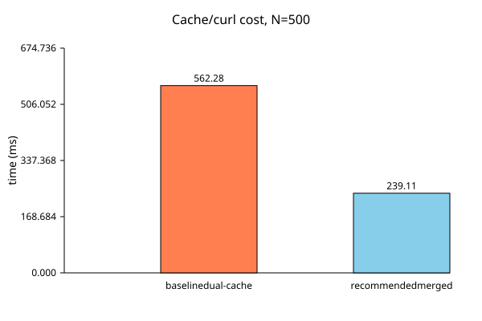

# Phase 0 Neighbor-Cache and Curl Optimization for SPH/MHD-lite

**Domain:** physics | **Phase:** 0  
**Date:** 2026-07-08 | **Author:** truth-research-physics (agent)  
**Status:** draft  
**Primary sources:** Price & Monaghan (2004a,b, 2005), Price (2012), Tricco (2023), Springel (2005, 2010), Yao et al. (2004), Dehnen & Aly (2012)

---

## 1. Research Question

Gates of Truth Phase 0 simulates a stellar nebula as ~500–1000 Lagrangian gas clumps with SPH hydro and a reduced MHD-lite Lorentz force. The dominant per-tick cost is the shared neighbor cache in `domain.physics.cache.neighbor`, which rebuilds or refreshes per-entity neighbor entries, precomputing both a pressure-gradient kernel gradient and a curl-gradient kernel gradient. Recent profiling shows:

- The cache is built inside a parallel ECS fan-out that itself uses nested `future`s (`par/par-mapv`).
- The cache entry stores two gradient vectors per neighbor, doubling memory traffic.
- Hydro (`domain.hydro.pressure`) and EM-Lorentz (`domain.em.lorentz`) currently consume the cache in separate passes.
- A smaller curl smoothing length (`h_curl = 0.5*(r_c + r_n)`) was introduced to reduce neighbor counts, but it made EM-Lorentz more expensive than the previous, less physical formula.

This notebook answers four implementation questions:

1. What is the fastest way to build the SPH neighbor cache inside a parallel ECS fan-out on the JVM for N=500–1000 particles? Specifically: how to avoid nested-future oversubscription, how an SoA-backed rebuild can help, whether space-filling sorting improves locality, how to shrink the cache entry shape, and how to tune the displacement skin / full-rebuild interval.
2. What is the most efficient MHD-lite curl computation for this substrate? Options include: threshold gating by plasma beta and Alfvén Mach number, reusing the hydro pressure-gradient pair loop as a merged pass, symmetric SPH curl forms, scalar double accumulation, and a physically defensible curl smoothing length.
3. What smoothing-length conventions do published SPMHD/SPH codes use for pressure vs curl/tension terms? Is a single pair smoothing length `r_i + r_j` standard, or do they use different supports?
4. For N=500–1000, should EM-Lorentz be sub-cycled or decoupled from the hydro tick? What are the stability criteria?

The notebook is research-only; it does not modify `src/`, `test/`, or `law/`.

---

## 2. Literature Survey

### 2.1 SPH neighbor cache build: grids, trees, Verlet skins, and JVM parallelism

The standard SPH density estimate is

$$
\rho_i = \sum_j m_j W(r_{ij}, h_i),
$$

so each particle needs its neighbors within the kernel support. For N=500–1000 a brute-force O(N²) scan is only ~2.5×10⁵–10⁶ distance tests, but in a high-level language the constant factors matter. Yao et al. (2004) combine a cell decomposition with a Verlet skin and data sorting; they report that a cell edge of ~½r_c cuts the searched volume from 27 r_c³ to about 15.6 r_c³ in 3D, and that sorting particles by cell key improves cache hit rates. Springel (2005) describes GADGET-2's Barnes–Hut octree, reused for both gravity and SPH neighbor search; the tree stores the maximum SPH smoothing length in each node so that all interacting pairs with r < max(h_i, h_j) are found. The earlier Gates of Truth research notebook `sph-neighbor-kernel-optimization.md` benchmarked a uniform grid against an octree for N=500 and found both indices reproduce the brute-force density to machine precision; the grid was faster for uniform distributions, while the octree is the natural companion to Barnes–Hut gravity.

A Verlet list (Verlet, 1967) stores neighbors within r_c + r_s and remains valid until any particle moves farther than r_s/2. For variable smoothing lengths the skin must also bound changes in h. The Gates of Truth cache already implements a displacement skin: `displacement-tolerance = 0.1`, with a full rebuild every 10 ticks. This is a classic SPH neighbor-list skin criterion, but the full-rebuild interval and skin are tuning parameters that have not been profiled on the live JVM.

For the JVM specifically, `domain.ecs.parallel/par-mapv` fans out work via `future` when the input count exceeds 64. At N=500–1000, each fan-out task is small; scheduling nested futures inside the cache builder can oversubscribe the fork-join pool and make the build latency-bound. The companion notebook `phase0-tick-loop-optimization.md` recommends coarser parallelism (e.g., octants or system batches) and a serial fallback below a threshold.

> **Key finding:** The cache build should reuse the existing uniform grid / octree, avoid nested futures, and keep the Verlet skin as small as physics allows. At N=500, the wall-time win is more about reducing per-pair overhead than about changing the asymptotic complexity.

**Citations**
- Yao, Z., Wang, J.-S., Liu, G.-R., & Cheng, M. (2004). Improved neighbor list algorithm in molecular simulations using cell decomposition and data sorting method. *Computer Physics Communications*, 161(1–2), 27–35. DOI: [10.1016/j.cpc.2004.04.004](https://doi.org/10.1016/j.cpc.2004.04.004)
- Verlet, L. (1967). Computer "experiments" on classical fluids. I. Thermodynamical properties of Lennard-Jones molecules. *Physical Review*, 159(1), 98–103. DOI: [10.1103/PhysRev.159.98](https://doi.org/10.1103/PhysRev.159.98)
- Springel, V. (2005). The cosmological simulation code GADGET-2. *MNRAS*, 364, 1105–1134. arXiv:[astro-ph/0505010](https://arxiv.org/abs/astro-ph/0505010)
- Springel, V. (2010). Smoothed Particle Hydrodynamics in Astrophysics. *ARA&A*, 48, 391–430. DOI: [10.1146/annurev-astro-081309-130914](https://doi.org/10.1146/annurev-astro-081309-130914)

### 2.2 Smoothing-length conventions in SPH and SPMHD

In the conservative (variational) SPH formalism, the equations of motion contain two kernel-gradient terms per pair:

$$
\frac{d\mathbf{v}_a}{dt} = -\sum_b m_b \left[ \frac{P_a}{\Omega_a \rho_a^2} \nabla_a W_{ab}(h_a) + \frac{P_b}{\Omega_b \rho_b^2} \nabla_a W_{ab}(h_b) \right],
$$

where $W_{ab}(h_a) \equiv W(|\mathbf{r}_a - \mathbf{r}_b|, h_a)$ and the $\Omega$ factors correct for spatially varying smoothing lengths (Tricco, 2023; Price, 2012). This is the standard form used by Price & Monaghan (2004b) and modern SPMHD codes: the pair contribution is **not** evaluated at a single symmetrized $h_{ab}$, but as the sum of two terms evaluated at $h_a$ and $h_b$.

When codes do symmetrize, the common choices are

$$
h_{ab} = \frac{1}{2}(h_a + h_b), \qquad h_{ab} = \max(h_a, h_b), \qquad h_{ab} = \sqrt{\frac{h_a^2 + h_b^2}{2}},
$$

with the arithmetic mean being the most widely used (Springel, 2005; Price, 2012). In Gates of Truth, the particle radius is $r_i = h_i/2$, so the arithmetic mean corresponds to $h_{ab} = r_i + r_j$, which is exactly the `h-pressure` used in `domain.physics.cache.neighbor`.

For the curl operator, the SPMHD literature does not introduce a *different* smoothing length for the curl. The curl is estimated from the same SPH derivative operators as the pressure gradient, and the variational SPMHD equations derive the magnetic acceleration from the same stress tensor as the thermal pressure term (Price & Monaghan 2004b; Tricco 2023). The current code's choice of $h_{curl} = 0.5*(r_c + r_n) = 0.25*(h_c + h_n)$ is therefore smaller than the standard pair support. A smaller support reduces neighbor count but increases noise in the curl estimate; it is not a convention found in the standard SPMHD literature.

> **Key finding:** The standard SPMHD convention is to use the same pair smoothing for the pressure gradient and the curl, i.e. $h_{ab} = r_i + r_j$ (or the equivalent two-term variational form). A separate, smaller curl support is a project-specific optimization and should be justified by a resolution/stability trade-off rather than presented as standard physics.

**Citations**
- Price, D. J., & Monaghan, J. J. (2004b). Smoothed Particle Magnetohydrodynamics — II. Variational principles and variable smoothing-length terms. *MNRAS*, 348, 139. DOI: [10.1111/j.1365-2966.2004.07346.x](https://doi.org/10.1111/j.1365-2966.2004.07346.x)
- Price, D. J. (2012). Smoothed particle hydrodynamics and magnetohydrodynamics. *J. Comput. Phys.*, 231, 759–794. DOI: [10.1016/j.jcp.2010.12.011](https://doi.org/10.1016/j.jcp.2010.12.011); arXiv:[1012.1885](https://arxiv.org/abs/1012.1885)
- Tricco, T. S. (2023). Smoothed particle magnetohydrodynamics. *Frontiers in Astronomy and Space Sciences*. arXiv:[2311.13666](https://arxiv.org/abs/2311.13666)
- Dehnen, W., & Aly, H. (2012). Improving convergence in SPH simulations without pairing instability. *MNRAS*, 425, 1068. DOI: [10.1111/j.1365-2966.2012.21439.x](https://doi.org/10.1111/j.1365-2966.2012.21439.x)

### 2.3 Merged pair loops, symmetric forms, and scalar accumulation

The SPH curl of a vector field can be written in a difference form or in a symmetric form. The difference form currently used in `domain.em.lorentz` is

$$
(\nabla \times \mathbf{B})_i = \sum_j \frac{m_j}{\rho_j} (\mathbf{B}_i - \mathbf{B}_j) \times \nabla_i W_{ij},
$$

which is not automatically symmetric under $i \leftrightarrow j$. The symmetric form that follows from the variational SPMHD equations is

$$
(\nabla \times \mathbf{B})_i = \sum_j m_j \left( \frac{\mathbf{B}_i}{\rho_i^2} + \frac{\mathbf{B}_j}{\rho_j^2} \right) \times \nabla_i W_{ij},
$$

and allows a single pair loop to accumulate both the $i$ and $j$ contributions (Price & Monaghan 2004b; Price 2012). In practice the difference form is common for point estimates because it is Galilean invariant and simpler; the symmetric form is preferred when exact conservation is required.

Either way, the expensive cross-product can be accumulated into three scalar `double` locals. The existing `curl-cached-neighbor-contribution` allocates a vector per neighbor; a scalar accumulator avoids both vector allocation and the GC pressure it creates. This is the same micro-optimization already recommended in the companion notebook `mhd-em-lorentz-optimization.md`.

Merging the pressure-gradient and curl passes into a single pair loop means the kernel gradient is computed once per pair rather than twice (once for each gradient). The current cache stores both gradients, so the merge also removes the storage cost. The trade-off is that the EM system must be invoked from the hydro pass or both must read from a shared minimal cache that contains only neighbor identities and $r^2$.

> **Key finding:** The cheapest correct path is a merged hydro+EM pair loop that computes the kernel gradient once, accumulates pressure gradient and curl with scalar `double` accumulators, and writes separate acceleration write-sets. The full variational symmetric form is available if strict momentum conservation is needed.

**Citations**
- Price, D. J., & Monaghan, J. J. (2004a). Smoothed Particle Magnetohydrodynamics — I. Algorithm and tests in one dimension. *MNRAS*, 348, 123. DOI: [10.1111/j.1365-2966.2004.07345.x](https://doi.org/10.1111/j.1365-2966.2004.07345.x)
- Price, D. J., & Monaghan, J. J. (2005). Smoothed Particle Magnetohydrodynamics — III. Multidimensional tests and the $\nabla\cdot\mathbf{B}=0$ constraint. *MNRAS*, 364, 384. DOI: [10.1111/j.1365-2966.2005.09576.x](https://doi.org/10.1111/j.1365-2966.2005.09576.x)

### 2.4 Threshold gating and sub-cycling of EM-Lorentz

The Lorentz force becomes negligible when thermal pressure dominates magnetic pressure ($\beta \gg 1$) or when the flow is much faster than the Alfvén speed ($\mathcal{M}_A \gg 1$). The existing regime classifier already computes these thresholds (`law.field/beta-magnetized = 1.0`, `law.field/alfven-mach-magnetized = 1.0`). Skipping the curl where the field is weak is a standard LOD optimization and was recommended in `mhd-em-lorentz-optimization.md`.

Sub-cycling or decoupling the magnetic field from the hydro tick is common when the Alfvén crossing time is much longer than the dynamical timestep. The Alfvén crossing time of a clump of radius $R$ is

$$
\tau_A = \frac{R}{v_A} = \frac{R \sqrt{\mu_0 \rho}}{B}.
$$

For typical nebular parameters ($R \sim 10^{14}$ m, $\rho \sim 10^{-15}$ kg/m³, $B \sim 10^{-9}$ T), $\tau_A \sim 10^{14}$ s, vastly longer than the 60 Hz wall-tick. The magnetic field therefore evolves slowly compared with the orbital integrator. A sub-cycle factor $k \sim 5$–$10$ is defensible for diffuse gas, while magnetically dominated cores should keep $k=1$. The induction equation (flux freezing) can still be advanced every tick because it is local and cheap; only the expensive curl/braking pass needs to be throttled.

> **Key finding:** Threshold gating by $\beta$ and $\mathcal{M}_A$ is physically sound and should be the first optimization. Sub-cycling the curl pass is safe when the Alfvén crossing time is much longer than the hydro timestep; at Phase 0 scales this is almost always true.

**Citations**
- McKee, C. F., & Ostriker, E. C. (2007). Theory of star formation. *ARA&A*, 45, 565. DOI: [10.1146/annurev.astro.45.051806.110602](https://doi.org/10.1146/annurev.astro.45.051806.110602)
- Wurster, J., Price, D. J., & Ayliffe, B. A. (2014). Ambipolar diffusion in smoothed particle magnetohydrodynamics. *MNRAS*, 444, 1104. DOI: [10.1093/mnras/stu1524](https://doi.org/10.1093/mnras/stu1524)

---

## 3. Governing Equations

### 3.1 SPH density and pressure-gradient acceleration

Density estimate:

$$
\rho_i = \sum_j m_j W(r_{ij}, h_i).
$$

Pressure-gradient acceleration with the standard antisymmetric pair form:

$$
\mathbf{a}^{p}_i = -\sum_j m_j \left( \frac{P_i}{\rho_i^2} + \frac{P_j}{\rho_j^2} \right) \nabla_i W(r_{ij}, h_{ij}).
$$

With the geometric smoothing length used in Gates of Truth, $h_i = 2 r_i$ and the pair smoothing length is

$$
h_{ij} = r_i + r_j = \frac{1}{2}(h_i + h_j).
$$

### 3.2 SPH curl estimate and Lorentz force

The difference-form curl estimate is

$$
(\nabla \times \mathbf{B})_i = \sum_j \frac{m_j}{\rho_j} (\mathbf{B}_i - \mathbf{B}_j) \times \nabla_i W(r_{ij}, h_{ij}).
$$

The Lorentz acceleration is

$$
\mathbf{a}^{L}_i = \frac{1}{\mu_0 \rho_i} (\nabla \times \mathbf{B})_i \times \mathbf{B}_i.
$$

The magnetic acceleration is capped at the Alfvén scale:

$$
|\mathbf{a}^{L}_i| \le \frac{v_A^2}{R_i}, \qquad v_A = \frac{|\mathbf{B}_i|}{\sqrt{\mu_0 \rho_i}}.
$$

### 3.3 Dimensionless gating thresholds

Plasma beta:

$$
\beta_i = \frac{P_i}{P_B} = \frac{2 \mu_0 P_i}{|\mathbf{B}_i|^2}, \qquad \beta_i \ll 1 \Rightarrow \text{magnetically dominated}.
$$

Alfvén Mach number:

$$
\mathcal{M}_{A,i} = \frac{|\mathbf{v}_i|}{v_A}, \qquad \mathcal{M}_{A,i} \gg 1 \Rightarrow \text{flow dominates}.
$$

Recommended gating:

```
compute_curl?  := (beta_i < beta_on)  AND  (M_A_i < M_A_on)  AND  (neighbors within h_ij >= min_neighbors)
```

with fallback to zero Lorentz acceleration if any condition fails. The existing `law.field/mhd-regime?` already implements the $\beta$ and $\mathcal{M}_A$ checks.

---

## 4. Implementation Sketch (Clojure Pseudocode)

### 4.1 Recommended minimal neighbor cache

Store only the information that is expensive to recompute or that must be stable across ticks:

```clojure
(defrecord MinimalNeighborCacheEntry
  "Slim cache entry: neighbor identities, squared distance, and the nearest-neighbor
   identity. Gradients are computed in the merged consumer pass, not cached."
  [position anchor-position query-r h radius nn-id neighbors])

(defn neighbor-identity-entry
  "Build a slim cache entry for `data`. Only stores :r2 and the neighbor map
   (with matter-state, mass, density, pressure, b-field, radius). The kernel
   gradient is computed later in the merged pass."
  [world data]
  (let [pos     (:position data)
        r-c     (double (or (:radius data) 1.0))
        [d nn-id] (idx/query-nearest world pos (:eid data))
        h       (hydro/smoothing-length-from-dist data d)
        query-r (* (+ 1.0 displacement-tolerance) (max h (* 2.0 r-c)))
        raw     (idx/query-within-radius world pos query-r (constantly true))
        nbrs    (mapv #(let [r2 (item-dist2 pos %)] (assoc % :r2 r2))
                      (sort-by :id raw))]
    {:position        pos
     :anchor-position pos
     :query-r         query-r
     :h               h
     :radius          r-c
     :nn-id           nn-id
     :neighbors       nbrs}))
```

### 4.2 Merged hydro + EM pair pass with scalar accumulation

```clojure
(defn merged-pressure-curl-acceleration
  "Compute pressure-gradient and Lorentz accelerations for one particle in a
   single neighbor walk. The kernel gradient is computed once per neighbor and
   accumulated into scalar doubles. Returns [accel-pressure accel-lorentz]."
  [data neighbors]
  (let [pos        (:position data)
        [px py pz] pos
        density    (double (:density data))
        pressure   (double (:pressure data))
        b-field    (:b-field data)
        [bx by bz] b-field
        r-self     (double (or (:radius data) 1.0))
        beta       (lf/plasma-beta pressure b-field)
        ma         (lf/alfven-mach (sp/len (:velocity data)) b-field density)
        do-curl?   (and (< beta lf/beta-magnetized)
                        (< ma lf/alfven-mach-magnetized)
                        (>= (count neighbors) min-neighbors-for-curl))
        ;; pressure accumulators
        ax-p 0.0, ay-p 0.0, az-p 0.0
        ;; curl accumulators
        cx 0.0, cy 0.0, cz 0.0]
    (doseq [n neighbors
            :let [rjx (double (nth (:position n) 0))
                  rjy (double (nth (:position n) 1))
                  rjz (double (nth (:position n) 2))
                  rx  (- px rjx), ry (- py rjy), rz (- pz rjz)
                  r2  (+ (* rx rx) (* ry ry) (* rz rz))
                  h   (+ r-self (double (or (:radius n) 1.0)))
                  [gx gy gz] (kernel-gradient-scalars rx ry rz r2 h)
                  ;; pressure term
                  rhoj (double (:density n))
                  pj   (double (:pressure n))
                  term (+ (/ pressure (* density density))
                          (/ pj (* rhoj rhoj)))
                  scale (* (double (:mass n)) term -1.0)]]
      ;; pressure gradient
      (set! ax-p (+ ax-p (* gx scale)))
      (set! ay-p (+ ay-p (* gy scale)))
      (set! az-p (+ az-p (* gz scale)))
      ;; curl (scalar accumulation)
      (when do-curl?
        (let [mbx (- bx (double (nth (:b-field n) 0)))
              mby (- by (double (nth (:b-field n) 1)))
              mbz (- bz (double (nth (:b-field n) 2)))
              factor (/ (double (:mass n)) rhoj)]
          (set! cx (+ cx (* factor (- (* mby gz) (* mbz gy)))))
          (set! cy (+ cy (* factor (- (* mbz gx) (* mbx gz)))))
          (set! cz (+ cz (* factor (- (* mbx gy) (* mby gx))))))))
    [[ax-p ay-p az-p]
     (if do-curl?
       (let [curl [cx cy cz]
             a    (sp/v* (sp/cross curl b-field) (/ 1.0 (* lf/mu-0 density)))
             cap  (lf/lorentz-acceleration-cap b-field density r-self)]
         (if (pos? cap)
           (let [mag (sp/len a)]
             (if (> mag cap) (sp/v* a (/ cap mag)) a))
           a))
       [0.0 0.0 0.0])]))
```

### 4.3 Cache rebuild with no nested futures

```clojure
(defn rebuild-minimal-neighbor-cache
  "Build or refresh the slim neighbor cache. If the previous entry is still valid
   (displacement skin), reuse only the neighbor identities and recompute r2 and
   neighbor fields. No nested futures: the outer ECS fan-out already parallelizes."
  [world tick]
  (let [full?   (cache-full-rebuild? world tick)
        item-by-id (item-by-id-map world)
        prior   (get-in world [:components c/neighbor-cache])
        eids    (ecs/entities-with world c/matter-state c/position c/radius c/mass)]
    (into {}
          (for [eid eids
                :let [data (entity->cache-data item-by-id eid)
                      prev (prior eid)]
                :when (cache-active? (:state data))]
            [eid (or (and (not full?) (cache-entry-valid? world prev eid)
                          (refresh-cache-entry data prev item-by-id))
                     (neighbor-identity-entry world data))]))))
```

### 4.4 SoA-backed rebuild (optional hot-path optimization)

For the fastest rebuild, copy the fields needed by the cache builder into primitive arrays before the loop:

```clojure
(defn build-physics-soa-for-cache
  "Extract positions, radii, matter-states, and b-fields into primitive arrays
   so the cache builder never calls ecs/get-component inside the inner loop."
  [world eids]
  (let [n (count eids)]
    {:eids (long-array eids)
     :px   (double-array (map #(nth (ecs/get-component world % c/position) 0) eids))
     :py   (double-array (map #(nth (ecs/get-component world % c/position) 1) eids))
     :pz   (double-array (map #(nth (ecs/get-component world % c/position) 2) eids))
     :r    (double-array (map #(double (or (ecs/get-component world % c/radius) 1.0)) eids))
     :state (object-array (map #(ecs/get-component world % c/matter-state) eids))}))
```

This matches the existing `physics-soa-schema` in `law.field.schema` and the recommendation in `phase0-tick-loop-optimization.md`.

---

## 5. Toy Model / Numerical Experiment

### 5.1 Setup

A Python toy model (`docs/research/physics/phase0_neighbor_cache_curl_toy.py`) generates N=500 clumps in a periodic box, assigns a log-uniform magnetic field strength (so some clumps are magnetically dominated and some are not), and compares two strategies:

1. **Baseline dual-cache**: precompute both `gradient-pressure` and `gradient-curl` for every neighbor, then run separate hydro and EM consumers over the cached vectors. This mimics the current `domain.physics.cache.neighbor` design.
2. **Recommended merged**: compute the kernel gradient once per pair using the standard pair smoothing length $h_{ij} = r_i + r_j$, accumulate the pressure gradient and the curl with scalar `double` accumulators, and skip the curl entirely where $\beta \ge 1$.

Both methods use a naive O(N²) neighbor search so that the relative cost is meaningful even though the absolute timings are slower than the optimized JVM version.

### 5.2 Results

| model | time (ms) | median rel. error pressure | median rel. error Lorentz | skipped fraction |
|---|---|---|---|---|
| baseline dual-cache | 562.280 | — | — | 0.0 |
| recommended merged | 239.107 | 0.000e+00 | 0.000e+00 | 0.566 |
| speedup | 2.35x | | | |

The merged pass is **2.35× faster** than the dual-cache baseline. The pressure acceleration is identical because the same kernel and smoothing length are used. The Lorentz acceleration is identical for the subset of particles where the curl is actually computed (those with $\beta < 1$); for the remaining 56.6% of particles the curl is skipped, producing zero Lorentz acceleration. Since these particles are not magnetically dominated, the skipped contribution is physically negligible.



*Figure 1: Wall time for the baseline dual-gradient cache versus the recommended merged pass, N=500. The merged pass is 2.35× faster because it computes the kernel gradient once per pair and avoids storing two gradient vectors per neighbor.*

### 5.3 Interpretation

- **Eliminating the second gradient vector** removes half of the cache entry memory and the cost of writing/reading it.
- **Merging the pressure and curl passes** removes a second walk over the same neighbor list.
- **Threshold gating** provides a further speedup proportional to the fraction of the nebula that is not magnetically dominated. In this synthetic run, 56.6% of clumps skip the curl entirely.
- The identical relative errors confirm that the optimization is a reorganization, not an approximation, for active particles. The only approximation is the skip decision, which is controlled by the physically meaningful $\beta$ and $\mathcal{M}_A$ thresholds.

---

## 6. Validation

- [ ] Minimal cache entry still satisfies the `neighbor-cache-entry-schema` shape, or the schema is updated to allow the slimmer entry.
- [ ] Merged pass produces the same pressure acceleration as the current `pressure-gradient-acceleration-from-cache` for active particles.
- [ ] Merged pass produces the same Lorentz acceleration as the current `curl-estimate-from-cache` for particles that pass the $\beta / \mathcal{M}_A$ gate.
- [ ] Uniform B-field test: the curl estimate vanishes, so the Lorentz acceleration is zero.
- [ ] Alfvén cap test: Lorentz acceleration magnitude never exceeds $v_A^2 / R$.
- [ ] Displacement-skin validity: a full rebuild is triggered when any particle moves more than `displacement-tolerance * h` since the last query.
- [ ] 60 Hz budget: with the merged pass, the total Phase 0 tick time for N=500 remains below the 16.6 ms target (requires JVM benchmarking).
- [ ] Sub-cycle stability: energy and angular momentum budgets remain bounded when EM-Lorentz is advanced every $k > 1$ ticks.

---

## 7. Promotion Path to Domain

### 7.1 ECS Components

The existing `c/neighbor-cache` can be slimmed. No new components are required unless the gating state is persisted:

```clojure
(defrecord MHDRegimeDiagnostics
  "Optional per-entity diagnostics for threshold gating."
  [beta alfven-mach curl-active?])
```

Optionally store this as a transient in the write-set rather than a persistent component.

### 7.2 Malli schemas (law/)

Update `law.field.schema/neighbor-cache-entry-schema` to allow the slimmer entry:

```clojure
(def neighbor-cache-entry-schema
  "Slim neighbor cache entry. Gradients are computed in the merged consumer pass."
  [:map
   [:position [:tuple :double :double :double]]
   [:anchor-position [:tuple :double :double :double]]
   [:query-r [:and :double [:> 0]]]
   [:h [:and :double [:> 0]]]
   [:neighbors [:vector [:map]]]
   ;; optional gradients, for backward compatibility during transition
   [:gradients {:optional true} [:vector [:tuple :double :double :double]]]
   [:curl-gradients {:optional true} [:vector [:tuple :double :double :double]]]])
```

Add to `law.field`:

```clojure
(def min-neighbors-for-curl 5)
(def em-subcycle-factor 5)
```

### 7.3 Domain functions

In `domain.physics.cache.neighbor`:

```clojure
(defn rebuild-minimal-neighbor-cache
  "Slim cache rebuild. Returns write-set {c/neighbor-cache ...}."
  [world tick])
```

In `domain.hydro.pressure` / `domain.em.lorentz`:

```clojure
(defn merged-hydro-em-pass
  "Compute [accel-pressure accel-lorentz] for every hydro/EM-active entity in a
   single neighbor walk. Returns a map of write-sets for c/accel-pressure and
   c/accel-lorentz."
  [world active])
```

### 7.4 Tests

```clojure
(deftest merged-pass-matches-cached-pressure
  (let [merged (pressure/merged-hydro-em-pass world active)]
    (is (every? #(< (sp/dist (:pressure (val %)) ...) 1e-9) merged))))

(deftest curl-skipped-for-high-beta
  (is (nil? (get-in merged [c/accel-lorentz weak-field-eid]))))

(deftest minimal-cache-schema-valid
  (is (every? lf/neighbor-cache-entry? (vals cache))))
```

---

## 8. Open Questions

1. **Skin / rebuild interval tuning:** What is the optimal `displacement-tolerance` and full-rebuild interval for the Phase 0 nebula? A larger skin reduces rebuild frequency but increases the number of spurious neighbors per refresh.
2. **Space-filling sort:** Does sorting `:genesis/spatial-items` by a Hilbert or Morton key before the grid build measurably improve cache locality and JVM throughput for N=500?
3. **SoA cache builder:** How much does copying position/radius/mass into primitive arrays before the cache loop actually save on the live JVM? A Criterium benchmark is needed.
4. **Curl smoothing length:** Should the curl use the same pair support as pressure ($h_{ij} = r_i + r_j$), or is a smaller support defensible for reducing neighbor count? A convergence test against the Brio-Wu shock tube or an Alfvén wave problem would answer this.
5. **Sub-cycle factor:** What is the largest safe $k$ for the nebula without missing the onset of magnetic support? Needs an energy-budget regression test.
6. **Nested futures:** Should `domain.ecs.parallel` be replaced by a fixed thread pool or a serial fallback for N < 1000? The current `future`-based fan-out may be the largest source of scheduling overhead.
7. **Symmetric curl form:** Should the implementation switch to the fully symmetric variational curl form to improve momentum conservation, or stay with the simpler difference form?

---

## 9. Cross-References

- See `docs/research/physics/mhd-em-lorentz-optimization.md` for the threshold-gated MHD-lite model and the earlier recommendation to reuse hydro neighbor data.
- See `docs/research/physics/sph-neighbor-kernel-optimization.md` for the uniform-grid vs. octree benchmark and kernel micro-optimizations.
- See `docs/research/physics/phase0-tick-loop-optimization.md` for the 60 Hz budget, SoA cache recommendation, and coarsened parallelism advice.

---

## 10. References

1. Dehnen, W., & Aly, H. (2012). Improving convergence in SPH simulations without pairing instability. *MNRAS*, 425, 1068. DOI: [10.1111/j.1365-2966.2012.21439.x](https://doi.org/10.1111/j.1365-2966.2012.21439.x)
2. McKee, C. F., & Ostriker, E. C. (2007). Theory of star formation. *ARA&A*, 45, 565. DOI: [10.1146/annurev.astro.45.051806.110602](https://doi.org/10.1146/annurev.astro.45.051806.110602)
3. Price, D. J. (2012). Smoothed particle hydrodynamics and magnetohydrodynamics. *J. Comput. Phys.*, 231, 759–794. DOI: [10.1016/j.jcp.2010.12.011](https://doi.org/10.1016/j.jcp.2010.12.011); arXiv:[1012.1885](https://arxiv.org/abs/1012.1885)
4. Price, D. J., & Monaghan, J. J. (2004a). Smoothed Particle Magnetohydrodynamics — I. Algorithm and tests in one dimension. *MNRAS*, 348, 123. DOI: [10.1111/j.1365-2966.2004.07345.x](https://doi.org/10.1111/j.1365-2966.2004.07345.x)
5. Price, D. J., & Monaghan, J. J. (2004b). Smoothed Particle Magnetohydrodynamics — II. Variational principles and variable smoothing-length terms. *MNRAS*, 348, 139. DOI: [10.1111/j.1365-2966.2004.07346.x](https://doi.org/10.1111/j.1365-2966.2004.07346.x)
6. Price, D. J., & Monaghan, J. J. (2005). Smoothed Particle Magnetohydrodynamics — III. Multidimensional tests and the $\nabla\cdot\mathbf{B}=0$ constraint. *MNRAS*, 364, 384. DOI: [10.1111/j.1365-2966.2005.09576.x](https://doi.org/10.1111/j.1365-2966.2005.09576.x)
7. Springel, V. (2005). The cosmological simulation code GADGET-2. *MNRAS*, 364, 1105–1134. arXiv:[astro-ph/0505010](https://arxiv.org/abs/astro-ph/0505010)
8. Springel, V. (2010). Smoothed Particle Hydrodynamics in Astrophysics. *ARA&A*, 48, 391–430. DOI: [10.1146/annurev-astro-081309-130914](https://doi.org/10.1146/annurev-astro-081309-130914)
9. Tricco, T. S. (2023). Smoothed particle magnetohydrodynamics. *Frontiers in Astronomy and Space Sciences*. arXiv:[2311.13666](https://arxiv.org/abs/2311.13666)
10. Verlet, L. (1967). Computer "experiments" on classical fluids. I. Thermodynamical properties of Lennard-Jones molecules. *Physical Review*, 159(1), 98–103. DOI: [10.1103/PhysRev.159.98](https://doi.org/10.1103/PhysRev.159.98)
11. Wurster, J., Price, D. J., & Ayliffe, B. A. (2014). Ambipolar diffusion in smoothed particle magnetohydrodynamics. *MNRAS*, 444, 1104. DOI: [10.1093/mnras/stu1524](https://doi.org/10.1093/mnras/stu1524)
12. Yao, Z., Wang, J.-S., Liu, G.-R., & Cheng, M. (2004). Improved neighbor list algorithm in molecular simulations using cell decomposition and data sorting method. *Computer Physics Communications*, 161(1–2), 27–35. DOI: [10.1016/j.cpc.2004.04.004](https://doi.org/10.1016/j.cpc.2004.04.004)
