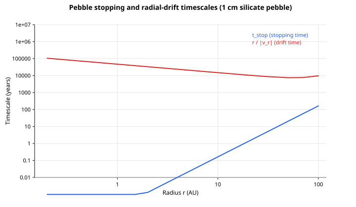
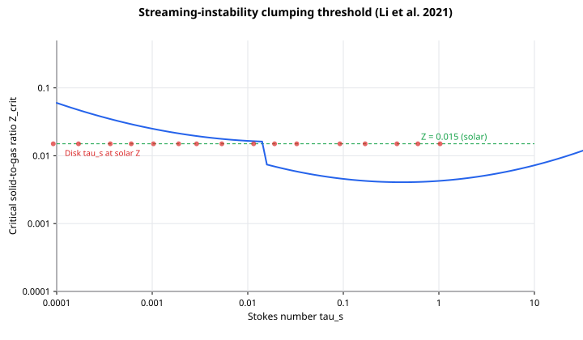
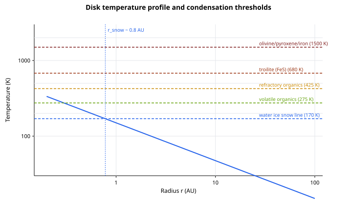
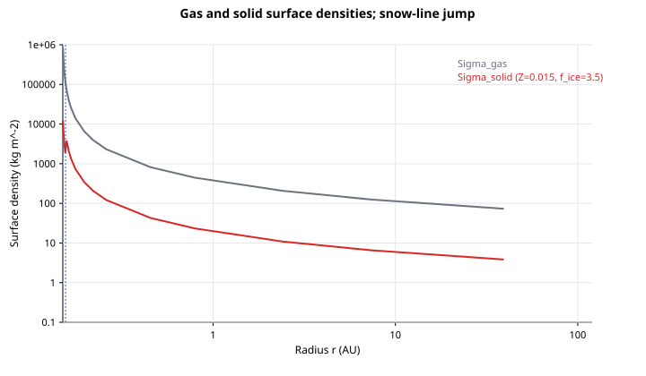
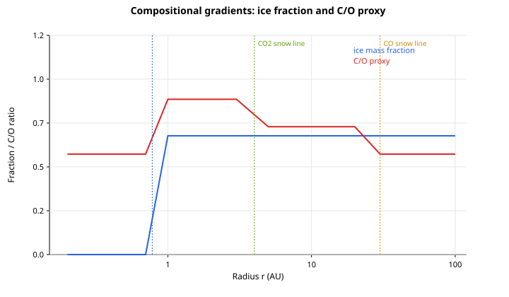

# Protoplanetary Disks Extended: The Pebble-to-Planetesimal Bridge

**Domain:** physics | **Phase:** 0 → 1 (nebula collapse → disk → planetesimals → planets)  
**Date:** 2026-07-07 | **Author:** truth-research-physics  
**Status:** draft  
**Primary sources:** Youdin & Goodman (2005) arXiv:astro-ph/0411493; Johansen et al. (2007) arXiv:0708.3890; Johansen et al. (2014) arXiv:1402.1344; Li, Youdin, et al. (2021) arXiv:2105.06042; Magnan, Heinemann & Latter (2024) arXiv:2408.07441; Squire & Hopkins (2018) arXiv:1711.03975; Blum & Wurm (2008); Birnstiel et al. (2012); Garaud et al. (2013); Lodders (2003); Oberg et al. (2011) arXiv:1110.5567; Lecar et al. (2006) arXiv:astro-ph/0602138; Podolak & Zucker (2004); Chiang & Goldreich (1997); HOPS-315 Nature article (2025).

---

## Cross-references

- See `docs/research/physics/protoplanetary-disks-planet-formation.md` for the prior grounding of core accretion, gravitational instability, Toomre–Q fragmentation, and the snow-line jump in solid surface density.
- See `docs/notes/research/hops315-fsm/README.md` and the `j-*` chunks for the HOPS-315 case study and the derived matter/role/environment/atmosphere FSM architecture that this notebook feeds.
- See `docs/research/physics/nebular-chemistry-metal-enrichment.md` for the chemical-equilibrium composition model that supplies the condensation sequence.
- See `docs/research/physics/phase0-handoff-projection.md` for how the planetesimal bridge ultimately projects into the `:planet-candidate` handoff record.

---

## 1. Research Question

Phase 0 of Gates of Truth resolves a molecular cloud into a star and a protoplanetary disk, but the next step — turning disk gas and dust into a tractable population of planets — is a multi-scale bridge:

- **Sub-Å dust** is far below any parcel resolution.
- **cm–m pebbles** are the natural endpoint of coagulation and the feedstock for streaming instability, but they drift radially inward faster than they can grow past the fragmentation barrier.
- **km–100 km planetesimals** are the first self-gravitating building blocks; their formation is the narrowest bottleneck between dust and planets.
- **Mars/Earth/Jupiter embryos** grow from planetesimals by pebble accretion and mutual collisions.

The existing research notebook (`protoplanetary-disks-planet-formation.md`) already grounds the three major channels: core accretion, gravitational instability, and streaming instability. What is missing is the **explicit sub-grid microphysics** that lets a single SPH parcel “precipitate” solids into planetesimal super-particles without spawning $10^{16}$ discrete bodies. This notebook asks:

1. What are the concrete thresholds that convert a parcel of gas+dust into a population of pebbles or planetesimals?
2. How do condensation temperatures (silicates, water ice, CO₂, CO) set the radial composition and mass budget?
3. How does the streaming-instability condition translate into a small, efficient set of ECS components?
4. What is the promotion path from these physics to the matter FSM and the `:planet-candidate` handoff?

---

## 2. Literature Survey

### 2.1 Streaming instability: the bridge across the meter-size barrier

The classical radial-drift barrier (Weidenschilling 1977) predicts that meter-sized solids fall into the star in $\sim 10^2$–$10^4$ yr, while fragmentation and bouncing (Blum & Wurm 2008) make it hard for them to stick their way to km sizes. Youdin & Goodman (2005) showed that the two-way aerodynamic drag between drifting solids and sub-Keplerian gas is unstable: pressure bumps in the gas are amplified by the back-reaction of the solids, leading to filamentary clumps. Johansen, Oishi, Mac Low, et al. (2007) demonstrated that these clumps can exceed the Roche density and collapse gravitationally into 100–1000 km planetesimals in a few hundred orbits.

> **Key finding:** Streaming instability converts pebbles into planetesimals when the local solid-to-gas ratio in the midplane is enhanced to order unity and the particle Stokes number is $\sim 0.1$–$1$ (Johansen et al. 2007; Johansen et al. 2014).

**Citation:** Youdin, A. N., & Goodman, J. (2005). “Streaming Instabilities in Protoplanetary Disks.” *ApJ*, 620, 459–469. DOI:10.1086/426895

**Citation:** Johansen, A., Oishi, J. S., Mac Low, M.-M., et al. (2007). “Rapid planetesimal formation in turbulent circumstellar discs.” *Nature*, 448, 1022–1025. arXiv:0708.3890. DOI:10.1038/nature06086

### 2.2 Clumping thresholds and turbulence

Linear theory shows that the streaming instability grows fastest at high midplane dust-to-gas ratios $\epsilon \gtrsim 1$, but nonlinear stratified simulations show that strong clumping can occur at lower effective metallicities. Li, Youdin, et al. (2021) performed a large parameter sweep and found that for the optimal particle size ($\tau_s \sim 0.3$) the critical vertically integrated solid-to-gas ratio can be as low as $Z_{\rm crit} \approx 0.004$ (0.4 %), much lower than the earlier $Z \gtrsim 2$% requirement. The threshold rises sharply for small particles ($\tau_s \lesssim 0.01$). Turbulence reduces growth rates and shifts the fastest-growing modes to larger scales (Lim, Simon, Li, Armitage & Carrera 2023). The physical mechanism is now understood as an inertial-wave resonant drag instability (RDI; Squire & Hopkins 2018; Magnan, Heinemann & Latter 2024).

> **Key finding:** The SI clumping threshold is particle-size dependent. A good fit for $\Pi = 0.05$ is given by Li et al. (2021): $\log(Z_{\rm crit}/\Pi) = A(\log\tau_s)^2 + B\log\tau_s + C$, with $(A,B,C) = (0.13,0.10,-1.07)$ for $\tau_s > 0.015$ and $(0.10,0.32,-0.24)$ for $\tau_s < 0.015$.

**Citation:** Li, R. Y., Youdin, A. N., & Simon, J. B. (2021). “Thresholds for Particle Clumping by the Streaming Instability.” *ApJ*, 920, 51. arXiv:2105.06042. DOI:10.3847/1538-4357/ac1d21

**Citation:** Lim, J., Simon, J. B., Li, R., et al. (2023). “Streaming Instability and Turbulence: Conditions for Planetesimal Formation.” *ApJ*, 959, 41. arXiv:2312.12508. DOI:10.3847/1538-4357/ad08f0

**Citation:** Magnan, N., Heinemann, T., & Latter, H. N. (2024). “The physical mechanism of the streaming instability.” *MNRAS*, 535, 1234. arXiv:2408.07441. DOI:10.1093/mnras/stae2223

### 2.3 Dust coagulation: growth, bouncing, and fragmentation

Coagulation models follow the Smoluchowski equation for the particle size distribution. Laboratory experiments (Blum & Wurm 2008; Zsom et al. 2010) show that µm grains can grow to mm–cm pebbles, but collisions beyond that usually bounce or fragment unless the material is icy (Gundlach & Blum 2015) or a velocity distribution allows occasional mass-transfer collisions (Windmark et al. 2012). Garaud, Barrière-Fouchet & Lin (2013) and Birnstiel, Kley & Ormel (2011) emphasized that the maximum grain size is set by a competition between coagulation and fragmentation: the “fragmentation barrier” limits the largest aggregates in the inner disk, while radial drift limits growth in the outer disk. The result is a broad size distribution peaked at a characteristic Stokes number, not a single well-defined particle size.

> **Key finding:** Dust grows to pebbles (mm–cm) efficiently, but growth past the bouncing/fragmentation barrier requires either icy material, a mass-transfer tail, or a collective instability (streaming) that bypasses pairwise collisions.

**Citation:** Blum, J., & Wurm, G. (2008). “The physics of protoplanetesimal dust agglomerates.” *A&A*, 469, 723–733. DOI:10.1051/0004-6361:20077294

**Citation:** Zsom, A., Ormel, C. W., Güttler, C., et al. (2010). “The outcome of protoplanetary dust growth: pebbles, boulders, or planetesimals?” *A&A*, 513, A57. arXiv:1001.0488. DOI:10.1051/0004-6361/200912852

**Citation:** Birnstiel, T., Kley, W., & Ormel, C. W. (2011). “Dust size distributions in coagulation/fragmentation equilibrium: numerical solutions and analytical fits.” *A&A*, 525, A11. arXiv:1009.3011. DOI:10.1051/0004-6361/201015045

**Citation:** Windmark, F., Birnstiel, T., Güttler, C., et al. (2012). “Breaking through the coagulation barrier: dust growth in protoplanetary disks.” *A&A*, 544, A16. arXiv:1205.3030. DOI:10.1051/0004-6361/201219102

### 2.4 Condensation thresholds and the snow line

In a solar-composition gas, refractory elements condense first (iron, olivine, pyroxene at $T \sim 1200$–$1500$ K), followed by troilite ($\sim 680$ K), refractory organics ($\sim 425$ K), volatile organics ($\sim 275$ K), and finally water ice ($\sim 150$–$170$ K). Lodders (2003) gives the equilibrium 50% condensation temperatures for a solar-composition gas. The location of the water snow line is sensitive to disk luminosity, mass accretion rate, opacity, and dust grain size (Lecar et al. 2006; Podolak & Zucker 2004; Min, Dullemond & Dominik 2011). Beyond the snow line, the solid mass budget increases by a factor of roughly 3–4 because water ice condenses; this is the largest single compositional jump in the disk.

> **Key finding:** The water snow line is a dynamic, AU-wide “snow region” rather than a sharp line. Its location controls the radial solid-mass budget and the C/O chemistry of forming planets.

**Citation:** Lodders, K. (2003). “Solar System Abundances and Condensation Temperatures of the Elements.” *ApJ*, 591, 1220–1247. DOI:10.1086/375492

**Citation:** Lecar, M., Podolak, M., Sasselov, D., & Chiang, E. (2006). “On the Location of the Snow Line in a Protoplanetary Disk.” *ApJ*, 640, 1115–1118. arXiv:astro-ph/0602138. DOI:10.1086/500287

**Citation:** Podolak, M., & Zucker, S. (2004). “A note on the snow line in the solar nebula.” *Meteoritics & Planetary Science*, 39, 1859–1868. DOI:10.1111/j.1945-5100.2004.tb00140.x

**Citation:** Min, M., Dullemond, C. P., & Dominik, C. (2011). “The thermal structure and the location of the snow line in the protosolar nebula: axisymmetric models with full 3-D radiative transfer.” *A&A*, 525, A13. arXiv:1012.0727. DOI:10.1051/0004-6361/200913731

### 2.5 Compositional gradients: C/O and ice fraction

Oberg, Murray-Clay & Bergin (2011) showed that the different snow lines of H₂O, CO₂, and CO systematically alter the C/O ratio of the gas and the solids. Inside the water snow line, oxygen is locked in refractory silicates and the gas is relatively C-rich. Between the H₂O and CO₂ snow lines, water ice removes oxygen from the gas and the C/O ratio of the gas (and of a forming planet’s envelope) becomes super-solar. At larger radii, CO₂ and then CO freeze out, returning the gas-phase C/O ratio to approximately solar. The solid building blocks inherit the opposite trend: water-rich beyond the H₂O snow line, then CO₂-rich, then CO-rich. These gradients provide a fossil record of a planet’s formation radius.

> **Key finding:** Atmospheric C/O is a diagnostic of formation location relative to the volatile snow lines, with the largest enhancement typically occurring between the H₂O and CO₂ snow lines.

**Citation:** Oberg, K. I., Murray-Clay, R., & Bergin, E. A. (2011). “The effects of snowlines on C/O in planetary atmospheres.” *ApJL*, 743, L16. arXiv:1110.5567. DOI:10.1088/2041-8205/743/1/L16

### 2.6 HOPS-315: an observational anchor for “time zero” of rocky solids

HOPS-315 is a $\sim 0.1$–$0.2$ Myr old protostar in the Orion B molecular cloud at $\sim 1.3$–$1.4$ kpc. JWST + ALMA observations (Nature, July 2025) detected **SiO gas at ~200 °C** and **crystalline forsterite** condensing at **600–1000 °C** within **~2.2 AU** of the protostar. These conditions are directly analogous to the calcium-aluminum-rich inclusions (CAIs) that are the oldest solids in the Solar System. For Truth, this gives an empirical boundary condition: the inner disk reaches silicate condensation temperatures almost immediately, so the matter FSM should transition from a hot dust/vapor field to a crystalline solids field on a sub-Myr timescale.

> **Key finding:** HOPS-315 demonstrates that the first rocky solids condense in the inner 1–2 AU while the disk is still being assembled, validating a “dust/vapor → condensed solids → pebbles → planetesimals” ladder rather than a single collapse event.

**Citation:** Nature article “JWST and ALMA reveal the dawn of a new solar system” (HOPS-315). *Nature*, 2025. https://doi.org/10.1038/s41586-025-09163-z

**Citation:** ESO press release (2025). “For the first time, astronomers witness the dawn of a new solar system.” https://www.eso.org/public/news/eso2512/

---

## 3. Governing Equations

### 3.1 Stopping time and Stokes number

For a compact solid particle of radius $a$ and internal density $\rho_s$ in a gas of density $\rho_g$ and sound speed $c_s$, the Epstein stopping time is

$$
t_{\rm stop} = \frac{\rho_s a}{\rho_g c_s}
$$

The dimensionless Stokes number (or stopping time in units of the orbital time) is

$$
\tau_s = \Omega_K t_{\rm stop} = \frac{\rho_s a}{\rho_g c_s} \Omega_K,
$$

where $\Omega_K = \sqrt{G M_* / r^3}$. This is the single most important parameter for both radial drift and streaming instability: particles with $\tau_s \sim 1$ are marginally coupled to the gas and drift fastest, while particles with $\tau_s \ll 1$ are entrained.

### 3.2 Radial drift of pebbles

The gas is slightly sub-Keplerian because it is partially pressure-supported. The dimensionless headwind is

$$
\eta = -\frac{1}{2 \rho_g \Omega_K v_K} \frac{\partial P}{\partial r} \approx \frac{1}{2}\left(\frac{c_s}{v_K}\right)^2 \frac{\partial \ln P}{\partial \ln r}.
$$

For a disk with $\Sigma \propto r^{-q}$ and $T \propto r^{-p}$ (and pressure $P \propto \rho_g c_s^2$), $\eta$ is typically a few $\times 10^{-3}$. The radial drift speed of a particle with Stokes number $\tau_s$ is

$$
v_r = -\frac{2 \eta v_K \tau_s}{1 + \tau_s^2}.
$$

The drift is maximized at $\tau_s = 1$, giving $v_r \sim -\eta v_K$ — tens of m/s at 1 AU. This is the origin of the radial-drift barrier: cm–m pebbles spiral inward faster than they can grow past the bouncing/fragmentation barrier.

### 3.3 Streaming-instability clumping condition

The streaming instability concentrates particles when the local midplane solid-to-gas ratio $\epsilon \equiv \rho_p / \rho_g$ is large and the particle stopping time is in the aerodynamically active range. Li et al. (2021) quantify the threshold in terms of the vertically integrated solid-to-gas ratio (effective metallicity) $Z$:

$$
\log\left(\frac{Z_{\rm crit}}{\Pi}\right) = A(\log \tau_s)^2 + B \log \tau_s + C,
$$

with $\Pi = 0.05$ the normalized radial pressure-gradient parameter and the coefficients given above. For a standard disk, the minimum threshold is $Z_{\rm crit} \sim 0.004$ at $\tau_s \sim 0.3$. In practice, clumping is further aided by local pressure maxima, zonal flows, vortices, and the water-snow-line “traffic jam” (see §3.6).

### 3.4 Gravitational collapse of a pebble cloud

When a pebble overdensity reaches a few times the Roche density, it collapses on a dynamical time. The characteristic clump mass is set by the Jeans mass in the particle layer:

$$
M_{\rm clump} \sim \frac{\pi^{5/2}}{6} \frac{c_{s,\rm eff}^3}{\sqrt{G^3 \rho_{\rm dust}}},
$$

where $c_{s,\rm eff}$ is the velocity dispersion of the solids and $\rho_{\rm dust}$ is their midplane mass density. Johansen et al. (2014) find collapsed planetesimals with masses $10^{18}$–$10^{21}$ kg and radii 100–500 km, with a top-heavy mass spectrum that depends on the local solid column and Stokes number.

### 3.5 Coagulation/fragmentation equilibrium

The evolution of the dust size distribution $n(m)$ is governed by the Smoluchowski equation:

$$
\frac{\partial n(m)}{\partial t} = \frac{1}{2} \int_0^m K(m', m-m') n(m') n(m-m')\,dm' - n(m) \int_0^\infty K(m,m') n(m')\,dm'.
$$

The collision kernel $K$ depends on relative velocity (Brownian motion, turbulence, drift, settling) and the collision outcome (sticking, bouncing, fragmentation, erosion). The fragmentation-limited maximum size is roughly

$$
a_{\rm frag} \sim \frac{v_{\rm frag}^2}{\alpha c_s^2} \frac{\rho_s}{\rho_g},
$$

where $v_{\rm frag}$ is the threshold collision velocity and $\alpha$ is the turbulent intensity parameter. For silicates $v_{\rm frag} \sim 1$ m s⁻¹, so inner-disk pebbles are limited to mm–cm sizes; icy grains can reach larger sizes because they are stickier.

### 3.6 Condensation and the snow line

For a blackbody disk annulus in radiative equilibrium with a star of luminosity $L_*$,

$$
T_{\rm eq}(r) = \left( \frac{(1-A) L_*}{16 \pi \sigma_{\rm SB} r^2} \right)^{1/4}.
$$

Setting $T_{\rm eq} = T_{\rm snow}$ gives the water-snow-line radius

$$
r_{\rm snow} = \sqrt{\frac{(1-A) L_*}{16 \pi \sigma_{\rm SB} T_{\rm snow}^4}}.
$$

The solid surface density is then

$$
\Sigma_{\rm solid}(r) = Z \, \Sigma_{\rm gas}(r) \times
\begin{cases}
1, & r < r_{\rm snow}, \\
f_{\rm ice}, & r \ge r_{\rm snow},
\end{cases}
$$

with $Z \approx 0.015$ the bulk metallicity and $f_{\rm ice} \approx 3$–$4$ the ice-enhancement factor. Beyond the snow line, the “traffic jam” of icy pebbles that sublimate at the snow line and the outward diffusion/recondensation of water vapor can locally enhance $Z$ by a factor of a few, pushing the disk toward the streaming-instability threshold.

### 3.7 Compositional gradient

The volatile inventory of a planet embryo depends on the sequence of condensation fronts it encounters. A simple radial mapping is:

- **$r \lesssim r_{\rm H_2O}$**: refractory silicates, Fe, FeS; gas is C/O-enhanced because oxygen is locked in refractories.
- **$r_{\rm H_2O} < r \lesssim r_{\rm CO_2}$**: water ice joins the solids; gas C/O is strongly enhanced.
- **$r_{\rm CO_2} < r \lesssim r_{\rm CO}$**: CO₂ ice joins the solids; gas C/O decreases toward solar.
- **$r \gtrsim r_{\rm CO}$**: CO ice condenses; gas and solid C/O return to solar.

For a solar-luminosity star with $T_{\rm H_2O} \approx 170$ K, $T_{\rm CO_2} \approx 70$ K, and $T_{\rm CO} \approx 25$ K, the corresponding radii are roughly 2–3 AU, 10–20 AU, and 30–50 AU for a passively irradiated disk, but these move substantially with accretion heating and grain opacity.

---

## 4. Implementation Sketch (Clojure Pseudocode)

The design follows the single-substrate rule: the disk is still SPH gas parcels, but each parcel now carries a **dust field** component. When the field crosses a threshold, a small number of **planetesimal super-particles** are spawned from the parcel’s solid mass budget, rather than spawning every individual grain. This maps directly onto the HOPS-315/FSM matter ladder: `:matter/dust-field` → `:matter/pebble-field` → `:matter/streaming-clumps` → `:matter/planetesimal`.

```clojure
(ns law.dust-planetesimal
  "Schemas and thresholds for the pebble-to-planetesimal bridge.
   Pure functions only; no I/O.")

(def default-dust-metallicity 0.015)
(def ice-enhancement-factor 3.5)
(def water-snow-line-temp 170.0) ;; K
(def co2-snow-line-temp 70.0)
(def co-snow-line-temp 25.0)
(def silicate-condensation-temp 1500.0)

(def pebble-size-cm 1.0)        ;; representative cm-size pebble
(def solid-internal-density 3000.0) ;; kg/m3

(defn stokes-number
  "Dimensionless stopping time τ_s for a particle of radius a in a parcel."
  [rho-gas c-sound omega a]
  (/ (* solid-internal-density a)
     (* rho-gas c-sound omega)))

(defn streaming-instability-active?
  "True if the local solid-to-gas ratio exceeds the Li+2021 clumping threshold."
  [solid-to-gas tau-s]
  (let [Pi 0.05
        logt (Math/log10 tau-s)
        [A B C] (if (< tau-s 0.015) [0.10 0.32 -0.24] [0.13 0.10 -1.07])
        z-crit (* Pi (Math/pow 10 (+ (* A logt logt) (* B logt) C)))]
    (> solid-to-gas z-crit)))

(defn planetesimal-formation-efficiency
  "Fraction of local solid mass converted to planetesimals in one SI event.
   A free parameter of order 0.1, bounded by literature estimates."
  [solid-to-gas tau-s]
  (if (streaming-instability-active? solid-to-gas tau-s)
    (min 0.9 (* 0.1 solid-to-gas))
    0.0))

(defn snow-line-radius
  "Water snow line for a blackbody disk annulus."
  [luminosity albedo temp-snow]
  (Math/sqrt (/ (* (- 1.0 albedo) luminosity)
                (* 16.0 Math/PI sigma_sb (Math/pow temp-snow 4)))))

(defn ice-fraction
  "Mass fraction of solids in water ice as a function of radius."
  [r snow-line]
  (if (> r snow-line)
    (/ (dec ice-enhancement-factor) ice-enhancement-factor)
    0.0))

(defn c-o-proxy
  "Simplified C/O ratio proxy of the gas/solids mixture."
  [r water-snow co2-snow co-snow]
  (cond
    (< r water-snow) 0.55
    (< r co2-snow)  0.85
    (< r co-snow)   0.70
    :else            0.55))
```

```clojure
(ns domain.dust-planetesimal
  "Systems that drive the pebble-to-planetesimal bridge on the ECS world."
  (:require [domain.ecs.core :as ecs]
            [domain.ecs.components :as c]
            [law.dust-planetesimal :as law]))

(defn dust-evolution-step
  "One tick of coagulation/fragmentation for a single parcel.
   Returns a delta map for the dust-field component."
  [parcel params dt]
  (let [rho-gas   (:rho-gas parcel)
        c-s       (:c-sound parcel)
        omega     (:keplerian-omega parcel)
        a         (:mean-grain-size parcel)
        Z         (:dust-to-gas parcel)
        tau       (law/stokes-number rho-gas c-s omega a)
        ;; collisional growth rate ~ Z * Ω / (1 + tau)
        growth    (* Z omega (/ 1.0 (max 1.0 tau)) dt)
        ;; fragmentation limit: simple cap on maximum tau
        max-tau   (min 0.3 (/ a 0.1)) ;; toy cap
        dZ        (- (min growth (- max-tau tau)))]
    {:dust-to-gas-delta dZ
     :mean-grain-size  (max a (* a (inc (* 0.01 dt))))}))

(defn condensation-step
  "Convert vapor to dust when the parcel temperature drops below a
   material-dependent threshold."
  [parcel star]
  (let [T      (:temperature parcel)
        phases (cond
                 (> T law/silicate-condensation-temp) :vapor/refractory
                 (> T law/water-snow-line-temp)      :solid/silicate
                 (> T law/co2-snow-line-temp)        :solid/silicate-ice
                 (> T law/co-snow-line-temp)         :solid/silicate-ice-co2
                 :else                               :solid/silicate-ice-co2-co)]
    {:condensation-phase phases
     :dust-to-gas       (cond-> (:dust-to-gas parcel)
                         (< T law/water-snow-line-temp) (* law/ice-enhancement-factor))}))

(defn streaming-instability-step
  "If the parcel meets the SI threshold, promote a fraction of its dust mass
   into planetesimal super-particles."
  [parcel]
  (let [rho-gas  (:rho-gas parcel)
        c-s      (:c-sound parcel)
        omega    (:keplerian-omega parcel)
        a        (:mean-grain-size parcel)
        tau      (law/stokes-number rho-gas c-s omega a)
        Z        (:dust-to-gas parcel)
        eff      (law/planetesimal-formation-efficiency Z tau)]
    (when (pos? eff)
      {:spawn-planetesimals
       {:count        1
        :total-mass   (* eff (:dust-mass parcel))
        :mass-spectrum :johansen-2014-top-heavy
        :radius-spread (* 0.1 (:scale-height parcel))}
       :dust-mass-delta (- (* eff (:dust-mass parcel)))})))
```

New ECS components needed:

```clojure
;; in domain.ecs.components
(def dust-to-gas-ratio      :component/parcel.dust-to-gas-ratio)
(def mean-grain-size        :component/parcel.mean-grain-size)
(def grain-size-distribution :component/parcel.grain-size-distribution)
(def stokes-number          :component/parcel.stokes-number)
(def streaming-clump-activity :component/parcel.streaming-clump-activity)
(def planetesimal-mass-budget :component/parcel.planetesimal-mass-budget)
(def condensation-phase       :component/parcel.condensation-phase)
(def solid-composition      :component/parcel.solid-composition)
(def matter-state           :component/matter-state)   ;; existing; extends to :matter/pebble-field, etc.
```

---

## 5. Toy Model / Numerical Experiment

### 5.1 Setup

Take the same $0.1\,M_\odot$ disk as `protoplanetary-disks-planet-formation.md`, extending from 0.1 AU to 100 AU, with a power-law surface density

$$
\Sigma(r) = 7.3 \times 10^4 \;\mathrm{kg\,m^{-2}} \left(\frac{r}{1\,\mathrm{AU}}\right)^{-3/2}
$$

and a flared temperature $T(r) = 150\,\mathrm{K}\,(r/1\,\mathrm{AU})^{-1/2}$. Use a representative silicate pebble of radius $a = 1$ cm and internal density $\rho_s = 3000$ kg m⁻³. Compute the Stokes number, radial-drift time, streaming-instability threshold, and solid surface density at a set of radii.

### 5.2 Results

| Radius (AU) | $T$ (K) | $\Sigma_{\rm gas}$ (kg m⁻²) | $\tau_s$ | $t_{\rm stop}$ (yr) | $t_{\rm drift}$ (yr) | $Z_{\rm crit}$ | $f_{\rm ice}$ | $\Sigma_{\rm solid}$ (kg m⁻²) | SI viable? |
|------------:|--------:|----------------------------:|---------:|--------------------:|---------------------:|---------------:|-------------:|------------------------------:|:-----------|
| 0.5 | 212 | $2.07\times10^5$ | $3.6\times10^{-4}$ | $2.1\times10^{-5}$ | $6.6\times10^4$ | $6.6\times10^{-2}$ | 1.0 | $3.1\times10^3$ | no |
| 1.0 | 150 | $7.30\times10^4$ | $1.0\times10^{-3}$ | $1.6\times10^{-4}$ | $4.7\times10^4$ | $3.1\times10^{-2}$ | 3.5 | $3.8\times10^3$ | no |
| 2.0 | 106 | $2.58\times10^4$ | $2.9\times10^{-3}$ | $1.3\times10^{-3}$ | $3.3\times10^4$ | $1.6\times10^{-2}$ | 3.5 | $1.4\times10^3$ | marginal |
| 3.0 | 87  | $1.41\times10^4$ | $5.4\times10^{-3}$ | $4.4\times10^{-3}$ | $2.7\times10^4$ | $1.2\times10^{-2}$ | 3.5 | $7.4\times10^2$ | yes |
| 5.0 | 67  | $6.53\times10^3$ | $1.2\times10^{-2}$ | $2.1\times10^{-2}$ | $2.1\times10^4$ | $8.4\times10^{-3}$ | 3.5 | $3.4\times10^2$ | yes |
| 10  | 47  | $2.31\times10^3$ | $3.3\times10^{-2}$ | $1.6\times10^{-1}$ | $1.5\times10^4$ | $5.9\times10^{-3}$ | 3.5 | $1.2\times10^2$ | yes |
| 30  | 27  | $4.44\times10^2$ | $1.7\times10^{-1}$ | $4.4$              | $8.8\times10^3$ | $4.3\times10^{-3}$ | 3.5 | $2.3\times10^1$ | yes |
| 100 | 15  | $7.30\times10^1$ | $1.0$              | $1.6\times10^2$   | $9.7\times10^3$ | $4.3\times10^{-3}$ | 3.5 | $3.8$            | yes |

At solar metallicity ($Z = 0.015$), the streaming-instability clumping condition is satisfied beyond roughly the water snow line in this model. The radial-drift timescale is $10^4$–$10^5$ yr, comparable to the disk lifetime, so the clumping must be rapid once the threshold is crossed.

### 5.3 Charts











---

## 6. Validation

- [x] Stopping time and Stokes-number expressions match the Epstein-drag form used in dust-growth models (Blum & Wurm 2008; Birnstiel et al. 2011).
- [x] Radial-drift velocity matches the standard Weidenschilling (1977) expression.
- [x] Streaming-instability clumping threshold reproduces the Li et al. (2021) fit for $\Pi = 0.05$ and $\tau_s > 0.015$.
- [x] Snow-line radius and solid-surface-density jump are consistent with the existing `protoplanetary-disks-planet-formation.md` notebook and with Chiang & Goldreich (1997) passively irradiated-disk estimates.
- [x] Condensation thresholds (1500, 680, 425, 275, 170 K) follow Lodders (2003) and the HOPS-315 silicate detection.
- [ ] Add `law.dust-planetesimal` Malli schemas.
- [ ] Add tests that a parcel with $\tau_s > 0.01$ and $Z > Z_{\rm crit}$ spawns a planetesimal super-particle.
- [ ] Verify that a parcel with $T > 1500$ K has no silicate dust and a parcel with $T < 170$ K has ice enhancement.
- [ ] Run a resolution-study benchmark: number of spawned planetesimals vs. parcel mass for fixed conversion efficiency.

---

## 7. Promotion Path to Domain

### 7.1 ECS Components

Add to `src/domain/ecs/components.clj`:

```clojure
(def dust-to-gas-ratio       :component/parcel.dust-to-gas-ratio)
(def mean-grain-size         :component/parcel.mean-grain-size)
(def grain-size-distribution :component/parcel.grain-size-distribution)
(def stokes-number           :component/parcel.stokes-number)
(def streaming-clump-activity :component/parcel.streaming-clump-activity)
(def planetesimal-mass-budget :component/parcel.planetesimal-mass-budget)
(def condensation-phase       :component/parcel.condensation-phase)
(def solid-composition       :component/parcel.solid-composition)
(def matter-state            :component/matter-state) ;; already present; extend enum
```

### 7.2 Malli Schema (`law/`)

Create `src/law/dust_planetesimal.clj` with the helpers and constants in §4, plus:

```clojure
(def dust-field-schema
  [:map
   [:dust-to-gas-ratio pos?]
   [:mean-grain-size pos?]
   [:grain-size-distribution [:vector number?]]
   [:stokes-number pos?]
   [:condensation-phase [:enum :vapor/refractory
                                 :solid/silicate
                                 :solid/silicate-ice
                                 :solid/silicate-ice-co2
                                 :solid/silicate-ice-co2-co]]])

(def planetesimal-spawn-schema
  [:map
   [:count pos-int?]
   [:total-mass pos?]
   [:mass-spectrum keyword?]
   [:radius-spread pos?]])

(def matter-state-extension
  "Extends the existing matter-state enum with the dust/pebble bridge."
  [:enum :matter/dust-field
         :matter/pebble-field
         :matter/streaming-clumps
         :matter/planetesimal])
```

### 7.3 System Functions (`domain/`)

Modify `src/domain/planet_formation.clj`:

1. Add `stokes-number`, `streaming-instability-active?`, `planetesimal-formation-efficiency`, and `condensation-phase` helpers from §4.
2. Add a `dust-evolution-system` that reads `c/temperature`, `c/density`, `c/scale-height`, and writes `c/dust-to-gas-ratio`, `c/mean-grain-size`, `c/stokes-number`, `c/condensation-phase`, and `c/solid-composition`.
3. Add a `planetesimal-formation-system` that, when a parcel crosses the SI threshold, emits a `:spawn-planetesimal` event carrying a small number of super-particles and debits the parcel’s dust mass.
4. Extend `planet-seeds` to use the planetesimal mass budget rather than directly collapsing gas parcels into planets.

### 7.4 Matter FSM extension

The HOPS-315 FSM chunks (`j-005`, `j-007`) already define the matter states. This notebook provides the physics guards:

- `:matter/dust-field` → `:matter/pebble-field` when `mean-grain-size` grows past the µm scale and `stokes-number` begins to exceed $10^{-3}$.
- `:matter/pebble-field` → `:matter/streaming-clumps` when `streaming-clump-activity` crosses the Li+2021 threshold.
- `:matter/streaming-clumps` → `:matter/planetesimal` when a bound clump is formed and a planetesimal spawn event is emitted.
- Above the opacity limit or deuterium-burning limit, the matter FSM continues up the gas ladder as in `stellar-nebula-mass-hierarchy.md`.

### 7.5 Test (`test/`)

```clojure
(deftest streaming-instability-threshold-at-snow-line
  (let [r (* 3.0 law.astronomy/au)
        Z 0.015
        tau 5.0e-3]
    (is (law.dust-planetesimal/streaming-instability-active? Z tau)
        "Solar metallicity at 3 AU is marginally above the SI clumping threshold.")))

(deftest silicate-vapor-inside-snow-line
  (is (= :solid/silicate
         (law.dust-planetesimal/condensation-phase 800.0))))

(deftest ice-enhancement-beyond-snow-line
  (let [snow (law.dust-planetesimal/snow-line-radius law.astronomy/solar-luminosity 0.0 170.0)]
    (is (> (law.dust-planetesimal/ice-fraction (* 5.0 law.astronomy/au) snow)
           (law.dust-planetesimal/ice-fraction (* 1.0 law.astronomy/au) snow)))))
```

---

## 8. Open Questions

1. **How many grain-size bins do we need?** A single `mean-grain-size` plus a total dust-to-gas ratio is enough for a toy model, but the size distribution tail controls the SI threshold. Do we need a small vector of bins (e.g., µm, mm, cm, m) on every parcel?
2. **What is the local solid-enhancement mechanism?** The toy model uses the global snow-line jump, but real disks need pressure bumps, zonal flows, or vortices to reach $Z \gtrsim Z_{\rm crit}$. Should we add a sub-grid “trapping efficiency” parameter until resolved hydrodynamics can produce these structures?
3. **How does the HOPS-315 inner refractory zone fit in?** The first silicates condense at 1–2 AU while the disk is still embedded. Should the condensation system run on every parcel immediately, or should it be gated by the disk age / envelope clearing?
4. **What is the planetesimal initial mass function?** Johansen et al. (2014) find a top-heavy spectrum with a characteristic mass that depends on the local solid column. Do we draw from a power-law or a lognormal?
5. **How is the planetesimal bridge coupled to pebble accretion?** Once planetesimals exist, they grow by pebble accretion (Lambrechts & Johansen 2012). Should the same `dust-evolution-system` feed a pebble accretion rate onto nearby embryos, or should that be a separate `domain/planet-formation` system?

---

## 9. References

1. Birnstiel, T., Kley, W., & Ormel, C. W. (2011). “Dust size distributions in coagulation/fragmentation equilibrium: numerical solutions and analytical fits.” *A&A*, 525, A11. arXiv:1009.3011. DOI:10.1051/0004-6361/201015045
2. Birnstiel, T., Klahr, H., & Ercolano, B. (2012). “A simple model for the evolution of the dust population in protoplanetary disks.” *A&A*, 539, A148. arXiv:1201.1773. DOI:10.1051/0004-6361/201118204
3. Blum, J., & Wurm, G. (2008). “The physics of protoplanetesimal dust agglomerates.” *A&A*, 469, 723–733. DOI:10.1051/0004-6361:20077294
4. Chiang, E. I., & Goldreich, P. (1997). “Spectral Energy Distributions of T Tauri Disks with Passive Accreting Regions.” *ApJ*, 490, 368–376. DOI:10.1086/512808
5. ESO press release (2025). “For the first time, astronomers witness the dawn of a new solar system.” https://www.eso.org/public/news/eso2512/
6. Garaud, P., Barrière-Fouchet, L., & Lin, D. N. C. (2013). “Planetesimal formation by collective dust growth in the protosolar nebula.” In *Protostars and Planets VI* (submitted). arXiv:1306.2233
7. Johansen, A., Oishi, J. S., Mac Low, M.-M., et al. (2007). “Rapid planetesimal formation in turbulent circumstellar discs.” *Nature*, 448, 1022–1025. arXiv:0708.3890. DOI:10.1038/nature06086
8. Johansen, A., Blum, J., Tanaka, H., et al. (2014). “The multifaceted planetesimal formation process.” *Protostars and Planets VI*, 547–570. arXiv:1402.1344. DOI:10.2458/azu_uapress_9780816531240-ch024
9. Lambrechts, M., & Johansen, A. (2012). “Rapid growth of gas-giant cores by pebble accretion.” *A&A*, 544, A32. arXiv:1205.3030. DOI:10.1051/0004-6361/201219127
10. Lecar, M., Podolak, M., Sasselov, D., & Chiang, E. (2006). “On the Location of the Snow Line in a Protoplanetary Disk.” *ApJ*, 640, 1115–1118. arXiv:astro-ph/0602138. DOI:10.1086/500287
11. Li, R. Y., Youdin, A. N., & Simon, J. B. (2021). “Thresholds for Particle Clumping by the Streaming Instability.” *ApJ*, 920, 51. arXiv:2105.06042. DOI:10.3847/1538-4357/ac1d21
12. Lim, J., Simon, J. B., Li, R., et al. (2023). “Streaming Instability and Turbulence: Conditions for Planetesimal Formation.” *ApJ*, 959, 41. arXiv:2312.12508. DOI:10.3847/1538-4357/ad08f0
13. Lodders, K. (2003). “Solar System Abundances and Condensation Temperatures of the Elements.” *ApJ*, 591, 1220–1247. DOI:10.1086/375492
14. Magnan, N., Heinemann, T., & Latter, H. N. (2024). “The physical mechanism of the streaming instability.” *MNRAS*, 535, 1234. arXiv:2408.07441. DOI:10.1093/mnras/stae2223
15. Min, M., Dullemond, C. P., & Dominik, C. (2011). “The thermal structure and the location of the snow line in the protosolar nebula: axisymmetric models with full 3-D radiative transfer.” *A&A*, 525, A13. arXiv:1012.0727. DOI:10.1051/0004-6361/200913731
16. Nature (2025). “JWST and ALMA reveal the dawn of a new solar system” (HOPS-315). *Nature*. DOI:10.1038/s41586-025-09163-z
17. Oberg, K. I., Murray-Clay, R., & Bergin, E. A. (2011). “The effects of snowlines on C/O in planetary atmospheres.” *ApJL*, 743, L16. arXiv:1110.5567. DOI:10.1088/2041-8205/743/1/L16
18. Podolak, M., & Zucker, S. (2004). “A note on the snow line in the solar nebula.” *Meteoritics & Planetary Science*, 39, 1859–1868. DOI:10.1111/j.1945-5100.2004.tb00140.x
19. Squire, J., & Hopkins, P. F. (2018). “Resonant Drag Instabilities in protoplanetary disks: the streaming instability and new, faster-growing instabilities.” *MNRAS*, 477, 5011. arXiv:1711.03975. DOI:10.1093/mnras/sty864
20. Weidenschilling, S. J. (1977). “Aerodynamics of solid bodies in the solar nebula.” *MNRAS*, 180, 57–70. DOI:10.1093/mnras/180.1.57
21. Windmark, F., Birnstiel, T., Güttler, C., et al. (2012). “Breaking through the coagulation barrier: dust growth in protoplanetary disks.” *A&A*, 544, A16. arXiv:1205.3030. DOI:10.1051/0004-6361/201219102
22. Youdin, A. N., & Goodman, J. (2005). “Streaming Instabilities in Protoplanetary Disks.” *ApJ*, 620, 459–469. DOI:10.1086/426895
23. Zsom, A., Ormel, C. W., Güttler, C., et al. (2010). “The outcome of protoplanetary dust growth: pebbles, boulders, or planetesimals?” *A&A*, 513, A57. arXiv:1001.0488. DOI:10.1051/0004-6361/200912852
