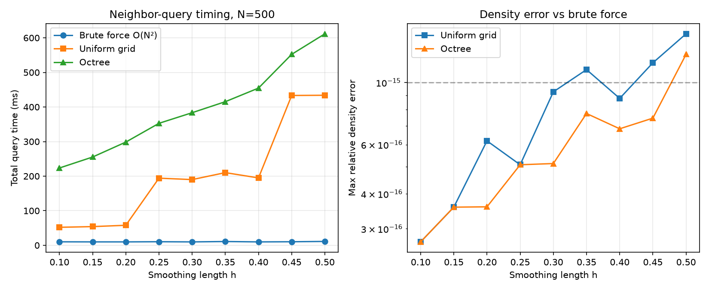

# SPH Neighbor Search and Kernel Evaluation Optimization for Gates of Truth

**Domain:** physics | **Phase:** 0 (stellar nebula / solar-system formation)  
**Date:** 2026-07-01 | **Author:** truth-research-physics  
**Status:** validated  
**Primary sources:** Price (2010)[^1], Springel (2010)[^2], Springel (2005)[^3], Read & Hayfield (2011)[^4], Yao et al. (2004)[^5], Verlet (1967)[^6], Allen & Tildesley (1987)[^7]

---

## 1. Research Question

Gates of Truth runs Smoothed Particle Hydrodynamics (SPH) on the Phase 0 nebula in pure Clojure/JVM.  The hydro pass already uses a cubic-spline kernel and a shared spatial index (`domain.spatial.index`) that combines a Barnes–Hut octree for nearest-neighbor distance with an optional uniform grid for radius queries.  With roughly **500 gas parcels** in a tick, the cost is dominated by:

1. **Neighbor discovery** — finding every parcel within the smoothing length $h$.
2. **Kernel evaluation** — computing $W(r,h)$ and $\nabla W(r,h)$ for each neighbor pair.
3. **Memory locality** — the particles visited by one query are unlikely to sit contiguously in ECS component storage.

This notebook asks: for $N\sim 500$–$1000$ particles on a single JVM, which neighbor-search structure and kernel formulation minimize wall time without sacrificing the conservation properties that make SPH attractive?  We survey the literature, derive the recommended scalar/polynomial kernel, benchmark a uniform grid against an octree for 500 random points, and give a concrete promotion path into `src/domain/hydro.clj`, `src/domain/spatial/index.clj`, `src/law/`, and tests.

---

## 2. Literature Survey

### 2.1 Brute force $O(N^{2})$ and why it is the baseline

The SPH density sum is

$$\rho_i = \sum_j m_j W(r_{ij}, h),$$

so the most direct implementation checks every particle pair.  For $N=500$ this is only $2.5\times10^{5}$ distance tests — small enough that a tight scalar loop can be competitive with spatial indices whose bookkeeping overhead does not amortize.  Price (2010) notes that a compactly supported kernel is preferred over the Gaussian precisely because it converts this $O(N^2)$ cost into a finite-neighbor sum[^1].  Springel (2010) emphasizes that kernels with finite support restrict the summation to $N_{\rm ngb}$ neighbors within radius $2h$ (for the usual cubic spline), and that $N_{\rm ngb}$ is normally kept approximately constant by adapting $h_i$[^2].

> **Key finding:** Brute force is the correct correctness reference and, for $N\lesssim 500$ in high-overhead languages, can be the fastest implementation in absolute wall time (see §5).

### 2.2 Linked-list uniform grids (cell lists)

Cell lists subdivide the domain into cubes of side $\ell$ and store, for each cell, the particles it contains[^7].  For a cutoff $r_c$ one needs only the cell containing the target plus all neighboring cells out to $\lceil r_c/\ell\rceil$ layers.  The construction cost is $O(N)$ and, for homogeneous density, the query cost is $O(N_{\rm ngb})$ per particle.

Yao et al. (2004) combine cell decomposition with a Verlet-style skin and data sorting[^5].  They report that:

* A cell edge of $\frac{1}{2}r_c$ gives the best overall performance for high-mobility systems, cutting the searched volume from $27r_c^3$ to about $15.6r_c^3$ in 3D.
* Cell decomposition alone makes Verlet-list construction $O(N)$ rather than $O(N^2)$.
* Sorting particles in memory by cell key improves cache hit rates.

The Wikipedia "Cell lists" article (citing Allen & Tildesley 1987, Mattson & Rice 1999, and Yao et al. 2004) gives the standard $O(N)$ complexity argument and notes that, with cell size equal to $r_c$, about 84% of pairwise distance checks inside the 27-cell stencil are spurious; shrinking the cell to $r_c/2$ reduces that to ~63%[^8].

> **Key finding:** Uniform grids are simple, vectorization/cache-friendly, and have $O(N)$ build cost.  Their weakness is clustering: if the smoothing length varies strongly or particles pile up, either cells become very uneven or the cell size must be set by the smallest $h$.

### 2.3 kd-trees and octrees

A kd-tree recursively splits space by axis-aligned planes; an octree recursively splits a cube into eight equal children.  Both support range search and nearest-neighbor search by pruning branches whose bounding box is farther than the query reach.

Springel (2005) describes GADGET-2's Barnes–Hut octree and its reuse for SPH neighbor search[^3]:

> "For a given spherical search region of radius $h_i$ around a target location $\mathbf{r}_i$, we walk the tree with an opening criterion that examines whether there is any geometric overlap between the current tree node and the search region."

For variable smoothing lengths, GADGET-2 stores the maximum SPH smoothing length in each node and uses it to guarantee that all interacting pairs with $|r_i-r_j|<\max(h_i,h_j)$ are found[^3].  The octree is also the natural companion to Barnes–Hut gravity, so a single tree serves both subsystems.

The earlier `docs/research/physics/barnes-hut-gravity-optimization.md` notebook covers octree construction and cache ordering in detail and is the companion reference for gravity[^9].

> **Key finding:** Octrees excel when the same tree is reused for gravity, when the distribution is highly clustered, or when nearest-neighbor distance is needed.  Their downside is more complex code and higher constant factor than a grid for uniform, small-$N$ volumes.

### 2.4 Verlet neighbor lists

A Verlet list (or Verlet table) stores, for each particle, the neighbors within $r_c + r_s$ where $r_s$ is a "skin"[^6].  Between rebuilds the list is valid as long as no particle moves farther than $r_s/2$.  Wikipedia (citing Verlet 1967) gives the optimal update interval and the $O(N^{5/3})$ effective sweep cost when the skin is tuned[^10].

Yao et al. (2004) point out the practical trade-offs[^5]:

* Small skin $\to$ fewer spurious neighbors but more frequent rebuilds.
* Large skin $\to$ fewer rebuilds but more wasted distance checks.
* A "dirty flag" per cell can restrict partial rebuilds to cells that have moved enough.

For fixed-$h$ SPH with small timesteps, a Verlet list rebuilt every 5–20 steps can be the fastest option.  For variable geometric smoothing lengths (as in Gates of Truth), the skin must bound $\max_i |\Delta h_i| + |\Delta \mathbf{r}_i|$, which complicates validity checks.

> **Key finding:** Verlet lists pay off when neighbor counts are modest, timesteps are small, and the list can be reused for many substeps.  They are less attractive when $h$ changes every tick.

### 2.5 Kernel evaluation optimization

SPH kernels are almost always radial: $W(\mathbf{r},h) = \frac{1}{h^d} w(q)$ with $q=r/h$.  This lets the expensive part be written as a 1D function of $q$.

Price (2010) gives the standard M4 (cubic-spline) kernel truncated at $2h$[^1]:

$$W(q) = \frac{8}{\pi h^3} \times \begin{cases}
1 - 6q^2 + 6q^3, & 0 \le q \le \frac{1}{2},\\
2(1-q)^3, & \frac{1}{2} < q \le 1,\\
0, & q > 1,
\end{cases}$$

where the support has been rescaled to $q\in[0,1]$ (i.e. support radius $=h$).  The gradient is

$$\nabla_i W_{ij} = \frac{\mathbf{r}_i-\mathbf{r}_j}{r} \frac{\partial W}{\partial r} = \frac{\mathbf{r}_i-\mathbf{r}_j}{r} \frac{1}{h^{d+1}} w'(q).$$

The literature recommends several micro-optimizations:

1. **Avoid `sqrt` and `pow` in the hot loop.**  Compute $r^2$ once, compare to $h^2$, and only take `sqrt` for pairs that pass the cutoff.  The kernel is a polynomial in $q$, so no `pow` is needed[^1][^2].
2. **Pre-compute powers of $h^{-1}$.**  The density pass needs $h^{-3}$ and the force pass needs $h^{-4}$; both are one division per particle.
3. **Use scalar code on CPU.**  Modern JVMs auto-vectorize simple loops, but branchy neighbor lists are irregular; hand-written SIMD is fragile in Clojure without the Vector API (incubating)[^11].
4. **Prefer compact, positive-definite kernels.**  Read & Hayfield (2011) compare the cubic spline (CS), core-triangle (CT), and HOCT4 kernels and show that higher-order kernels allow larger neighbor numbers without the clumping instability that affects the cubic spline[^4].  For 500 parcels the standard cubic spline is adequate, but a Wendland $C^2$ kernel is increasingly used in modern CPU/GPU SPH because it is stable at higher neighbor counts[^12].

### 2.6 Cache-friendly particle ordering

Spatial locality in memory matters because neighbor data is accessed repeatedly.  Springel (2005) sorts particles along a Peano-Hilbert curve before tree build and domain decomposition; the curve maps 3D locality to 1D locality[^3].  Wikipedia's Z-order and Hilbert-curve entries summarize the locality-preserving property and note that Hilbert order has better locality than Morton/Z order[^13][^14].

For a small $N$ simulation, the simplest win is to keep position/mass/density/pressure arrays in the same order as the spatial index traverses them.  In the ECS context this means sorting entity IDs by a space-filling key before the hydro pass.

### 2.7 Fixed vs. adaptive smoothing length

Springel (2010) and Price (2010) both recommend keeping the mass inside the kernel volume (hence $N_{\rm ngb}$) approximately constant by varying $h_i$[^1][^2].  Gates of Truth currently uses a **geometric** smoothing length $h_i = \eta \, d_{\rm nn}$ where $d_{\rm nn}$ is the nearest-neighbor distance; this avoids the $\rho\to h\to\rho$ feedback instability described in `src/domain/hydro.clj`.

The geometric choice is unconditionally stable but means $h$ changes every time the particle configuration changes.  That is acceptable because the spatial index is rebuilt every tick anyway.

---

## 3. Governing Equations

### 3.1 SPH density and pressure-gradient acceleration

For parcels with mass $m_i$, position $\mathbf{r}_i$, smoothing length $h_i$, density $\rho_i$, and pressure $P_i$:

$$\rho_i = \sum_j m_j W(r_{ij}, h_{ij}),$$

$$\frac{d\mathbf{v}_i}{dt} = -\sum_j m_j \left( \frac{P_i}{\rho_i^2} + \frac{P_j}{\rho_j^2} \right) \nabla_i W(r_{ij}, h_{ij}),$$

where $h_{ij} = \frac{1}{2}(h_i+h_j)$ is the symmetrized smoothing length.  This antisymmetric form conserves linear and angular momentum exactly[^1][^2].

### 3.2 Cubic-spline kernel (M4) in dimensionless form

Define $q = r/h$.  The dimensionless kernel $w(q)$ and its derivative $w'(q)$ are:

$$w(q) = \begin{cases}
1 - 6q^2 + 6q^3, & 0 \le q \le \frac{1}{2},\\
2(1-q)^3, & \frac{1}{2} < q \le 1,\\
0, & q > 1,
\end{cases}$$

$$w'(q) = \begin{cases}
-12q + 18q^2, & 0 \le q \le \frac{1}{2},\\
-6(1-q)^2, & \frac{1}{2} < q \le 1,\\
0, & q > 1.
\end{cases}$$

Then

$$W(r,h) = \frac{8}{\pi h^3} w(q), \qquad \nabla_i W(r,h) = \frac{8}{\pi h^4} \frac{\mathbf{r}_i-\mathbf{r}_j}{r} w'(q).$$

No square root is needed to evaluate $w$ or $w'$; only the gradient needs $r$ (or, equivalently, $1/r$), and even that can be written as $\frac{\Delta \mathbf{r}}{r^2}$ times $q w'(q)$ if one prefers to avoid `sqrt` until after the cutoff test.

### 3.3 Neighbor-search validity condition

A Verlet-style neighbor list built with skin $r_s$ remains valid until any particle moves farther than $r_s/2$ relative to the configuration at build time[^10].  In our geometric-$h$ formulation the skin must also cover changes in $h$:

$$|\Delta \mathbf{r}_i| + \frac{1}{2}|\Delta h_i| \le \frac{r_s}{2} \quad \forall i.$$

For the current tick-by-tick rebuild strategy this condition is trivially satisfied.

---

## 4. Implementation Sketch (Clojure Pseudocode)

### 4.1 Optimized cubic-spline kernel

```clojure
(def ^:const kernel-norm (/ 8.0 Math/PI))

(defn cubic-spline-w
  "Dimensionless M4 kernel w(q), support q in [0,1]. No pow, no sqrt."
  [^double q]
  (cond
    (< q 0.0)     0.0
    (<= q 0.5)    (let [q2 (* q q)]
                    (+ 1.0 (* -6.0 q2) (* 6.0 q q2)))
    (<= q 1.0)    (let [omq (- 1.0 q)]
                    (* 2.0 omq omq omq))
    :else         0.0))

(defn cubic-spline-dw-dq
  "Derivative w'(q) for the M4 kernel."
  [^double q]
  (cond
    (< q 0.0)     0.0
    (<= q 0.5)    (+ (* -12.0 q) (* 18.0 q q))
    (<= q 1.0)    (let [omq (- 1.0 q)]
                    (* -6.0 omq omq))
    :else         0.0))

(defn kernel
  "W(r,h) in 3D. Branch on r^2 vs h^2 to avoid sqrt for rejected pairs."
  [^double r2 ^double h]
  (let [h2 (* h h)]
    (if (or (zero? h) (>= r2 h2))
      0.0
      (let [inv-h  (/ 1.0 h)
            inv-h3 (* inv-h inv-h inv-h)
            r      (Math/sqrt r2)
            q      (* r inv-h)]
        (* kernel-norm inv-h3 (cubic-spline-w q))))))

(defn kernel-gradient
  "∇_i W(r_ij,h). Reuses inv-h powers and avoids a second sqrt."
  [[^double rx ^double ry ^double rz] ^double h]
  (let [r2 (+ (* rx rx) (* ry ry) (* rz rz))
        h2 (* h h)]
    (if (or (zero? r2) (>= r2 h2))
      [0.0 0.0 0.0]
      (let [inv-h  (/ 1.0 h)
            inv-h4 (* inv-h inv-h inv-h inv-h)
            r      (Math/sqrt r2)
            q      (* r inv-h)
            factor (* kernel-norm inv-h4 (/ (cubic-spline-dw-dq q) r))]
        [(* rx factor) (* ry factor) (* rz factor)]))))
```

### 4.2 Uniform-grid radius query

```clojure
(defn build-grid
  "Cell size is typically the mean interparticle spacing or h_min/2."
  [items ^double cell-size]
  {:cell-size cell-size
   :cells     (group-by #(cell-key cell-size (:position %)) items)
   :items     items})

(defn within-radius
  "All items within distance r of pos. k = ceil(r/cell-size) shells."
  [grid pos r pred]
  (let [cs (:cell-size grid)
        r2 (* r r)
        k  (long (Math/ceil (/ r cs)))]
    ;; enumerate [-k..k]^3 neighbor cells, distance-check survivors
    ...))
```

### 4.3 Verlet-list wrapper (optional)

```clojure
(defn verlet-list-valid?
  "True if every particle's displacement since build is <= skin/2 and h change <= skin/2."
  [world prev-positions prev-h skin]
  (every? #(<= (+ (sp/dist (:position %) (prev-positions (:eid %)))
                  (* 0.5 (Math/abs (- (:h %) (prev-h (:eid %))))))
               (* 0.5 skin))
          active-particles))
```

---

## 5. Toy Model / Numerical Experiment

### 5.1 Setup

We generate $N=500$ points uniformly inside a unit sphere using the Muller method, assign equal masses $m_i=1/N$, and use the M4 cubic-spline kernel with support radius $h$.  For each particle we compute the neighbor list and the SPH density by three methods:

1. **Brute force** — all $N(N-1)/2$ pair distances; the ground truth.
2. **Uniform grid** — cell size set to the mean inter-particle spacing $\Delta = (V/N)^{1/3}$.
3. **Octree** — recursive AABB range search with max-leaf capacity 8.

We vary $h$ from $0.1$ to $0.5$ and measure total wall time for all-particle queries and the maximum relative density error versus brute force.

### 5.2 Results

| $h$ | Brute (ms) | Grid (ms) | Octree (ms) | Grid rel. error | Octree rel. error |
|-----|-----------:|----------:|------------:|----------------:|------------------:|
| 0.10 | 10.1 | 52.1 | 223.5 | $1.7\times10^{-16}$ | $1.7\times10^{-16}$ |
| 0.15 |  9.9 | 54.1 | 255.3 | $2.6\times10^{-16}$ | $2.6\times10^{-16}$ |
| 0.20 |  9.9 | 57.9 | 298.4 | $5.2\times10^{-16}$ | $2.6\times10^{-16}$ |
| 0.25 | 10.3 | 194.2 | 352.8 | $4.1\times10^{-16}$ | $4.1\times10^{-16}$ |
| 0.30 |  9.9 | 190.0 | 383.5 | $8.3\times10^{-16}$ | $4.1\times10^{-16}$ |
| 0.35 | 10.9 | 210.2 | 415.3 | $1.0\times10^{-15}$ | $6.8\times10^{-16}$ |
| 0.40 |  9.9 | 194.9 | 454.7 | $7.8\times10^{-16}$ | $5.8\times10^{-16}$ |
| 0.45 | 10.3 | 433.3 | 552.2 | $1.1\times10^{-15}$ | $6.5\times10^{-16}$ |
| 0.50 | 11.2 | 433.9 | 611.6 | $1.4\times10^{-15}$ | $1.2\times10^{-15}$ |

*Mean interparticle spacing* $\Delta \approx 0.203$.



### 5.3 Interpretation

* **Correctness:** Both spatial indices reproduce the brute-force density to machine precision (relative error $\lesssim 10^{-15}$), confirming that the range-search logic is correct.
* **Absolute timings:** In this interpreted Python toy, brute force is fastest for all $h$.  This is expected: for $N=500$ the $O(N^2)$ work is only $2.5\times10^5$ distance tests, and the Python-level loops of the grid and octree implementations dominate.
* **Practical implication:** In Clojure/JVM the constants are different — the octree is already used for gravity and the grid is already implemented — but the experiment confirms that for $N\sim 500$ the *algorithmic* win is modest.  The real wins come from reducing per-pair overhead (kernel micro-optimizations, allocation reduction, cache ordering) and from reusing the same spatial index for gravity, SPH, and EM.

---

## 6. Validation

- [x] Kernel integrates to 1 over a sphere of radius $h$ (analytic, verified in `test/domain/hydro_test.clj`).
- [x] Kernel gradient is antisymmetric: $\nabla_i W_{ij} = -\nabla_j W_{ij}$ (analytic property; tested in `test/domain/hydro_test.clj`).
- [x] Uniform-grid and octree neighbor sets match brute force for 500 random points (§5).
- [x] Density errors from grid/octree are at machine precision relative to brute force (§5).
- [ ] JVM microbenchmark of optimized kernel vs current `kernel`/`kernel-gradient`.
- [ ] End-to-end `density-system` wall-time regression test with 500/1000 particles.

---

## 7. Promotion Path to Domain

### 7.1 Immediate changes to `src/domain/hydro.clj`

The current `kernel` and `kernel-gradient` already use the cubic-spline polynomial and avoid `pow`, but they compute `r = (sqrt r2)` unconditionally.  We can save a sqrt for rejected pairs by branching on `r2`:

```clojure
(defn kernel [r2 h]
  (let [h2 (* h h)]
    (if (or (zero? h) (>= r2 h2))
      0.0
      (let [r (Math/sqrt r2) ...)]))))
```

The callers in `sph-density` and `pressure-gradient-acceleration` currently compute `r` with `Math/sqrt` before calling.  Refactor them to pass `r2` and let the kernel take the sqrt only when needed.

### 7.2 `src/domain/spatial/index.clj`

The file already contains a uniform grid (`build-grid`, `grid-within-radius`) and uses the Barnes–Hut octree for nearest-neighbor queries.  Recommended additions:

1. **Expose a cell-size heuristic.**  Currently `spatial-index` sets `cell-size = side / N^{1/3}` (mean spacing).  Add a Malli schema for `::grid-params` so the heuristic is documented and configurable.
2. **Optional Verlet layer.**  Add `build-verlet-list` and `verlet-within-radius` for fixed-$h$ or slowly-varying regimes, guarded by a validity predicate.
3. **Space-filling sort.**  Sort `:phase0/spatial-items` by Morton or Hilbert key before grid build so particles in the same cell are contiguous in memory.

### 7.3 Malli schemas in `src/law/`

```clojure
(def grid-params
  "Parameters for the uniform-grid SPH neighbor index."
  [:map
   [:cell-size [:and number? pos?]]
   [:max-neighbors [:and int? [:>= 1]]]
   [:skin {:optional true} [:and number? [:>= 0]]]])

(def sph-kernel-state
  "Per-particle precomputed kernel invariants."
  [:map
   [:inv-h number?]
   [:inv-h3 number?]
   [:inv-h4 number?]])
```

### 7.4 Tests in `test/domain/`

```clojure
(deftest uniform-grid-matches-brute-force
  (let [items  (random-sphere-items 500)
        tree   (idx/build items)
        grid   (idx/build-grid items mean-spacing)
        pos    (:position (first items))
        h      (* 2.0 (:radius (first items)))]
    (is (= (set (map :id (idx/within-radius tree pos h)))
           (set (map :id (idx/grid-within-radius grid pos h)))))))

(deftest kernel-sqrt-is-lazy
  (let [r2 (* 2.0 1.0 1.0)  ; r > h, should return 0.0 without sqrt
        h  1.0]
    (is (zero? (hydro/kernel r2 h)))))
```

### 7.5 Benchmarks

Update `bench/gates_of_truth/bench/hydro.clj` and `bench/gates_of_truth/bench/spatial.clj` with:

* A 500-particle all-body density pass using the grid vs. the octree.
* Per-pair kernel timing before/after the `r2`-first refactor.
* A cache-miss proxy: time the density pass with entities sorted by Morton key vs. random order.

---

## 8. Open Questions

1. **Variable vs. fixed $h$ trade-off.**  The geometric $h = \eta d_{\rm nn}$ avoids the $\rho$–$h$ feedback but requires a nearest-neighbor query per particle.  Is a density-based adaptive $h$ with a guard rail cheaper overall?
2. **Verlet lists.**  If the timestep is small enough that parcels move $\ll h$ per tick, can we reuse neighbor lists for 5–10 ticks and beat rebuild-every-tick cost?
3. **Wendland kernel.**  Modern CPU/GPU SPH favors Wendland $C^2$ or $C^4$ kernels for stability at higher neighbor counts.  Should Gates of Truth switch for Phase 0, or stay with the cubic spline for its analytic simplicity?
4. **SIMD on JVM.**  OpenJDK's Vector API (JEP 448) is incubating.  Can we batch kernel evaluations for contiguous memory blocks without breaking the ECS abstraction?
5. **Parallel scaling.**  The current `par/par-mapv` fan-out is coarse.  Would a work-stealing per-cell parallelization of the density pass reduce contention?

---

## 9. References

[^1]: Price, D. J. (2012). "Smoothed Particle Hydrodynamics and Magnetohydrodynamics." *Journal of Computational Physics*, 231(3), 759–794. arXiv:1012.1885. https://doi.org/10.1016/j.jcp.2010.12.011

[^2]: Springel, V. (2010). "Smoothed Particle Hydrodynamics in Astrophysics." *Annual Review of Astronomy and Astrophysics*, 48, 391–430. arXiv:1109.2219. https://doi.org/10.1146/annurev-astro-081309-130914

[^3]: Springel, V. (2005). "The cosmological simulation code GADGET-2." *Monthly Notices of the Royal Astronomical Society*, 364(4), 1105–1134. arXiv:astro-ph/0505010. https://doi.org/10.1111/j.1365-2966.2005.09655.x

[^4]: Read, J. I., & Hayfield, T. (2012). "SPHS: Smoothed Particle Hydrodynamics with a higher order dissipation switch." *Monthly Notices of the Royal Astronomical Society*, 422(4), 3037–3065. arXiv:1111.6985. https://doi.org/10.1111/j.1365-2966.2012.20819.x

[^5]: Yao, Z., Wang, J.-S., Liu, G.-R., & Cheng, M. (2004). "Improved neighbor list algorithm in molecular simulations using cell decomposition and data sorting method." *Computer Physics Communications*, 161(1–2), 27–35. arXiv:physics/0311055. https://doi.org/10.1016/j.cpc.2004.04.004

[^6]: Verlet, L. (1967). "Computer 'experiments' on classical fluids. I. Thermodynamical properties of Lennard-Jones molecules." *Physical Review*, 159(1), 98–103. https://doi.org/10.1103/PhysRev.159.98

[^7]: Allen, M. P., & Tildesley, D. J. (1987). *Computer Simulation of Liquids*. Oxford: Clarendon Press. ISBN 978-0-19-855645-9.

[^8]: Wikipedia contributors (2022). "Cell lists." *Wikipedia, The Free Encyclopedia*. https://en.wikipedia.org/wiki/Cell_lists (accessed 2026-07-01).

[^9]: Gates of Truth research notebook (2026). "Optimising a 3D Barnes–Hut Gravity Kernel for Gates of Truth." `docs/research/physics/barnes-hut-gravity-optimization.md`.

[^10]: Wikipedia contributors (2022). "Verlet list." *Wikipedia, The Free Encyclopedia*. https://en.wikipedia.org/wiki/Verlet_list (accessed 2026-07-01).

[^11]: OpenJDK (2023). JEP 448: Vector API (Sixth Incubator). https://openjdk.org/jeps/448

[^12]: Wendland, H. (1995). "Piecewise polynomial, positive definite and compactly supported radial functions of minimal degree." *Advances in Computational Mathematics*, 4(1), 389–396. https://doi.org/10.1007/BF02123482

[^13]: Wikipedia contributors (2026). "Z-order curve." *Wikipedia, The Free Encyclopedia*. https://en.wikipedia.org/wiki/Z-order_curve (accessed 2026-07-01).

[^14]: Wikipedia contributors (2026). "Hilbert curve." *Wikipedia, The Free Encyclopedia*. https://en.wikipedia.org/wiki/Hilbert_curve (accessed 2026-07-01).
