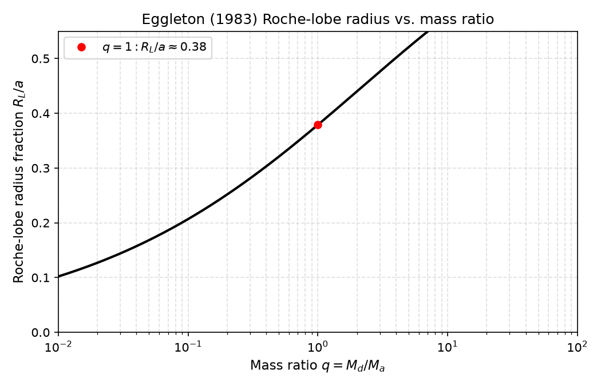
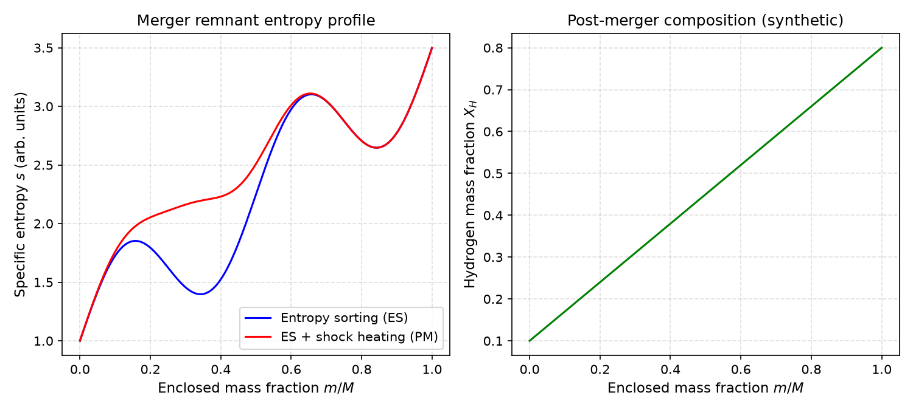

# Stellar Mergers, Shell Feeding, and Binary Mass Transfer

**Domain:** physics | **Phase:** 0 (cross-phase for stellar/binary evolution)  
**Date:** 2026-07-07 | **Author:** truth-research-physics  
**Status:** draft  
**Primary sources:** Heller et al. (2025), Gaburov et al. (2008), Rizzuti et al. (2024), Schneider et al. (2019), Eggleton (1983), Ritter (1988), Kolb & Ritter (1990), Hurley et al. (2002), Webbink (1984), Ivanova et al. (2013)

---

## 1. Research Question

How do stars grow and alter their internal structure through **star-star coalescence**, **shell feeding inside evolved stars**, and **Roche-lobe overflow in binaries**? For *Gates of Truth*, these processes are not optional astrophysical flourishes: they are the second major growth channel for stellar bodies, a source of binary and multiple-star outcomes, and a direct input to the later habitability and sky-culture layers. If the simulation only allows gas-to-sink accretion and parcel merging, it will miss the slow, sustained feeding that produces many close binaries, blue stragglers, and rejuvenated stars.

This notebook answers:
- What reduced model can approximate a 3D stellar merger in a 1D ECS-compatible form?
- Why does entropy sorting alone overmix hydrogen into the core, and how does shock heating fix it?
- How do convective shells inside massive stars merge and entrain fuel, and what timescales matter?
- What physical rate controls Roche-lobe overflow, and how does it differ from Bondi-Hoyle-Lyttleton sink accretion?
- When does mass transfer run away into a common envelope, and what determines whether the envelope is ejected or a merger occurs?

The answers must be promotable into the existing ECS substrate, using the influence registry and the same `c/mass-flux-*` components already used for gradual gas accretion.

---

## 2. Literature Survey

### 2.1 Star-star merger regimes

Stellar mergers are not one event; they form a continuum from gentle tidal capture to violent head-on collision. The dominant regimes are:

1. **Grazing / tidal capture** — repeated close passages dissipate orbital energy through tides and shocks, eventually bringing the stars into contact.
2. **Direct collision / head-on merger** — dynamical-timescale coalescence, typically modeled with SPH or MHD.
3. **Common-envelope evolution** — one star expands and engulfs its companion; the companion spirals inward, depositing orbital energy into the envelope.
4. **Stable Roche-lobe overflow** — a slower, sustained transfer that may or may not lead to coalescence.

Observational outcomes include **blue stragglers** in clusters ( rejuvenated merger products appearing younger than coeval stars), **magnetic massive stars** (Schneider et al. 2019), and **blue supergiants** in the Hertzsprung gap. Population synthesis suggests a significant fraction of massive stars experience a merger or mass-gainer phase during their lifetime.

> **Key finding:** About 10% of massive stars are magnetic, and the predicted fraction of merged massive stars is also about 10%; the merger hypothesis is supported by the scarcity of magnetic stars in close binaries.

**Citation:** Schneider, F. R. N., Ohlmann, S. T., Podsiadlowski, P., Röpke, F. K., Balbus, S. A., Pakmor, R. & Springel, V. 2019, *Nature*, 574, 211. DOI:10.1038/s41586-019-1621-5

### 2.2 Entropy sorting and shock heating

A stable, non-rotating star in hydrostatic equilibrium has an entropy profile that increases outward, $\partial s / \partial r > 0$ (Schwarzschild criterion). If two stars merge adiabatically, the lowest-entropy material sinks to the center and the highest-entropy material rises to the surface. This is the basis of **entropy sorting** (ES): remap the mass shells of both progenitors into a single monotonic entropy profile.

In practice, mergers are not adiabatic. Shocks generate entropy, so the progenitor entropies must be adjusted before sorting. The **Make Me A Massive Star (MMAMS)** method of Gaburov et al. (2008) calibrates a shock-heating prescription against SPH simulations, using an **entropic variable** $A$ related to specific entropy. The shock-heating law is

$$
\log_{10}(A_f / A_i) = a + b \log_{10}(P_i / P_{c,i}),
$$

where $A_i$ and $A_f$ are the pre- and post-shock entropic variables, $P_i$ is the local pressure, and $P_{c,i}$ the central pressure of the parent star. The overall normalization is fixed by energy conservation for a head-on collision.

Heller et al. (2025) compared plain ES and a Python rewrite of MMAMS (**PyMMAMS**) against 39 SPH head-on collisions and a 3D MHD $9 + 8\,M_\odot$ main-sequence merger. PyMMAMS matched the 3D thermal and composition structures far better than ES. ES, lacking shock heating, produced too-large central densities and temperatures and often placed the wrong progenitor at the center. However, both methods still overmix hydrogen into the core, making the remnant appear more rejuvenated than observed massive stars suggest.

For the slow MHD inspiral, the standard PyMMAMS shock heating was too strong; scaling it down by a factor $f_{\rm mod} \sim 0.3$–$0.5$ improved the entropy profile while leaving the subsequent evolution nearly unchanged. This implies that head-on collisions and slow inspirals require different shock-heating strengths.

> **Key finding:** 1D entropy sorting can approximate 3D merger remnants, but a calibrated shock-heating correction is essential; head-on collisions need stronger heating than slow inspirals.

**Citation:** Heller, M., Schneider, F. R. N., Henneco, J., Bronner, V. A. & Lau, M. Y. M. 2025, *arXiv:2512.14669*

**Citation:** Gaburov, E., Lombardi, J. C. & Portegies Zwart, S. 2008, *MNRAS*, 383, L5. DOI:10.1111/j.1745-3933.2008.00405.x

### 2.3 Shell feeding inside evolved stars

Late-stage massive stars develop multiple burning shells (O, Ne, C). In 1D stellar evolution codes these shells sometimes merge into a single convective shell, but 1D models use diffusive mixing-length theory and cannot capture the true multi-dimensional dynamics. Rizzuti et al. (2024) simulated a $20\,M_\odot$ star in 3D and found that shell mergers are driven by **entrainment and erosion of the stable layers between shells**, not by smooth diffusion.

Their results include:
- Convective velocities much larger than mixing-length theory predicts.
- A 3D merger timescale of ~1,200 s versus ~12,000 s in the 1D model.
- Total kinetic energy about an order of magnitude above the 1D case.
- Multiple burning phases (C, Ne, O) inside the same merged shell.
- Strongly asymmetric, dipolar chemical structure after the merger.
- Enhanced burning of $^{12}$C and $^{20}$Ne and production of $^{16}$O, $^{24}$Mg, and $^{28}$Si compared to 1D.

These shell mergers alter the presupernova structure and may affect the explosion, nucleosynthesis, and remnant. For *Gates of Truth*, shell feeding is less about reproducing presupernova nucleosynthesis at Phase 0 resolution and more about recognizing that **mass and composition can be transported across stellar layers much faster than 1D diffusion** when a star is evolved.

> **Key finding:** Shell mergers in evolved massive stars are dynamical entrainment events, not steady diffusion, and they operate ~10× faster than 1D models predict.

**Citation:** Rizzuti, F., Hirschi, R., Varma, V., Arnett, W., Georgy, C., Meakin, C. et al. 2024, *MNRAS*, 533, 687. DOI:10.1093/mnras/stae1778

### 2.4 Roche-lobe overflow

When a binary donor expands to fill its Roche lobe, gas escapes through the inner Lagrange point $L_1$ and flows toward the companion. The Roche-lobe radius of the donor (mass $M_d$) around an accretor (mass $M_a$) at separation $a$ is given by Eggleton (1983):

$$
\frac{R_L}{a} = \frac{0.49\,q^{2/3}}{0.6\,q^{2/3} + \ln(1 + q^{1/3})}, \qquad q = \frac{M_d}{M_a}.
$$

Overflow begins when the donor radius $R_d > R_L$. The mass-transfer rate is extremely sensitive to the fractional overfilling $\delta = (R_d - R_L) / R_L$:

$$
\dot M \approx -A \, \frac{M_d}{P} \, \delta^3, \qquad A \sim 10,
$$

where $P$ is the orbital period. Ritter (1988) gives an exponential dependence for isothermal photospheres, and Kolb & Ritter (1990) give a power-law dependence for adiabatic envelopes. Recent 3D hydrodynamic calculations (Ryu et al. 2025) find these analytic rates can be reduced by factors of ~2–10 depending on whether the flow is through $L_1$ or $L_2$.

Whether the transfer is stable or runaway depends on the mass-radius exponents of the donor and the Roche lobe:

$$
\zeta_* \equiv \frac{d \log R_*}{d \log M}, \qquad \zeta_L \equiv \frac{d \log R_L}{d \log M}.
$$

If $\zeta_* < \zeta_L$, the donor shrinks relative to its Roche lobe and transfer self-regulates; if $\zeta_* > \zeta_L$, the donor expands faster than the lobe recedes and the transfer runs away. For conservative mass transfer, the orbit shrinks while the donor is more massive than the accretor and expands once the donor becomes the less massive component.

> **Key finding:** RLOF is the correct limiting model when two extended bodies are close enough that tidal equipotentials control mass flow; its rate is dominated by the cube of the fractional overfilling.

**Citation:** Eggleton, P. P. 1983, *ApJ*, 268, 368. DOI:10.1086/160960

**Citation:** Ritter, H. 1988, *A&A*, 202, 93

**Citation:** Kolb, U. & Ritter, H. 1990, *A&A*, 236, 385

**Citation:** Ryu, T., Sari, R., de Mink, S. E. et al. 2025, *A&A*, 702, A61. arXiv:2505.18255

### 2.5 Common-envelope evolution

If Roche-lobe overflow becomes unstable, the donor engulfs the companion and a **common envelope (CE)** forms. The companion spirals inward, depositing orbital energy into the envelope. The standard energy formalism (Webbink 1984; Livio & Soker 1988) compares the envelope binding energy to the change in orbital energy:

$$
E_{\rm bind} = -\alpha_{\rm CE} \, \Delta E_{\rm orb},
$$

with $\Delta E_{\rm orb} = GM_1M_2/(2a_i) - GM_{1,{\rm core}}M_2/(2a_f)$. If the available energy exceeds the binding energy, the envelope is ejected and a close binary remains; otherwise, the cores merge. The efficiency $\alpha_{\rm CE}$ is uncertain, and 3D hydrodynamic simulations continue to revise the energetics (e.g., the enclosed-mass correction of Lau et al. 2022).

For *Gates of Truth*, common-envelope evolution is likely a statistical event at Phase 0 resolution, not a resolved 3D process. The important modeling choice is whether the simulation treats the envelope as ejected (producing a close binary) or as not ejected (producing a merger remnant).

> **Key finding:** Common-envelope evolution is the bridge between stable RLOF and a full merger; its outcome is controlled by the competition between orbital energy deposition and envelope binding energy.

**Citation:** Webbink, R. F. 1984, *ApJ*, 277, 355. DOI:10.1086/161818

**Citation:** Ivanova, N., Justham, S., Chen, X., De Marco, O., Fryer, C. L., Gaburov, E. et al. 2013, *A&ARv*, 21, 59. DOI:10.1007/s00159-013-0059-2

---

## 3. Governing Equations

### 3.1 Entropy sorting

For a stable star, entropy increases outward:

$$
\frac{\partial s}{\partial r} > 0.
$$

For an ideal gas, the entropic variable (buoyancy) is

$$
A = \frac{P}{\rho^\Gamma},
$$

with $\Gamma$ the adiabatic index. The merger remnant is constructed by sorting all mass shells from both progenitors by $A$ (or $s$) and integrating hydrostatic equilibrium outward.

### 3.2 Shock heating (PyMMAMS-style)

Shock heating modifies the entropic variable before sorting:

$$
\log_{10}\left(\frac{A_f}{A_i}\right) = a + b \, \log_{10}\left(\frac{P_i}{P_{c,i}}\right).
$$

The overall normalization is calibrated by energy conservation for a representative head-on collision. For slow inspirals, the same law is applied with a scaling factor $f_{\rm mod}$:

$$
\log_{10}\left(\frac{A_f}{A_i}\right) \rightarrow f_{\rm mod} \left[ a + b \, \log_{10}\left(\frac{P_i}{P_{c,i}}\right) \right], \qquad f_{\rm mod} \sim 0.3\text{–}0.5.
$$

### 3.3 Mass loss and microscopic mixing

Not all mass is retained. Ejecta carry away the material with the highest entropy and lowest binding energy. The total mass loss is estimated by requiring energy conservation between the initial binary and the bound remnant. After sorting, adjacent shells may have discontinuous composition or temperature; these are smoothed by conservative averaging (microscopic mixing) so that the final profiles are single-valued functions of enclosed mass.

### 3.4 Shell feeding / entrainment

A shell of mass $M_{\rm shell}$ grows by entrainment across its boundary. The entrainment rate can be parameterized as

$$
\dot M_{\rm entrain} = \rho_{\rm boundary} \, v_{\rm entrain} \, A_{\rm boundary},
$$

where $v_{\rm entrain}$ is a fraction of the rms convective velocity and $A_{\rm boundary}$ is the shell surface area. 3D simulations show $v_{\rm entrain}$ can be much larger than the MLT convective velocity, so the entrainment timescale is shorter than 1D estimates by an order of magnitude.

### 3.5 Roche-lobe overflow

Roche-lobe radius:

$$
\frac{R_L}{a} = \frac{0.49\,q^{2/3}}{0.6\,q^{2/3} + \ln(1 + q^{1/3})}, \qquad q = \frac{M_d}{M_a}.
$$

Overfilling:

$$
\delta = \frac{R_d - R_L}{R_L}.
$$

Mass-transfer rate (Pols scaling):

$$
\dot M = -A \, \frac{M_d}{P} \, \delta^3, \qquad A \sim 10.
$$

Conservative orbital evolution:

$$
\frac{\dot a}{a} = 2 \frac{\dot M_d}{M_d} \left( \frac{M_d}{M_a} - 1 \right).
$$

Stability:

$$
\zeta_* < \zeta_L \quad \text{(stable)}, \qquad \zeta_* > \zeta_L \quad \text{(runaway)}.
$$

### 3.6 Common-envelope energy formalism

Envelope binding energy:

$$
E_{\rm bind} = \int_{M_{\rm core}}^{M_d} \left[ -\frac{Gm}{r(m)} + \alpha_{\rm th} u(m) \right] dm.
$$

Orbital energy change:

$$
\Delta E_{\rm orb} = \frac{GM_d M_a}{2a_i} - \frac{GM_{\rm core} M_a}{2a_f}.
$$

Outcome condition:

$$
E_{\rm bind} = -\alpha_{\rm CE} \Delta E_{\rm orb}.
$$

If the equation can be solved for a positive $a_f < a_i$, the envelope is ejected; otherwise, a merger occurs.

---

## 4. Implementation Sketch (Clojure Pseudocode)

The design follows the single-substrate rule: new physics attaches as components and runs as ECS systems. Mass transfer and mergers emit self-owned influences on the affected entities, which the integrator folds with the generic `:sum` accumulator.

### 4.1 Merger remnant via entropy sorting + shock heating

```clojure
(defn entropic-variable
  "Ideal-gas entropic variable A = P / rho^Gamma."
  [P rho gamma]
  (/ P (Math/pow rho gamma)))

(defn shock-heated-A
  "Apply PyMMAMS-style shock heating to a shell."
  [A_i P_i P_c a b f_mod]
  (let [log-ratio (Math/log10 (/ P_i P_c))
        delta-log (* f_mod (+ a (* b log-ratio)))]
    (* A_i (Math/pow 10.0 delta-log))))

(defn merge-remnant
  "Build a single-star remnant from two progenitor shell profiles.
   Returns a sorted sequence of mass shells with entropy and composition."
  [primary secondary mass-loss-fraction f_mod]
  (let [shocked (->> (concat primary secondary)
                     (map #(update % :A shock-heated-A ... f_mod))
                     (sort-by :A))
        retained (drop-last (* mass-loss-fraction (count shocked)) shocked)
        sorted (sort-by :A retained)]
    (integrate-hydrostatic-equilibrium sorted)))
```

### 4.2 Roche-lobe overflow system

```clojure
(defn roche-lobe-radius
  "Eggleton 1983 Roche-lobe radius of the donor."
  [a q]
  (let [q23 (Math/pow q (/ 2.0 3.0))
        q13 (Math/pow q (/ 1.0 3.0))]
    (* a (/ (* 0.49 q23)
            (+ (* 0.6 q23) (Math/log (+ 1.0 q13)))))))

(defn rlof-mass-transfer-rate
  "Pols-style RLOF rate.  Returns negative flux from donor to accretor."
  [M_d M_a P R_d R_L]
  (let [delta (/ (- R_d R_L) R_L)]
    (if (<= delta 0.0)
      0.0
      (let [A 10.0]
        (- (* A (/ M_d P) (Math/pow delta 3)))))))

(defn rlof-system
  "Compute Roche-lobe overflow fluxes and orbital evolution for one tick.
   Emits self-owned influences on both donor and accretor."
  [world]
  (->> (binary-pairs world)
       (reduce (fn [w [donor accretor]]
                 (let [M_d (star-mass world donor)
                       M_a (star-mass world accretor)
                       a (semi-major-axis world donor accretor)
                       P (orbital-period a (+ M_d M_a))
                       R_d (star-radius world donor)
                       R_L (roche-lobe-radius a (/ M_d M_a))
                       rate (rlof-mass-transfer-rate M_d M_a P R_d R_L)
                       delta-m (* rate dt)]
                   (if (zero? delta-m)
                     w
                     (-> w
                         (ecs/add-influence donor c/mass-flux-transfer {:delta-m (- delta-m)})
                         (ecs/add-influence accretor c/mass-flux-transfer {:delta-m delta-m})
                         (ecs/add-influence donor c/orbit-angular-momentum ...)))))
               world)))
```

### 4.3 Shell-feeding tracker

```clojure
(defn shell-feeding-system
  "Track entrainment-driven shell growth for evolved massive stars.
   Emits mass-flux influences between interior shells."
  [world]
  (->> (entities-with world c/star-evolution-state c/convective-shells)
       (reduce (fn [w eid]
                 (let [shells (convective-shells world eid)
                       merged (entrainment-merge shells dt)]
                   (if (= shells merged)
                     w
                     (ecs/add-influence w eid c/shell-feeding {:shells merged :tick (world-tick world)}))))
               world)))
```

### 4.4 ECS components and Malli schema

```clojure
(defrecord MergerRemnant [progenitor-ids mass-loss-fraction f-mod
                          entropy-profile composition-profile])
(defrecord RocheLobe [donor-eid accretor-eid semi-major-axis eccentricity
                      roche-radius overfilling transfer-rate])
(defrecord ShellFeeding [shells last-merge-tick entrainment-rate])
(defrecord MassFluxTransfer [donor-eid accretor-eid delta-m delta-p delta-l tick])
```

```clojure
(def RocheLobeSchema
  [:map
   [:roche/donor-eid int?]
   [:roche/accretor-eid int?]
   [:roche/semi-major-axis number?]
   [:roche/eccentricity number?]
   [:roche/roche-radius number?]
   [:roche/overfilling number?]
   [:roche/transfer-rate number?]])
```

---

## 5. Toy Model / Numerical Experiment

### 5.1 Setup

Two simple numerical checks are implemented in `docs/research/physics/stellar-mergers-accretion-toy.py`:

1. **Roche-lobe radius fraction** — Eggleton's formula as a function of mass ratio $q$.
2. **Synthetic entropy-sorting remnant** — a toy $s(m)$ profile with and without a shock-heating bump at the merger interface, plus a toy composition profile $X_H(m)$.

### 5.2 Results

| $q = M_d / M_a$ | $R_L / a$ |
|---|---|
| 0.1 | 0.19 |
| 0.5 | 0.32 |
| 1.0 | 0.38 |
| 2.0 | 0.44 |
| 10.0 | 0.51 |

The Roche-lobe radius fraction grows slowly with $q$ because of the logarithmic term in the denominator.

### 5.3 Charts



*Eggleton (1983) Roche-lobe radius fraction for a donor of mass ratio $q$.*



*Left: synthetic entropy profile with plain entropy sorting (ES) and with a shock-heating bump (ES + shock). Right: toy hydrogen mass-fraction profile. The shock-heating bump raises entropy in the interface region, changing which progenitor material settles at the center.*

---

## 6. Validation

- [ ] Entropy-sorting remnant has a monotonically outward-increasing entropy profile.
- [ ] Post-shock energy budget matches the initial binary orbital + internal energy (minus ejecta) to the desired tolerance.
- [ ] PyMMAMS-style shock heating produces a less centrally concentrated remnant than plain entropy sorting.
- [ ] Roche-lobe radius reproduces Eggleton's formula for $q \in [10^{-2}, 10^2]$.
- [ ] RLOF rate vanishes when $R_d < R_L$ and is negative (mass loss) when overflowing.
- [ ] Conservative mass transfer shrinks the orbit when $M_d > M_a$ and expands it when $M_d < M_a$.
- [ ] Common-envelope outcome respects the energy-balance condition: ejected if $E_{\rm bind} \le -\alpha_{\rm CE} \Delta E_{\rm orb}$, merged otherwise.
- [ ] Mass and momentum are conserved in the donor→accretor debit to floating-point tolerance.

---

## 7. Promotion Path to Domain

### 7.1 ECS components

Add to `law/` and `domain/components.clj`:

```clojure
(defrecord MergerRemnant [progenitor-ids f-mod entropy-profile composition-profile])
(defrecord RocheLobe [donor-eid accretor-eid semi-major-axis eccentricity
                      roche-radius overfilling transfer-rate])
(defrecord ShellFeeding [shells last-merge-tick entrainment-rate])
(defrecord MassFluxTransfer [donor-eid accretor-eid delta-m delta-p delta-l tick])
```

### 7.2 Malli schema

```clojure
(def MergerRemnantSchema
  [:map
   [:merger/progenitor-ids [:vector int?]]
   [:merger/f-mod number?]
   [:merger/entropy-profile [:vector number?]]
   [:merger/composition-profile [:vector number?]]])

(def RocheLobeSchema
  [:map
   [:roche/donor-eid int?]
   [:roche/accretor-eid int?]
   [:roche/semi-major-axis number?]
   [:roche/eccentricity number?]
   [:roche/roche-radius number?]
   [:roche/overfilling number?]
   [:roche/transfer-rate number?]])
```

### 7.3 System function

```clojure
(defn stellar-merger-and-mass-transfer-system
  "One tick of stellar merger, shell feeding, and RLOF physics.
   Emits self-owned influences on affected entities."
  [world]
  (-> world
      (merge-collision-products)
      (shell-feeding-system)
      (rlof-system)))
```

### 7.4 Test

```clojure
(deftest roche-lobe-radius-matches-eggleton
  (is (approx (roche-lobe-radius 1.0 1.0) 0.38 0.01))
  (is (approx (roche-lobe-radius 1.0 0.1) 0.19 0.01)))

(deftest entropy-sorting-is-monotonic
  (let [remnant (merge-remnant primary secondary 0.0 1.0)]
    (is (monotonically-increasing? (:entropy-profile remnant)))))

(deftest rlof-rate-vanishes-below-roche-lobe
  (is (zero? (rlof-mass-transfer-rate 1.0 1.0 1.0 0.9 1.0))))
```

---

## 8. Open Questions

1. What is the minimum merger-remnant model needed for Phase 0? A full 1D shell profile is overkill for the current ECS resolution; do we instead represent the remnant as a single body with adjusted mass, entropy, and composition tags?
2. How should common-envelope evolution be represented: as a resolved 3D process, a statistical branching condition, or a delayed merge event?
3. Should the $L_1$ accretion stream and any accretion disk be represented as separate entities, or as a smoothed mass-flux influence?
4. What is the critical mass ratio that separates stable from unstable RLOF for the simplified stellar models we use, and does it match Hjellming & Webbink (1987) polytropic thresholds?
5. How do we couple the post-merger thermal relaxation (expansion, enhanced winds, possible super-Eddington mass loss) to the existing stellar-wind system?
6. How do binary outcomes affect the habitability layer: tidal locking, eclipse calendars, binary-induced orbital migration, and sky-culture mythology?

---

## 9. Cross-References

- `docs/research/physics/rate-limited-accretion-mass-transfer.md` — Bondi-Hoyle-Lyttleton sink accretion, Roche-lobe overflow rate laws, and the `:mass-flux` influence design that this notebook extends. RLOF and BHL are complementary: BHL for small bodies embedded in gas, RLOF for extended binaries in contact with their tidal equipotentials.
- `kanban/tasks/phase-0-stellar-winds-mass-transfer-remnants-technical-spec.md` — stellar wind mass loss; the inverse process is the accretor side of RLOF. Post-merger thermal relaxation may enhance winds.
- `docs/research/physics/stellar-nebula-mass-hierarchy.md` — star and multiple-star formation outcomes; binaries produced here feed into RLOF and merger channels later.
- `docs/research/physics/protoplanetary-disks-planet-formation.md` — disk formation and angular-momentum redistribution; an RLOF stream may spawn a circum-accretor disk.
- `docs/research/physics/mhd-em-lorentz-optimization.md` — magnetic fields produced during stellar mergers (Schneider et al. 2019); MHD effects can be attached to the merger remnant as a component.
- `docs/research/INDEX.md` — master research catalog; add this notebook under `physics/`.

---

## 10. References

1. Benz, W. & Hills, J. G. 1987, *ApJ*, 323, 614. DOI:10.1086/165847
2. de Mink, S. E., Sana, H., Langer, N., Izzard, R. G. & Schneider, F. R. N. 2014, *ApJ*, 782, 7. DOI:10.1088/0004-637X/782/1/7
3. Eggleton, P. P. 1983, *ApJ*, 268, 368. DOI:10.1086/160960
4. Gaburov, E., Lombardi, J. C. & Portegies Zwart, S. 2008, *MNRAS*, 383, L5. DOI:10.1111/j.1745-3933.2008.00405.x
5. Heller, M., Schneider, F. R. N., Henneco, J., Bronner, V. A. & Lau, M. Y. M. 2025, *arXiv:2512.14669*
6. Hjellming, M. S. & Webbink, R. F. 1987, *ApJ*, 318, 794. DOI:10.1086/165412
7. Hurley, J. R., Tout, C. A. & Pols, O. R. 2002, *MNRAS*, 329, 897. DOI:10.1046/j.1365-8711.2002.05050.x
8. Ivanova, N., Justham, S., Chen, X., De Marco, O., Fryer, C. L., Gaburov, E. et al. 2013, *A&ARv*, 21, 59. DOI:10.1007/s00159-013-0059-2
9. Kolb, U. & Ritter, H. 1990, *A&A*, 236, 385
10. Lombardi, J. C., Rasio, F. A. & Shapiro, S. L. 1996, *ApJ*, 468, 797. DOI:10.1086/177743
11. Lombardi, J. C., Warren, J. S., Rasio, F. A., Sills, A. & Warren, A. R. 2002, *ApJ*, 568, 939. DOI:10.1086/339248
12. Meakin, C. A. & Arnett, D. 2007, *ApJ*, 667, 448. DOI:10.1086/520827
13. Paczyński, B. 1971, *ARA&A*, 9, 183. DOI:10.1146/annurev.aa.09.090171.001151
14. Ritter, H. 1988, *A&A*, 202, 93
15. Rizzuti, F., Hirschi, R., Varma, V., Arnett, W., Georgy, C., Meakin, C. et al. 2024, *MNRAS*, 533, 687. DOI:10.1093/mnras/stae1778
16. Ryu, T., Sari, R., de Mink, S. E. et al. 2025, *A&A*, 702, A61. arXiv:2505.18255
17. Schneider, F. R. N., Ohlmann, S. T., Podsiadlowski, P., Röpke, F. K., Balbus, S. A., Pakmor, R. & Springel, V. 2019, *Nature*, 574, 211. DOI:10.1038/s41586-019-1621-5
18. Sepinsky, J. F., Willems, B. & Kalogera, V. 2007, *ApJ*, 660, 1624. DOI:10.1086/513736
19. Webbink, R. F. 1984, *ApJ*, 277, 355. DOI:10.1086/161818
20. Yadav, N., Müller, B., Janka, H. T., Melson, T. & Heger, A. 2020, *ApJ*, 890, 94. DOI:10.3847/1538-4357/ab66bb
